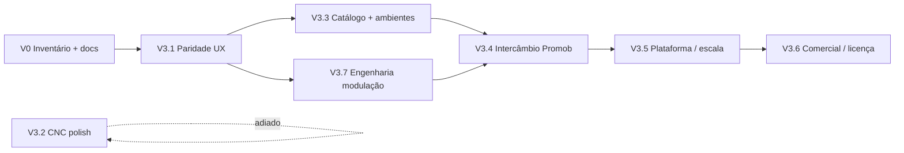

# Traços 3D Studio — Escopo V3: paridade completa Promob Plus

**Documento canônico a partir de 01/07/2026**  
**North star:** [Promob Plus](https://suporte.promob.com/hc/pt-br/articles/31123224474257-Plus) — paridade prática **e** ecossistema, executada em ondas até cobrir tudo que fizer sentido comercial e técnico.

| Campo | Valor |
|-------|-------|
| **Build de referência** | `2026.06.26.2012` (`dist/last-build.txt`) |
| **Testes** | **398** (`Tracos3DStudio.Tests`) |
| **Marcos anteriores** | [V1](./ESCOPO-V1-VS-PROMOB.md) · V2 (26/06/2026) |
| **Plano operacional** | [PLANO-EXECUCAO.md](./PLANO-EXECUCAO.md) |
| **PRD** | [PRD.md](./PRD.md) |

---

## 1. Decisão de produto (01/07/2026)

**Objetivo declarado:** fechar **tudo** que falta em relação ao Promob Plus — não apenas a trilha V1/V2 acordada, mas também itens antes marcados ➖, áreas do Plus ainda não inventariadas e Fase 6 (escala/intercâmbio).

**O que isso NÃO significa:**

- Copiar **100%** do backend Promob (Connect, servidores, catálogo online de fabricantes) sem infraestrutura própria.
- Ignorar **decisões comerciais** (ex.: licenciamento D5) — ficam documentadas até decisão do negócio.

**O que significa:**

- Manter o **mesmo loop de entrega** que funcionou em A→E: doc Promob → Promob ao vivo → uma lacuna → testes → MCP → manual → fixture.
- Trilhar **V3 em ondas** (V0–V6), com inventário completo e gates fecháveis.
- Atualizar **PLANO, ESCOPO, PRD e manual** a cada gate — este documento é a **fonte da verdade** para o que falta.

---

## 2. Estado atual — o que já está feito

### 2.1 Fases 1–6 (produto desktop)

| Fase | Conteúdo | Status |
|------|----------|--------|
| **1** | Ambiente, aberturas, vistas, persistência `.tracos` | ✅ |
| **2** | Módulos cozinha + dormitório + painéis + biblioteca | ✅ |
| **3** | Orçamento, PDF comercial, materiais, PNG | ✅ |
| **4** | Detalhamento, planta, DXF peças/planta | ✅ |
| **5** | Plano de corte MaxRects, etiquetas, furos | ✅ |
| **6 (local)** | Instalador, `.tracos-lib`, backup ZIP, ERP JSON | ✅ |
| **6 (nuvem/API)** | Connect-like, multi-usuário, ERP live | ⬜ **V3.5** |

### 2.2 Trilha Promob V1 — blocos A, B, C, D, E

| Bloco | Escopo | Paridade doc | Status |
|-------|--------|--------------|--------|
| **A** | Camadas, faixas, regiões (parede + piso) | [07 camadas](./manual/paredes/07-promob-paridade-camadas-faixas-regioes.md) | ✅ |
| **B** | Biblioteca Inserir/Ambiente, lista, drag | [07 biblioteca](./manual/modulos/07-promob-paridade-biblioteca.md) | ✅ |
| **C** | Materiais, janela, drag, modos | [07 materiais](./manual/materiais/07-promob-paridade-materiais.md) | ✅ |
| **D** | Orçamento polish (validade, desconto, vendedor) | [orcamento/](./manual/orcamento/README.md) | ✅ |
| **E** | E.1 JSON máquina · E.2 CSV furos · E.3 `tracos-cnc-job` · **E.4 `.tap` Jaraguá** | [producao/](./manual/producao/README.md) | ✅ |

### 2.3 Releases V2 (pós-marco V1)

| Release | ID | Entrega | Data |
|---------|-----|---------|------|
| **V2.1** | L7 | Biblioteca Painéis (Liso, Canaletado, Ripado) | 26/06/2026 |
| **V2.2** | A5 | Renomear instância na lista Ambiente | 26/06/2026 |
| **V2.3** | A3 | Lista agrupada por parede | 26/06/2026 |
| **V2.4** | A8 | Multi-seleção na lista Ambiente | 26/06/2026 |
| **V2.5** | A4 | Visível / Bloqueado na aba Ambiente | 26/06/2026 |
| **V2.6** | L10 | Recarregar biblioteca sem reiniciar | 26/06/2026 |
| **V2.7** | A3c | Lista agrupada por **cômodo → parede** + menu Adicionar cômodo | 26/06/2026 |
| **V2.8** | E.4 | Export `.tap` Jaraguá Mach4 (Solid TAF) | 26/06/2026 |

**Backlog V2:** ✅ **encerrado** (exceto validações opcionais de release — smoke Parte A).

### 2.4 Lacunas ainda ➖ nas tabelas de paridade (alvo V3)

| ID | Promob | Traços hoje | Onda V3 |
|----|--------|-------------|---------|
| **P8** | Diálogo *“Deseja fechar a parede…”* ao fechar contorno | Diálogo Sim/Não | ✅ **V3.1a** |
| **F7** | Botão **Editar Regiões** dentro do editor de faixas | Regiões em expander separado (equivalente funcional) | **V3.1** |
| **S3** | Abas multi-projeto na barra superior | Uma janela por projeto | **V3.1** |
| **L9** | Catálogo online / Connect Promob | Catálogo local `.tracos-lib` | **V3.5** |

### 2.5 Validação técnica atual

| Check | Status |
|-------|--------|
| `dotnet test` — **398** testes | ✅ |
| Instalador `2026.06.26.2012` | ✅ |
| Smoke Parte C (Release + fixture + MCP) | ✅ |
| Smoke Parte A (VM limpa) | 🟡 usuário |
| Comparação Aspire vs Traços (E.4 nesting) | 🟡 7/9 tamanho OK; posições divergem | ⏸ **V3.2 adiado** — E.4 fechado; polish na máquina depois |

**Fixture principal:** `fase-2-cozinha-L.tracos`  
**Referência CNC E.4:** `teste corte.tap`, `JRGCNC - TAF.pp`, `samples/fase-2-cozinha-L-comparacao-E4.zip`

---

## 3. O que o Promob Plus tem e ainda não está no inventário Traços

Além das tabelas A–E, o Plus cobre áreas **não mapeadas linha a linha** — entram no inventário **V0** (auditoria do índice Plus):

| Área Plus (índice / KB) | Traços hoje | Onda V3 |
|-------------------------|-------------|---------|
| Mais ambientes (banheiro, lavanderia, escritório, closet…) | Cozinha + dormitório + painéis | **V3.3** |
| Decoração / eletros 3D (pia, fogão, geladeira…) | ⬜ | **V3.3** |
| Render / iluminação / foto realista | Swatch + OpenGL básico | **V3.3+** (prioridade baixa) |
| Teto / laje / forro avançado | Teto automático básico | **V3.3** |
| Escadas, bancadas, sancas | ⬜ | **V3.3+** |
| Import / export **`.promob`** | Só `.tracos` | **V3.4** |
| Import **SKP** | ⬜ | **V3.4** |
| Cut Pro / `.planner` nativo | Equivalente E.1–E.4 (caminho Traços) | **V3.2** polish |
| Connect / nuvem / multi-usuário | ⬜ | **V3.5** |
| ERP / fiscal tempo real | Export JSON estático | **V3.5** |
| Licenciamento / assinatura (D5) | Pendente decisão comercial | **V3.6** |
| Construtor / engenharia de modulação | Caixa L×A×P; regras peças em C# | ⬜ **V3.7** |
| Cômodo automático ao fechar ambiente | Manual via **Projeto → Adicionar cômodo** | **V3.3** polish |

**Regra:** cada artigo do [índice Plus](https://suporte.promob.com/hc/pt-br/articles/31123224474257-Plus) vira linha na tabela mestre (seção 6) durante **V0**.

---

## 4. Trilha V3 — ondas (ordem recomendada)

### V0 — Inventário e documentação (gate zero)

**Objetivo:** uma tabela mestre Promob × Traços sem buracos de documentação.

| # | Entrega | Critério de aceite |
|---|---------|-------------------|
| V0.1 | Este documento + PLANO/ESCOPO/PRD alinhados | Links cruzados; contagem testes correta |
| V0.2 | Auditoria índice Plus → linhas ⬜ na tabela mestre (§6) | ≥ 1 linha por seção principal do índice |
| V0.3 | PRD RF-1…RF-7 espelham código | Nenhum RF entregue marcado ⬜ |
| V0.4 | Manuais sem texto pré-V2 | Revisão cruzada XAML, GUIA, INDICE |

**Estimativa:** 1–3 dias · **Status:** 🟡 **V0.1, V0.3, V0.4 ✅** (01/07/2026) · **V0.2** pendente (auditoria artigo a artigo do índice Plus)

---

### V3.1 — Paridade UX “barata” (lacunas ➖ das tabelas)

| Gate | ID | Entrega | Aceite |
|------|-----|---------|--------|
| V3.1a | **P8** | Diálogo confirmar fechamento de parede | Promob MCP + screenshot | ✅ 01/07/2026 |
| V3.1b | **F7** | Botão **Editar Regiões** no editor de faixas | Painel Regiões + MCP | ✅ 01/07/2026 |
| V3.1c | **S3** | Abas de projeto na barra (multi `.tracos`) | 2+ projetos abertos; salvar/fechar isolado | ✅ 01/07/2026 |

**Estimativa:** 1–2 semanas · **Status:** ✅ fechada 01/07/2026 (P8 · F7 · S3).

---

### V3.2 — Produção CNC polish E.4 ⏸ adiado

> **Decisão 01/07/2026:** **fora do próximo passo.** E.4 (`.tap` Jaraguá) está **entregue e fechado** (gate 5/5). Calibração Aspire, validação na chapa e comparativos na router ficam **quando houver teste na máquina** — não bloqueiam V3.1, V3.3 nem V0.2.

| Gate | Entrega | Aceite | Status |
|------|---------|--------|--------|
| V3.2a | Calibrar offset/nesting vs Aspire | ≥ 8/9 peças ou divergência documentada | ⏸ adiado |
| V3.2b | Menu **Exportar DXF nesting** | UI + `ExportCutPlanSheets` | ⬜ *(pode ser feito sem máquina; após V3.1)* |
| V3.2c | Validação na chapa Solid TAF | TAP + foto peça | ⏸ adiado |
| V3.2d | Post-processadores (TCN, BPP, MPR…) | Um formato por gate | ⬜ |

**Artefatos existentes:** `JaraguaMach4TapExporter`, `samples/fase-2-cozinha-L-chapa-*.tap/.dxf`, `compare_tap_coords.py`

---

### V3.3 — Catálogo e ambientes (volume Plus)

| Gate | Entrega | Aceite |
|------|---------|--------|
| V3.3a | Pacote catálogo **banheiro** (`.tracos-lib` + built-in) | Inserir + orçamento + corte |
| V3.3b | Pacote **lavanderia / closet** | idem |
| V3.3c | **Cômodo automático** ao fechar contorno (opcional desligar) | Lista Ambiente reflete cômodos |
| V3.3d | Miniaturas / preview 3D richer na biblioteca | L3 evoluído |
| V3.3e | Decoração básica (pia, fogão, geladeira) | RF-3.03 |

**Estimativa:** 4–8 semanas contínuo · **Entrega por pacote**, não big-bang.

> **Nota:** V3.3 adiciona **módulos prontos**. **V3.7** adiciona **como criar/configurar** módulos com regras (Construtor Promob). Complementares, não substitutos.

---

### V3.7 — Engenharia de modulação / Construtor de Armários

**Spec:** [08-engenharia-modulacao-construtor.md](./manual/modulos/08-engenharia-modulacao-construtor.md)

**Objetivo:** biblioteca parametrizada com **regras de construção configuráveis** (estrutura, vãos, interior, peças, usinagem) — paridade [Construtor de Armários Promob](https://suporte.promob.com/hc/pt-br/articles/31121711014545-Construtor-de-Arm%C3%A1rios), indo além do editor flat atual (`LibraryEditorWindow`).

| Gate | Entrega | Aceite |
|------|---------|--------|
| V3.7-spike | Mapear Construtor Plus (EM1–EM8) | Tabela Promob × Traços + observação MCP | ✅ 02/07/2026 |
| V3.7a | Schema `modulationRules` em `.tracos-lib` | Serialização + migração schema | ✅ 02/07/2026 |
| V3.7b | UI editor de modulação (estrutura, vãos, divisórias, portas/gavetas) | Template custom inserível no 3D | ✅ 02/07/2026 |
| V3.7c | Motor paramétrico (resize → internos + peças) | Fixture 600→800 mm | ✅ 26/06/2026 |
| V3.7d | Regras usinagem/fita por template | Lista peças + furos do template | ✅ 03/07/2026 |
| V3.7e | `ModuleDecompositionService` data-driven | Built-in + custom via regras; regressão testes |

**Baseline hoje:** `ModuleDefinition` (dims flat) · `ModuleDecompositionService` (C# fixo) · perfis 15/18/25 mm globais.

**Estimativa:** 8–16 semanas · **Prioridade sugerida:** após **V3.1**, em paralelo ou após **V3.3** — **sem teste na máquina**.

---

### V3.4 — Intercâmbio com Promob (alto risco)

| Gate | Entrega | Aceite |
|------|---------|--------|
| V3.4-spike | Spike 1 semana: ler `.promob` exportado simples | Relatório viabilidade |
| V3.4a | Import `.promob` — subset (paredes + 1 módulo) | Fixture round-trip ou doc ➖ |
| V3.4b | Export `.promob` — subset | idem |
| V3.4c | Import **SKP** (módulo ou decoração) | 1 mesh no viewport |

**Estimativa:** 8–16+ semanas · **Depende do spike.**

---

### V3.5 — Plataforma / escala (Fase 6 completa)

| Gate | Entrega | Aceite |
|------|---------|--------|
| V3.5a | Sync catálogo/preços (servidor ou pasta compartilhada) | 2 instâncias Traços |
| V3.5b | **L9** — catálogo corporativo online (Connect-like mínimo) | Login + pull biblioteca |
| V3.5c | Projetos em nuvem / multi-usuário | Salvar/abrir remoto |
| V3.5d | API ERP tempo real | Contrato + 1 ERP piloto |

**Estimativa:** 6–12+ meses · **Produto dentro do produto** — arquitetura separada.

---

### V3.6 — Comercial e release

| Gate | Entrega | Aceite |
|------|---------|--------|
| V3.6a | **D5** Licenciamento implementado | Decisão negócio fechada |
| V3.6b | Smoke Parte A (VM limpa) | Checklist [02-smoke](./manual/escala/02-smoke-instalador-maquina-limpa.md) |
| V3.6c | Release V3 declarado | PLANO + ESCOPO + build |

---

## 5. Metodologia operacional (obrigatória)

Cada gate V3 segue o **loop de 5 passos** (herdado do PLANO):

1. **Artigo Promob** (doc oficial ou KB) → requisito escrito.
2. **Promob Plus ao vivo** (`Promob5` via WinApp MCP) → comportamento observado **antes** de codar.
3. **Uma lacuna por entrega** — gate nomeado (`V3.2b`, não “produção completa”).
4. **`dotnet test`** + ambiente fechado no viewport + **WinApp MCP** + screenshots em `docs/screenshots/<área>/`.
5. Atualizar **manual**, **tabela paridade**, **PLANO**, **este documento** e **fixture `.tracos`** se aplicável.

**Checklist qualidade** (cada gate):

- [ ] Projeto novo e reaberto
- [ ] mm consistentes
- [ ] Sem regressão paredes
- [ ] UI pt-BR
- [ ] Sem duplicar `Geometry2D` / domínio
- [ ] Screenshot + barra de status via MCP

**Legenda paridade:**

| Símbolo | Significado |
|---------|-------------|
| ✅ | Entregue e documentado |
| 🟡 | Parcial ou validação pendente |
| ⬜ | Backlog V3 |
| ➖ | Diferença aceita permanentemente (só com decisão explícita) |

---

## 6. Tabela mestre Promob Plus × Traços (V3)

*Linhas das tabelas A–E já ✅ estão nos artigos de paridade; abaixo: **pendências V3** + **áreas do índice Plus**. Expandir em V0.2.*

### 6.1 Pendências das tabelas existentes

| ID | Promob | Traços | Status | Gate |
|----|--------|--------|--------|------|
| P8 | Diálogo fechar parede | Diálogo Sim/Não | ✅ | V3.1a |
| F7 | Editar Regiões no editor de faixas | Botão no WallBandsWindow | ✅ | V3.1b |
| S3 | Abas multi-projeto | Uma janela | ✅ | V3.1c |
| L9 | Connect / catálogo online | Local | ⬜ | V3.5b |
| EM1–EM8 | Construtor / engenharia modulação | Caixa + C# fixo | ⬜ | V3.7 |
| E.4-ref | Nesting TAP = Aspire | Diverge posição | 🟡 | V3.2a |
| E.4-ui | DXF nesting no menu | Só código/samples | ⬜ | V3.2b |

### 6.2 Índice Plus — áreas para inventariar (V0.2)

| Seção Plus (referência) | Status Traços | Gate V3 |
|-------------------------|---------------|---------|
| [Paredes](https://suporte.promob.com/hc/pt-br/articles/31122539571345-Promob-Paredes) | ✅ tabela PLANO P1–P9 | P8 → V3.1a |
| [Salvar projetos](https://suporte.promob.com/hc/pt-br/articles/31121685244049-Promob-Salvar-Projetos) | ✅ `.tracos` + abas S3 | V3.1c ✅ |
| [Importar/Exportar](https://suporte.promob.com/hc/pt-br/articles/31121702310417-Promob-Importar-e-Exportar-Projetos) | ⬜ | V3.4 |
| Camadas / faixas / regiões | ✅ Bloco A | F7 → V3.1b |
| Materiais | ✅ Bloco C | — |
| [Construtor de Armários](https://suporte.promob.com/hc/pt-br/articles/31121711014545-Construtor-de-Arm%C3%A1rios) | ⬜ caixa parametrizada | **V3.7** |
| [Configurar estrutura](https://suporte.promob.com/hc/pt-br/articles/31119877118609-Promob-Configurar-a-estrutura-do-arm%C3%A1rio) | ⬜ | V3.7b |
| Biblioteca / módulos | ✅ Bloco B + V2 (catálogo flat) | V3.3 expandir · **V3.7** regras |
| Orçamento / comercial | ✅ Bloco D | — |
| Produção / Cut | ✅ E.1–E.4 | V3.2 polish |
| Render / apresentação | 🟡 PNG/PDF | V3.3+ |
| Connect / nuvem | ⬜ | V3.5 |
| *Demais artigos do índice Plus* | ⬜ auditar | V0.2 |

> **V0.2:** percorrer o índice Plus link a link; cada artigo sem linha ✅ vira linha ⬜ aqui ou nos docs `07-promob-paridade-*`.

---

## 7. Priorização acordada

| Ordem | Onda | Motivo |
|-------|------|--------|
| **1** | **V0.2** ou **V3.1** | Docs ou paridade UX — **sem máquina** |
| **2** | **V3.3** | Catálogo / ambientes Plus (módulos prontos) |
| **3** | **V3.7** | Engenharia modulação / Construtor (regras configuráveis) |
| **4** | **V3.4** | Intercâmbio `.promob` (spike primeiro) |
| **5** | **V3.5–V3.6** | Plataforma + licença |
| — | **V3.2** | ⏸ **Adiado** — polish CNC / Aspire / chapa **só quando houver teste na máquina** |

**Próximo gate de código:** **V3.7e** (`ModuleDecompositionService` data-driven) — **V3.7d ✅** · **V3.7c ✅** · **V3.7b ✅** · **V3.7a ✅**.

---

## 8. Estimativas (1 dev, ritmo atual)

| Escopo | Ordem de grandeza |
|--------|-------------------|
| V0 + V3.1 + V3.2 polish | ~1–2 meses |
| V3.3 catálogo rico | +2–4 meses |
| V3.7 engenharia modulação | +8–16 semanas |
| V3.4 import `.promob` | incerto (0–6+ meses) |
| V3.5 plataforma | 6–12+ meses |

---

## 9. Documentos relacionados

| Documento | Papel |
|-----------|-------|
| [PLANO-EXECUCAO.md](./PLANO-EXECUCAO.md) | Checklists operacionais, marcos, gates |
| [ESCOPO-V1-VS-PROMOB.md](./ESCOPO-V1-VS-PROMOB.md) | Histórico marco V1/V2 |
| [PRD.md](./PRD.md) | Requisitos funcionais + backlog V3 |
| [TRILHA-PROMOB-BC-ESPECIFICACAO.md](./TRILHA-PROMOB-BC-ESPECIFICACAO.md) | Spec B/C (histórico) |
| [manual/README.md](./manual/README.md) | Manual de uso |
| Paridade A/B/C | `docs/manual/*/07-promob-paridade-*.md` · [08 modulação](./manual/modulos/08-engenharia-modulacao-construtor.md) |

---

## 10. Histórico

| Data | Alteração |
|------|-----------|
| 01/07/2026 | Criação — trilha V3 completa, decisão “fazer tudo Promob Plus”, consolidação pós-V2 |
| 01/07/2026 | **V3.7** — engenharia de modulação / Construtor de Armários registrado |

---

*Atualizar este documento ao fechar cada gate V3.x.*
