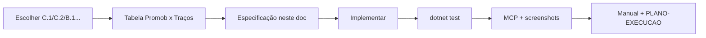

# Trilha Promob — Blocos B e C (+ cauda A)

**Documento de plano, lógica e especificação**  
**Versão:** 1.0  
**Data:** 19/06/2026  
**Plano operacional:** [PLANO-EXECUCAO.md](./PLANO-EXECUCAO.md)  
**North star:** [PRD.md](./PRD.md)

---

## Contexto

O **Bloco A** (paredes — faixas, regiões, camadas A.1–A.5) está **concluído** para o MVP acordado. A sequência aprovada para as próximas entregas é:

```
C.1 → C.2 → B.1 → B.2 → A.6 (cauda opcional de paredes)
```

**Fora desta trilha até nova ordem:** smoke do instalador, nuvem, SKP, licenciamento.

---

## Lógica de priorização

| Critério | Peso | Aplicação |
|----------|------|-----------|
| Impacto no fluxo diário | Alto | Materiais (C) e biblioteca (B) são usados em todo projeto |
| Dependência | Alto | C.1 (janela) desbloqueia C.2 (drag); B.1 (mapeamento) desbloqueia B.2 (UI) |
| Escopo fechável | Obrigatório | Uma entrega = um item numerado (C.1, C.2…), não “Bloco C inteiro” |
| Testabilidade | Obrigatório | Unit + MCP + screenshots por entrega |
| Paridade Promob | Referência | Tabela ✅/🟡/⬜/➖ antes de codar |

**Regra de ouro (inalterada):** implementar a **próxima lacuna concreta**, atualizar manual + plano + fixture, validar visualmente com ambiente fechado.

---

## Estado atual (baseline de código)

| Área | Hoje | Gap principal |
|------|------|---------------|
| Materiais módulo | Combo `PropertyMaterialCombo` | Sem janela/barra unificada |
| Materiais parede | Combos em faixa/região | Sem drag; parede “nua” sem material próprio |
| Materiais piso | `FloorMaterialCombo`, `FloorZoneMaterialCombo` | Sem drag |
| Catálogos | `MaterialCatalog`, `FloorMaterialCatalog`, `WallSurfaceMaterialCatalog` | Já unificam preview de cor |
| Biblioteca esquerda | Expanders Cozinhas / Dormitórios / Personalizados | Sem abas; sem lista do ambiente |
| Drag-and-drop | Não existe no projeto | C.2 introduz |

---

## Sequência de entregas

| # | Nome | Tipo | Depende de | Paridade |
|---|------|------|------------|----------|
| **C.1** | Janela de materiais + preview | Código + UI | — | [M1 parcial](./manual/materiais/07-promob-paridade-materiais.md) |
| **C.2** | Arrastar material → viewport | Código + pick | C.1 | [M1–M2 parcial](./manual/materiais/07-promob-paridade-materiais.md) |
| **B.1** | Mapeamento Promob × biblioteca | **Só documentação** | ✅ 19/06/2026 | [07-promob-paridade-biblioteca](./manual/modulos/07-promob-paridade-biblioteca.md) |
| **B.2** | Abas Inserir / Ambiente + lista | Código + UI | ✅ 19/06/2026 | idem |
| **A.6** | Cauda de paredes (1 item) | Código | A.5 | [07-promob-paridade camadas/regiões](./manual/paredes/07-promob-paridade-camadas-faixas-regioes.md) |

---

## C.1 — Janela de materiais + preview

**Referência Promob:** [Materiais](https://suporte.promob.com/hc/pt-br/articles/31121151669009-Promob-Materiais)

### Objetivo

Centralizar a escolha de acabamentos numa janela **Exibir → Materiais...**, com amostra de cor e nome — espelhando **Exibir → Camadas...** (`WallLayersWindow`).

### Escopo MVP

| Inclui | Não inclui (futuro) |
|--------|---------------------|
| Menu **Exibir → Materiais...** (foca aba lateral) | Editor de materiais custom (cadastro) |
| Guia dockada `MaterialsPanel` (aba **Materiais**) | Modos Promob Todo/Face/Perfil H/V (vai para C.2/C.3) |
| Lista unificada: módulos + pisos (`WallSurfaceMaterialCatalog.All`) | Arrastar (C.2) |
| Swatch de cor (`ColorHex`) + nome | Preço/orçamento na janela |
| Clique seleciona **material ativo** global | |
| Sincronizar seleção com combo do painel quando item selecionado | |
| `AutomationId` para MCP | |

### UI (especificação)

```
MaterialsPanel (aba Bibliotecas → Materiais)
├── Título: nome do projeto
├── Resumo: "N materiais — clique para selecionar; arraste no viewport (C.2)"
├── Filtro opcional: Combo "Grupo" → Todos | Módulos | Pisos
├── ListBox de linhas:
│     [■ swatch 24×24]  MDF Branco
│     [■ swatch]        Cerâmica Bege
└── Botões Copiar do selecionado / Copiar no viewport
```

**AutomationIds:**

| Elemento | Id |
|----------|-----|
| Painel | `MaterialsPanel` |
| Aba | `LibraryTabMaterials` |
| Lista | `MaterialsListBox` |
| Item | `MaterialItem_{id}` (slug do material) |
| Fechar | `MaterialsCloseButton` |
| Menu | `MaterialsMenuItem` |

### Modelo / serviço

- `MaterialApplicationService` (ou equivalente mínimo):
  - `ActiveMaterialId` — material destacado na janela
  - `GetAllDisplayOptions()` — delega a `WallSurfaceMaterialCatalog.All`
  - `TryApplyToModule`, `TryApplyToBand`, etc. — stubs usados em C.2; em C.1 só sincroniza combo do painel se houver seleção

### Aceite

1. `dotnet test` — testes de catálogo + janela abre com N itens
2. MCP: **Exibir → Materiais...** → lista ≥ 3 itens → clique altera material do módulo selecionado
3. Screenshot: `fase-C.1-janela-materiais.png`
4. Manual: [01-janela-materiais.md](./manual/materiais/01-janela-materiais.md)
5. Fixture: reutilizar `samples/quadrado-5000-camadas-faixas.tracos`

---

## C.2 — Arrastar material no viewport

**Referência Promob:** arrastar da barra de materiais sobre parede, faixa, região, piso, módulo.

### Objetivo

Arrastar um material da janela (ou futura barra) e **soltar** no viewport para aplicar no alvo sob o cursor.

### Escopo MVP

| Alvo (drop) | Campo atualizado | Detecção |
|-------------|------------------|----------|
| Faixa de parede | `WallBand.MaterialId` | Pick face + faixa ativa ou hit na faixa |
| Região de parede | `WallRegion.MaterialId` | Pick região (ret/circ/poly) |
| Região do piso | `FloorZone.MaterialId` | Pick zona / seleção de zona |
| Piso (base) | `FloorSurface.DefaultMaterialId` | Clique no piso sem zona |
| Módulo | `ModuleInstance.MaterialId` | `ModulePickService` |
| Face livre da parede | `WallSegment.InternalFaceMaterialId` / `ExternalFaceMaterialId` | Drop na parede sem faixa/região (C.2.1) |

### Comportamento

1. **Início do drag:** `MouseMove` + threshold a partir de item da lista (`MaterialsListBox`) ou material ativo
2. **Payload:** `MaterialDragPayload { MaterialId }` (WPF `DataObject`)
3. **Feedback:** cursor customizado ou ghost swatch; barra de status “Solte em faixa, região, piso ou módulo”
4. **Drop no viewport:** reutilizar picks existentes (`TryPickWallFaceAtScreen`, picks de região/faixa, `TryPickModuleAtScreen`, pick piso)
5. **Prioridade de hit** (mais específico primeiro): região > faixa > módulo > zona piso > piso > parede face (se C.2.1)
6. **Camada bloqueada/oculta:** não aplicar em alvos não pickáveis (mesma regra A.5)
7. **Undo:** não obrigatório no MVP; `MarkProjectDirty` + refresh viewport

### Modos M2 (Promob)

| Promob | Traços C.2 |
|--------|------------|
| Todo / Face / Região / Perfil | **Auto** pelo alvo do drop + combo **Modo** (C.3) |
| Seletor explícito de modo | ✅ C.3 — `MaterialsModeCombo` |

### Aceite

1. Testes unitários: `MaterialDropService.TryResolveTarget` com mocks de pick
2. MCP: abrir materiais → arrastar MDF Madeirado → soltar em região azul → combo/preview atualizados
3. Screenshots: `fase-C.2-drag-regiao.png`, `fase-C.2-drag-modulo.png`
4. Atualizar [07-promob-paridade-materiais](./manual/materiais/07-promob-paridade-materiais.md) M1/M2 → ✅ ou 🟡

---

## B.1 — Mapeamento biblioteca (documentação) ✅

**Tipo:** entrega **sem código** — tabela Promob × Traços + decisão de escopo B.2.  
**Status:** concluído 19/06/2026.

### Objetivo

Fechar o que o Promob oferece na **biblioteca lateral** vs o Traços hoje, antes de redesenhar a UI.

### Entregáveis

1. Arquivo [07-promob-paridade-biblioteca.md](./manual/modulos/07-promob-paridade-biblioteca.md) completo
2. Atualizar [modulos/README.md](./manual/modulos/README.md) com link e status
3. Seção **Decisão — escopo B.2** no final do parity doc (checklist fechado)

### Artigos Promob (referência)

- Plus — ambientação / biblioteca de módulos (índice Plus)
- Inserção de módulos na parede (já coberto em [01-inserir-na-face-interna.md](./manual/modulos/01-inserir-na-face-interna.md))

### Aceite

- Tabela com ≥ 10 linhas ✅/🟡/⬜/➖
- Escopo B.2 listado como bullet fechado (sem “etc.”)
- Revisão cruzada com `LeftLibraryBorder` / `MainWindow.xaml` atual

---

## B.2 — Abas Inserir / Ambiente + lista de módulos

**Depende de:** B.1 aprovado (escopo congelado)

### Objetivo

Organizar a coluna esquerda como no Promob: separar **inserir da biblioteca** de **listar o que já está no ambiente**.

### Escopo MVP (proposta — confirmar em B.1)

| Inclui | Não inclui |
|--------|------------|
| `TabControl` na biblioteca esquerda | Miniaturas 3D por módulo |
| Aba **Inserir** — conteúdo atual (Cozinhas, Dormitórios, Personalizados) | Catálogo online / Connect |
| Aba **Ambiente** — `ListBox` de `_project.Modules` | Agrupamento por parede/cômodo |
| Item: `{DisplayName} — L×A×P mm` | Edição inline na lista |
| Clique na lista → `SelectModule` + painel propriedades | Multi-seleção |
| Duplo-clique → enquadra câmera no módulo (opcional 🟡) | |
| `AutomationId`: `LibraryTabInsert`, `LibraryTabScene`, `SceneModuleList` | |

### Aceite

1. MCP: inserir balcão → aparece na aba Ambiente → clicar seleciona no viewport
2. Screenshot: `fase-B.2-aba-ambiente.png`
3. Fixture: `fase-2-cozinha-L.tracos`
4. Manual: [04-biblioteca-abas-ambiente.md](./manual/modulos/04-biblioteca-abas-ambiente.md)

---

## A.6 — Cauda do Bloco A (uma lacuna por entrega)

Escolher **um** item por sprint, na ordem sugerida:

| Opção | Lacuna | Esforço | Valor |
|-------|--------|---------|-------|
| **A.6a (recomendado)** | **C9** — Remover camada custom vazia | Baixo | Completa camadas pós-A.5 |
| A.6b | **R6** — Adicionar vértice na aresta da região | Médio | Editor de regiões |
| A.6c | **R7** — Mover região inteira (arraste do bloco) | Médio | UX regiões |

**C9 — especificação resumida:**

- Botão **Remover camadas vazias** em `WallLayersWindow`
- Remove só camadas **custom** sem paredes e sem módulos
- Confirmação se camada tiver nome mas zero itens
- Testes: `TryRemoveEmptyCustomLayers`

Item **S4** ✅ · **S2** ✅ · **A7** ✅ · **R1** ✅ · **C7** ✅ · **F1** ✅ · **F2** ✅ · **F8** ✅ · **R12** ✅ (19/06/2026).

---

## Fluxo operacional por entrega



---

## Riscos e mitigação

| Risco | Mitigação |
|-------|-----------|
| Drag no viewport OpenGL (sem UIA) | Hit-test via picks existentes no `Drop`/`MouseUp`, não UIA no GL |
| Catálogos duplicados | Sempre `WallSurfaceMaterialCatalog` na UI; módulo/piso mantêm IDs |
| Escopo B.2 inflar | B.1 congela checklist antes de codar |
| Regressão camadas A.5 | Testes `ModuleLayerTests` + pick bloqueado em drop |

---

## Próxima ação (pós-V1/V2)

**Marcos V1+V2 ✅** 26/06/2026 — [ESCOPO-V1-VS-PROMOB.md](./ESCOPO-V1-VS-PROMOB.md).

**Trilha ativa V3** (01/07/2026): [ESCOPO-V3-PROMOB-COMPLETO.md](./ESCOPO-V3-PROMOB-COMPLETO.md) — paridade Promob Plus completa em ondas V0→V3.6.

| **V3.1c** | Abas multi-projeto (S3) ✅. V3.2 ⏸ adiado.
