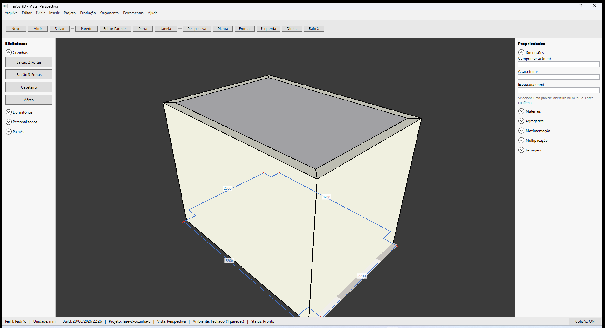
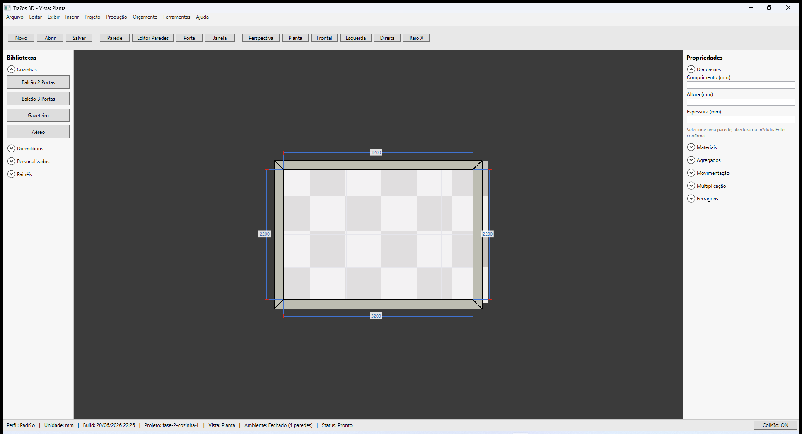
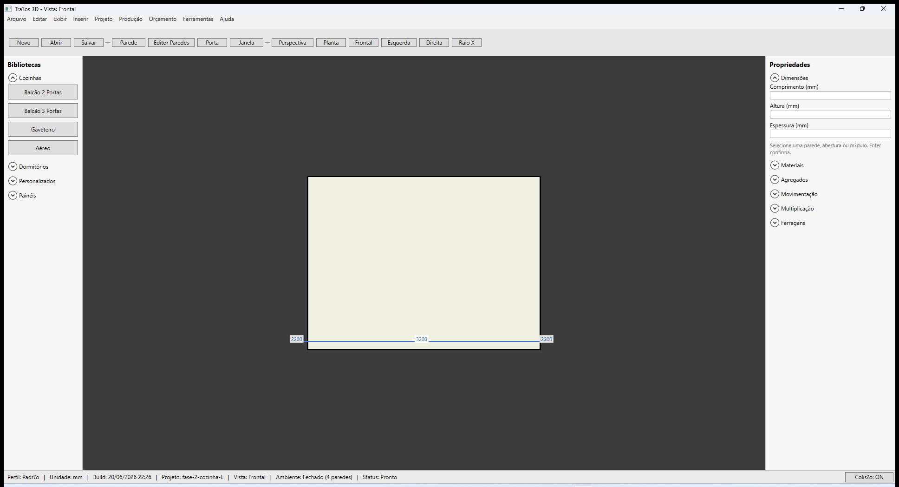
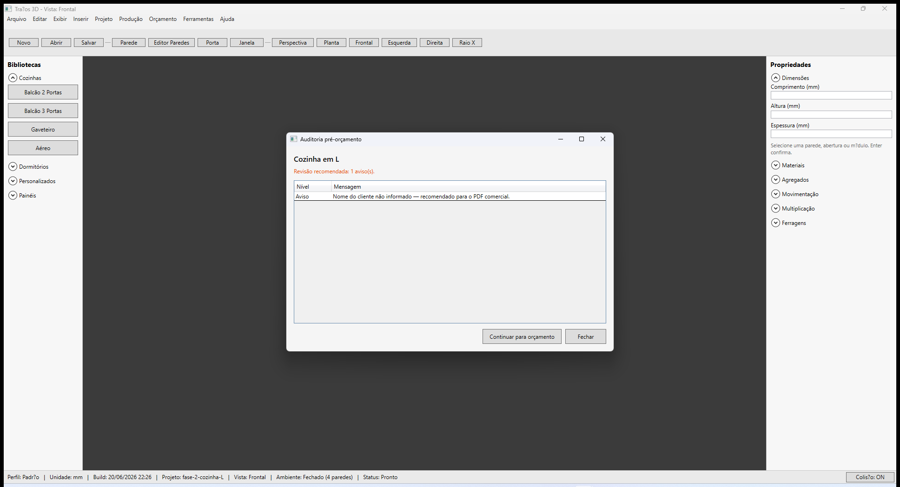
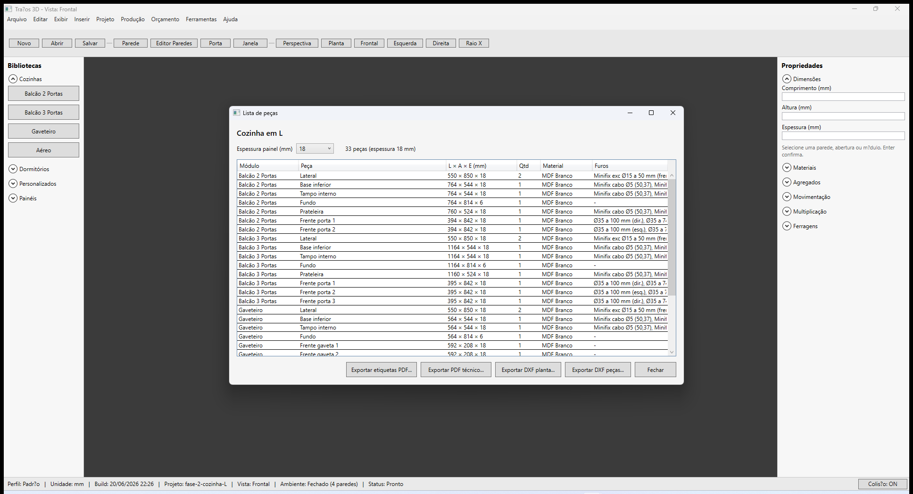
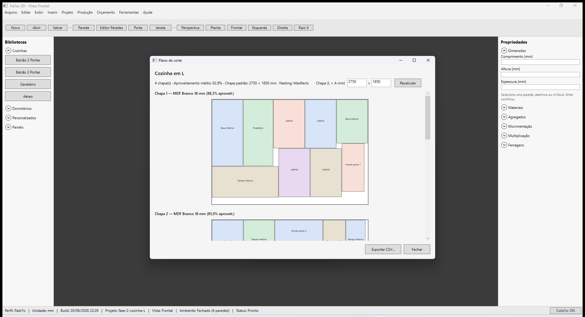

# Traços 3D — Guia de início rápido

**Última revisão:** 26/06/2026 — **V1 feature-complete**  
**Build de referência:** `2026.06.26.2012` (ver barra de status ou `dist/last-build.txt`)  
**Marco:** [Escopo V1 vs Promob](../ESCOPO-V1-VS-PROMOB.md)

Roteiro **ponta a ponta** — do instalador ao plano de corte — no espírito do fluxo [Promob Plus](https://suporte.promob.com/hc/pt-br/articles/31123224474257-Plus) (projeto → venda → detalhamento → produção).

Para detalhes de cada tela, use os artigos linkados. Mapa técnico: [INDICE-RAPIDO.md](./INDICE-RAPIDO.md).

---

## Antes de começar

1. Instale com `dist\Tracos3DStudio-setup.exe` ou execute `publish\win-x64\Tracos3DStudio.exe`.
2. **Release beta:** validação em máquina limpa — [Smoke do instalador](./escala/02-smoke-instalador-maquina-limpa.md).
3. Unidade padrão: **mm**. Perfil: **Padrão** (barra de status).
4. Atalhos úteis: **R** alterna orientação da parede; **Delete** remove seleção; **Ctrl+Z** desfaz parede em construção.

---

## Roteiro recomendado — cozinha em L

Use o projeto de exemplo **`fase-2-cozinha-L.tracos`** (raiz do repositório) ou reproduza o fluxo do zero.

| Etapa | O que fazer | Artigo |
|-------|-------------|--------|
| 1 | Ambiente fechado (4 paredes) | [Construir paredes](./paredes/01-construir-paredes.md) |
| 2 | Portas e janelas | [Inserir porta e janela](./aberturas/01-inserir-porta-janela.md) |
| 3 | Módulos na face interna | [Inserir na face interna](./modulos/01-inserir-na-face-interna.md) |
| 4 | (Opcional) Camadas, faixas, regiões | [Camadas, faixas e regiões](./paredes/06-camadas-faixas-regioes.md) |
| 5 | Orçamento comercial | [Auditoria e orçamento](./orcamento/01-auditoria-e-orcamento.md) |
| 6 | PDF técnico e DXF | [PDF técnico](./detalhamento/01-pdf-tecnico-planta.md) · [DXF](./detalhamento/02-exportacao-dxf.md) |
| 7 | Lista de peças, corte, etiquetas | [Lista de peças](./producao/01-lista-de-pecas.md) · [Plano de corte](./producao/02-plano-de-corte.md) |
| 8 | Salvar, backup, ERP JSON | [Distribuição local](./escala/01-distribuicao-local.md) |

---

## Passo a passo resumido

### 1. Abrir o projeto

- **Abrir projeto** na barra de ferramentas → selecione `fase-2-cozinha-L.tracos`.  
- Ou arraste o `.tracos` sobre o executável / use linha de comando:  
  `Tracos3DStudio.exe "caminho\fase-2-cozinha-L.tracos"`

Confirme na barra de status: **Projeto: fase-2-cozinha-L** · **Ambiente: Fechado (4 paredes)**.

### 2. Navegar nas vistas

Use a barra de ferramentas:

| Botão | Uso |
|-------|-----|
| **Perspectiva** | Apresentação 3D |
| **Planta** | Layout e cotas automáticas |
| **Frontal** / **Esquerda** / **Direita** | Elevações |
| **Raio X** | Ver módulos atrás das paredes |

### 3. Inserir ou revisar módulos

1. Biblioteca **Cozinhas** → escolha **Balcão 2 Portas**, **Gaveteiro**, etc.
2. Clique na **face interna** da parede — preview azul encosta no fundo.
3. Ajuste **Cotas** no painel **Propriedades** (Anterior / Posterior).
4. **Colisão: ON** na barra de status evita sobreposição.

Detalhes: [modulos/README.md](./modulos/README.md).

### 4. Orçamento

1. **Projeto → Dados do cliente e da obra...** — preencha cliente, obra e ambiente.
2. Menu **Orçamento → Abrir orçamento...**
2. Revise a **Auditoria pré-orçamento** (avisos não bloqueiam).
3. **Continuar para orçamento** → PDF comercial estilo Promob.

Exportação visual: menu **Exibir → Exportar PNG apresentação** (2×, só 3D).

### 5. Detalhamento técnico

| Menu | Saída |
|------|--------|
| **Projeto → Exportar PDF técnico...** | Planta + elevações + peças + furos |
| **Projeto → Exportar DXF planta...** | Planta 2D |
| **Projeto → Exportar DXF peças...** | Peças com furos |

### 6. Produção

1. **Projeto → Lista de peças...** — espessura do painel, furos dobradiça/minifix.

2. **Produção → Abrir plano de corte...** — nesting MaxRects, aproveitamento %.

3. **Produção → Exportar etiquetas PDF...** e **Exportar CSV do plano de corte...** quando necessário.

### 7. Salvar

- **Salvar projeto** — arquivo `.tracos` (JSON, projeto + módulos + paredes).
- **Ferramentas → Backup local (ZIP)...** — projeto + biblioteca custom.

---

## Fixtures de prática

| Fixture | Conteúdo |
|---------|----------|
| `samples/quadrado-5000-horario.tracos` | Quadrado 4×5000 mm, sentido horário |
| `samples/quadrado-5000-porta-janela.tracos` | Porta + janela |
| `samples/quadrado-5000-camadas-faixas.tracos` | Camadas, faixas, regiões |
| `fase-2-cozinha-L.tracos` | Cozinha L completa (orçamento + corte) |

Smoke release: checklist em [02-smoke-instalador-maquina-limpa.md](./escala/02-smoke-instalador-maquina-limpa.md) · screenshots `docs/screenshots/aceite-e2e/release-smoke-*.png`.

---

## Paridade Promob — o que já está coberto

| Área Promob Plus | Traços 3D |
|------------------|-----------|
| Construção de paredes, orientação, cotas | ✅ [paredes/README.md](./paredes/README.md) |
| Aberturas | ✅ [aberturas/README.md](./aberturas/README.md) |
| Biblioteca / módulos paramétricos | ✅ Cozinha + dormitório |
| Orçamento + PDF comercial | ✅ [orcamento/README.md](./orcamento/README.md) |
| Detalhamento 2D / peças | ✅ [detalhamento/README.md](./detalhamento/README.md) |
| Plano de corte (Maker / Cut) | ✅ MaxRects + CSV + etiquetas |
| Camadas / faixas / regiões | ✅ MVP — ver limitações abaixo |

---

## Limitações e trilha V3 (a partir de 01/07/2026)

**V1+V2** cobrem o fluxo offline completo (incl. Painéis L7, lista Ambiente V2, **E.4 `.tap` Jaraguá**). O que **ainda falta** para paridade Promob Plus **completa** está em **[Escopo V3](../ESCOPO-V3-PROMOB-COMPLETO.md)** — não é bug do V1, é fila V3.

| Promob | Traços hoje | Trilha |
|--------|-------------|--------|
| CNC calibrado na chapa | E.4 ✅ entregue; polish Aspire/chapa | ⏸ **V3.2 adiado** |
| Diálogo fechar parede (P8) | ✅ Sim/Não | **V3.1a** ✅ |
| Connect / nuvem | Desktop offline | **V3.5** |
| Import `.promob` | `.tracos` próprio | **V3.4** |
| Mais ambientes no catálogo | Cozinha + dormitório + painéis | **V3.3** |
| Engenharia modulação / Construtor | Caixa L×A×P; regras em C# | **V3.7** |

---

## Próximo passo sugerido para você

Depois de concluir este roteiro uma vez:

1. Crie um projeto **seu** (cliente real ou fictício).
2. Preencha **Projeto → Dados do cliente e da obra...** antes do orçamento (evita aviso na auditoria).
3. Gere PDF comercial + plano de corte e arquive na pasta do cliente.

Dúvidas por tópico → índice completo em [README.md](./README.md).
