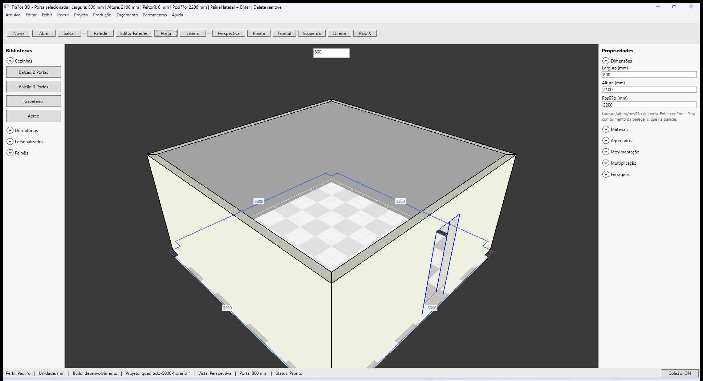
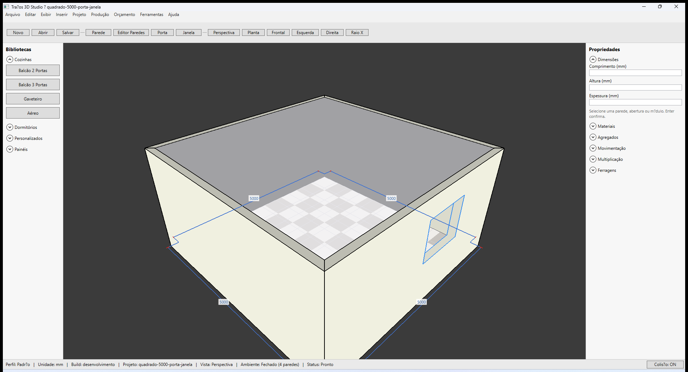

# Traços 3D — Inserir porta e janela

**Última revisão:** 20/06/2026

---

## Neste artigo

- Inserir **Porta** e **Janela** na face da parede
- Valores padrão e margens de borda
- Editar no painel **Propriedades → Dimensões**
- Excluir abertura selecionada

---

## Antes de começar

1. Ambiente com pelo menos uma parede (ideal: contorno **fechado**).
2. Fixture: `samples/quadrado-5000-horario.tracos` ou `samples/quadrado-5000-porta-janela.tracos`.

---

## Valores padrão

| Tipo | Largura | Altura | Peitoril | Margem nas extremidades |
|------|---------|--------|----------|-------------------------|
| **Porta** | 800 mm | 2100 mm | 0 (piso) | 50 mm |
| **Janela** | 1200 mm | 1000 mm | 1100 mm | 50 mm |

A parede precisa ter comprimento suficiente: porta padrão exige **≥ 900 mm** (800 + 2×50).

---

## Inserir porta

1. Clique **Porta** na barra superior.
2. Aponte a **face da parede** no viewport — o título mostra a posição em mm.
3. **Clique** para confirmar. O preview verde indica onde a abertura ficará.
4. **Esc** cancela o modo inserção.

### Porta inserida (perspectiva)

---

## Inserir janela

1. Clique **Janela**.
2. Clique na face de outra parede (ou outro ponto da mesma parede, sem sobrepor).
3. Confira no painel **Propriedades**:

| Campo | Janela |
|-------|--------|
| **Largura (mm)** | 1200 |
| **Altura (mm)** | 1000 |
| **Peitoril (mm)** | 1100 |

Para **porta**, o terceiro campo é **Posição (mm)** — distância do início da parede até a borda esquerda da abertura.

---

## Editar e excluir

- Selecione a abertura clicando sobre ela no viewport.
- Altere **Largura**, **Altura** ou **Peitoril/Posição** e pressione **Enter**.
- Se a abertura não cabe (sobreposição ou parede curta), a barra de título ou o painel avisa.
- **Delete** remove a abertura selecionada.

---

## Persistência

Aberturas são salvas no `.tracos` junto com as paredes. Use **Salvar projeto** e reabra para validar.

Fixture com porta + janela: `samples/quadrado-5000-porta-janela.tracos`

---

## Parede curva

Portas e janelas funcionam em paredes com **Flecha** — o recorte e o contorno seguem o arco tessellado (não a corda). Fixture: `samples/curva-porta.tracos`. Detalhes em [Paredes curvas (G2)](../paredes/05-encontros-geometria.md#paredes-curvas-g2).

---

## Atalhos

| Ação | Tecla |
|------|-------|
| Cancelar inserção | **Esc** |
| Confirmar valor no painel | **Enter** |
| Excluir abertura | **Delete** |
