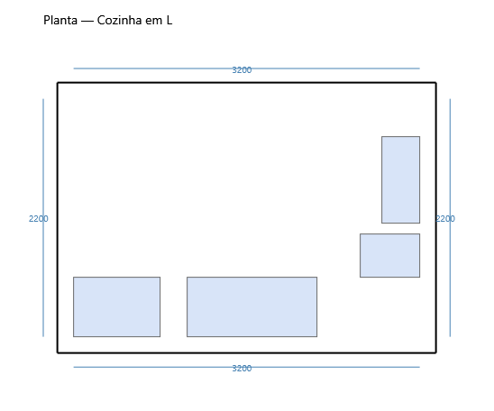

# Traços 3D — PDF técnico e planta com cotas

**Última revisão:** 20/06/2026

---

## Neste artigo

- Exportar **PDF técnico** (planta + elevações + peças)
- Exportar **PNG da planta com cotas**
- Coluna **Furos** (dobradiça Ø35 + minifix)

---

## PDF técnico

1. **Projeto → Exportar PDF técnico...** (ou na janela **Lista de peças**).
2. O PDF inclui:
   - **Planta baixa** com cotas das paredes (mm)
   - **Elevações** por orientação dos módulos
   - **Tabela de peças** com L × A × E, material e **furos** (dobradiça e minifix)

Fixture: `fase-2-cozinha-L.tracos`

---

## PNG planta com cotas

1. **Exibir → Exportar PNG planta com cotas...**
2. Gera imagem da planta com paredes, módulos e cotas em mm — útil para e-mail ou orçamento.

---

## Lista de peças

**Projeto → Lista de peças...** abre a grade com a mesma decomposição usada no PDF:

| Coluna | Conteúdo |
|--------|----------|
| Módulo / Peça | Nome do módulo e da peça |
| L × A × E | Dimensões em mm |
| Furos | Dobradiça, minifix cabo, minifix excêntrico |

Os furos são calculados automaticamente (`DoorHingeDrillingService`, `MinifixDrillingService`).
