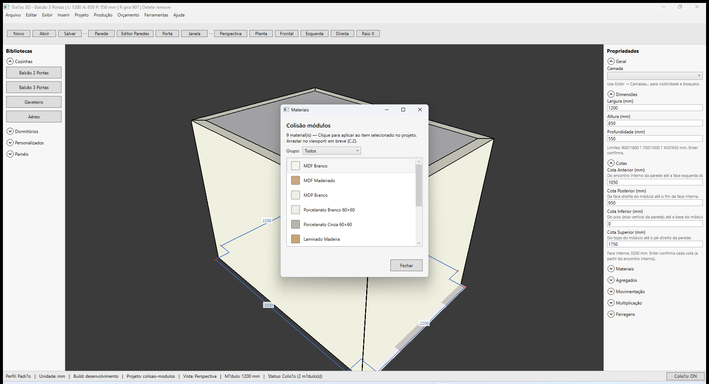

# Traços 3D — Janela de materiais

**Última revisão:** 19/06/2026  
**Referência Promob:** [Materiais](https://suporte.promob.com/hc/pt-br/articles/31121151669009-Promob-Materiais)

---

## Abrir

1. Menu **Exibir → Materiais...**
2. A janela lista todos os acabamentos com **amostra de cor** e nome.

---

## Grupos

Combo **Grupo:**

| Opção | Conteúdo |
|-------|----------|
| **Todos** | Módulos + pisos |
| **Módulos** | MDF, MDP (acabamento de móveis) |
| **Pisos** | Porcelanato, cerâmica, laminado, etc. |

---

## Modo de aplicação (C.3)

Combo **Modo** (ao lado de Grupo):

| Modo | Clique na lista | Arraste no viewport |
|------|-----------------|---------------------|
| **Automático** | Aplica ao item selecionado no projeto | Região > faixa > face livre > módulo > piso |
| **Módulo** | Módulo selecionado | Somente sobre módulo |
| **Face da parede** | Face interna/externa da parede selecionada | Área livre da face (ignora faixa/região) |
| **Faixa da parede** | Faixa selecionada no painel | Somente sobre faixa |
| **Região da parede** | Região selecionada no painel | Somente sobre região |
| **Piso** | Piso selecionado | Base do piso (fora de regiões) |
| **Região do piso** | Região do piso selecionada | Somente sobre região do piso |

No painel da parede (**Regiões → Componente**), o combo **Material da face** define o acabamento da **área livre** da face interna ou externa (sem faixa nem região no ponto).

---

## Selecionar e aplicar (clique)

1. Selecione no viewport um **módulo**, **face**, **faixa**, **região** (parede ou piso) ou o **piso**.
2. Na janela Materiais, **clique** no acabamento desejado.
3. O material é aplicado ao item selecionado (quando compatível) e fica como **material ativo**.

| Item selecionado | Materiais aceitos |
|------------------|-------------------|
| Módulo | Grupo **Módulos** |
| Piso / região do piso | Grupo **Pisos** |
| Faixa ou região de parede | Todos (preview unificado) |
| Face livre da parede (sem faixa/região) | Todos (preview unificado) |

Screenshot de aceite região: `docs/screenshots/materiais/fase-R12-drag-regiao.png`

---

## Arrastar no viewport (C.2)

1. Abra **Exibir → Materiais...** (pode deixar a janela aberta).
2. **Arraste** um material da lista para o viewport.
3. Solte sobre o alvo desejado:

| Onde soltar | Aplica em |
|-------------|-----------|
| Região azul na parede | Material da **região** |
| Faixa (entre linhas laranja) | Material da **faixa** |
| Face da parede (fora de faixa/região) | Material da **face livre** |
| Módulo | Acabamento do **módulo** |
| Região no piso | Material da **região do piso** |
| Piso (planta) | Material **base** do piso |

**Prioridade automática:** o ponto mais próximo da câmera vence (ex.: módulo na frente da parede). Entre região e faixa na mesma parede, **região** tem prioridade. Na área livre da face (sem faixa nem região), aplica na **face** da parede.

Camadas bloqueadas ou ocultas não recebem material.

---

## Copiar material (M3)

Fluxo estilo Promob: copiar de um item e colar em outros.

### Barra de ferramentas

1. Clique **Copiar material** (`MaterialCopyButton`).
2. Clique no **item de origem** no viewport (módulo, face, faixa, região ou piso com material).
3. Clique nos **destinos** para aplicar o mesmo material.
4. **Esc** ou novo clique em **Copiar material** cancela.

### Janela Materiais

| Botão | Ação |
|-------|------|
| **Copiar do selecionado** | Lê o material do item selecionado no projeto → material ativo |
| **Copiar no viewport** | Fecha a janela e entra no modo da barra (origem + destinos por clique) |

Depois de copiar, aplique ao destino clicando na lista, arrastando no viewport ou continuando no modo **Copiar material**.

---

## Fixture

`samples/quadrado-5000-camadas-faixas.tracos` — faixas e regiões com materiais distintos.
