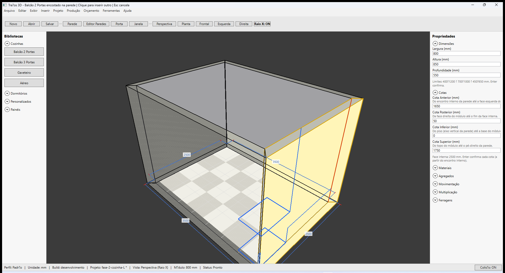
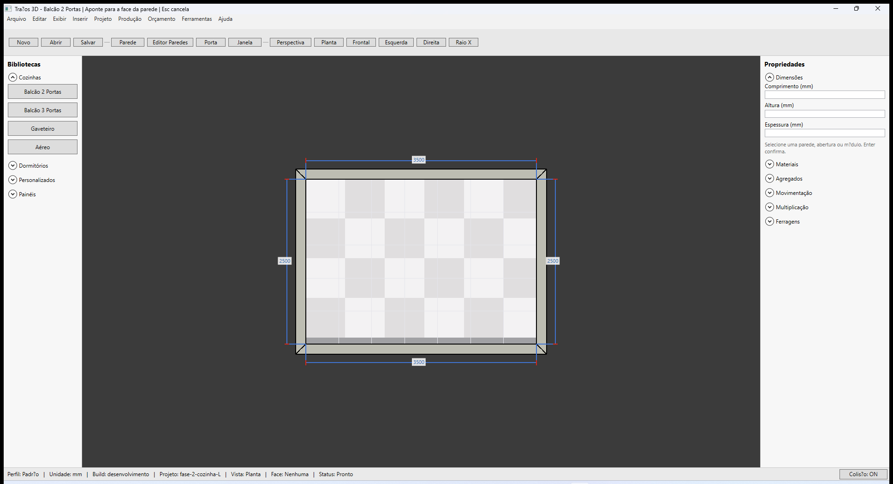

# Traços 3D — Inserir módulo na face interna

**Última revisão:** 10/07/2026

---

## Neste artigo

- Escolher um módulo na biblioteca **Cozinhas** ou **Dormitórios**
- **Arrastar** da biblioteca para a face interna (paridade Promob) — **soltar** confirma a inserção
- Apontar a **face interna** da parede (não o eixo)
- Conferir **cotas** na barra de status e no painel **Propriedades → Cotas**
- Ver preview + **cotas numéricas** no viewport (vermelho) e linhas de cota; parede alvo destacada

---

## Antes de começar

1. Abra `fase-2-cozinha-L.tracos` (**Abrir projeto**) ou monte um ambiente fechado com paredes em **Orientação Interna**.
2. Use vista **Planta** ou **Perspectiva**; **Raio X** ajuda a ver a face da parede.

---

## Inserir Balcão 2 Portas

### Arrastar e soltar (único modo — paridade Promob)

1. Na biblioteca **Cozinhas**, **pressione e arraste** **Balcão 2 Portas** até o viewport.
2. Sobre a **face interna** da parede: a parede fica **destacada**, aparece o **preview** do módulo e as **cotas ao vivo** (números vermelhos no viewport + linhas + valores Ant/Post/Base/Topo na barra de status).
3. Mova livremente na parede — **horizontal** (ao longo da face) e **vertical** (altura na face).
4. **Solte o botão** na parede — o módulo é **inserido e o modo encerra** (sem segundo clique). **Esc** cancela durante o arrasto.

> **Nota:** um clique simples no botão da biblioteca **não** inicia inserção; é necessário arrastar, como no Promob.

### Preview com cotas (face interna 2500 mm)

No painel **Propriedades**:

| Campo | Exemplo | Significado |
|-------|---------|-------------|
| **Cota Anterior** | 1650 | Distância da face interna (início) até a borda frontal do módulo |
| **Cota Posterior** | 50 | Distância da borda traseira do módulo até o fim da face interna |
| **Cota Inferior** | 0 | Altura do piso da parede até a base do módulo |
| **Cota Superior** | 1750 | Distância do topo do módulo até o pé-direito |

A linha de ajuda mostra **Face interna: 2500 mm**. A soma **Anterior + largura + Posterior** fecha com o comprimento da face interna (tolerância 1 mm).

Digite um valor em qualquer cota e pressione **Enter** para reposicionar o módulo.

---

## Cozinha em L (fixture)

Após abrir `fase-2-cozinha-L.tracos`, em **Planta** aparecem quatro módulos ao longo das faces internas (dois balcões no trecho sul, gaveteiro e aéreo no trecho leste).

| Módulo | Biblioteca |
|--------|------------|
| Balcão 2 Portas | Cozinhas |
| Balcão 3 Portas | Cozinhas |
| Gaveteiro | Cozinhas |
| Aéreo | Cozinhas |

---

## Outros módulos

- **Dormitórios:** Guarda-roupa 2P, Criado-mudo 2G, Cômoda 4G
- **Personalizados:** módulos importados via biblioteca `.tracos-lib`

Margem mínima nas extremidades da face interna: **0 mm** — o módulo pode encostar nas bordas da parede (Anterior/Posterior = 0).

---

## Mover módulo na parede (arrastar)

1. **Clique** em **qualquer** módulo já inserido na parede para selecioná-lo (lista da cena ou viewport).
2. **Pressione e arraste** sobre o módulo — ele se move na face da parede (horizontal e vertical).
3. **Cotas ao vivo** no viewport e na barra de status durante o arrasto.
4. **Solte** para confirmar. **Esc** cancela e restaura a posição anterior.
5. Com **Colisão: ON**, só colide com módulos do **mesmo plano** na parede (balcão×balcão, aéreo×aéreo). Aéreo passa livre sobre balcões.
6. **Atração magnética** (40 mm): ao aproximar, alinha bordas laterais; subindo alinha topos, descendo alinha bases.
7. Segure **Ctrl** para ignorar colisão e sobrepor módulos.

Módulos **bloqueados** ou em seleção múltipla não podem ser arrastados.

---

## Atalhos

| Ação | Tecla |
|------|-------|
| Ignorar colisão (sobrepor módulos) | **Ctrl** + arrastar |
| Cancelar inserção | **Esc** |
| Excluir módulo selecionado | **Delete** |
| Confirmar cota no painel | **Enter** |
