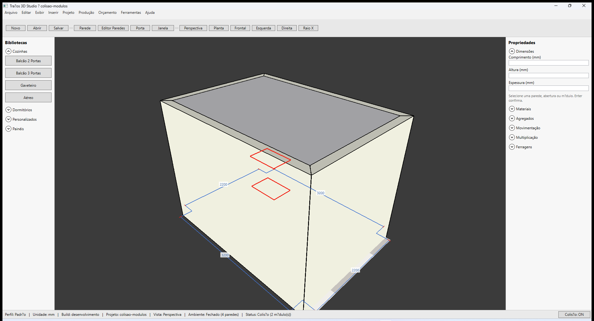

# Traços 3D — Colisão e exclusão de módulos

**Última revisão:** 20/06/2026

---

## Neste artigo

- Toggle **Colisão** na barra de status
- Aviso visual quando módulos se sobrepõem
- Excluir módulo com **Delete**

---

## Colisão ON/OFF

Na barra inferior, clique **Colisão: ON** ou **Colisão: OFF**.

| Estado | Comportamento |
|--------|----------------|
| **ON** | Detecta sobreposição entre módulos; status mostra `Colisão (N módulo(s))` |
| **OFF** | Não bloqueia inserção nem destaca colisão (útil para ajustes finos) |

Com **Colisão ON**, módulos em conflito exibem **contorno e malha vermelhos** no viewport.

Fixture com dois balcões sobrepostos: `samples/colisao-modulos.tracos`

---

## Ao inserir módulo

Com colisão ativa, o preview **não confirma** se a posição geraria sobreposição com outro módulo — o clique é ignorado e a barra de status indica colisão.

---

## Excluir módulo

1. Selecione o módulo no viewport (clique na face frontal).
2. Pressione **Delete** ou altere dimensões no painel até remover da cena.
3. **Esc** cancela modo de inserção sem colocar módulo.

---

## Auditoria de orçamento

O menu **Orçamento → Auditoria** lista módulos em colisão antes de gerar proposta comercial.

---

## Voltar ao índice

[Módulos — visão geral](./README.md)
