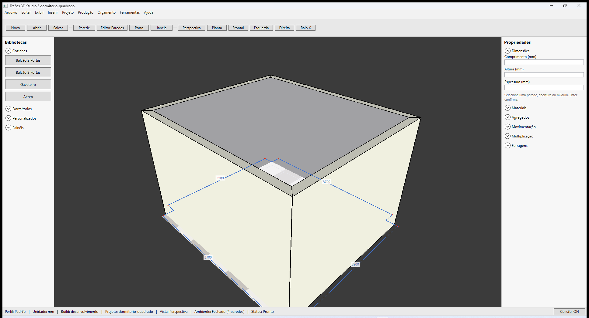

# Traços 3D — Módulos de dormitório

**Última revisão:** 20/06/2026  
**Referência Promob:** ambientação com módulos de dormitório encostados na parede

---

## Neste artigo

- Biblioteca **Dormitórios** na barra lateral
- Guarda-roupa, criado-mudo e cômoda
- Inserção na face interna (igual à cozinha)

---

## Módulos disponíveis

| Botão | Dimensões padrão (L × A × P) | Detalhe |
|-------|------------------------------|---------|
| **Guarda-roupa 2 Portas** | 1200 × 2100 × 550 mm | 2 portas |
| **Criado-mudo 2 Gavetas** | 500 × 550 × 450 mm | 2 gavetas |
| **Cômoda 4 Gavetas** | 800 × 850 × 450 mm | 4 gavetas |

Limites min/max respeitados pelo configurador (mesma lógica dos módulos de cozinha).

---

## Antes de começar

1. Ambiente fechado com pé-direito ≥ 2100 mm (guarda-roupa).
2. Fixture: `samples/dormitorio-quadrado.tracos` (3 módulos já posicionados).

---

## Inserir guarda-roupa

1. Expanda **Dormitórios** na biblioteca.
2. Clique **Guarda-roupa 2 Portas**.
3. Aponte a **face interna** da parede e **clique** para confirmar.
4. Confira cotas no painel **Propriedades → Cotas** (Anterior, Posterior, Inferior, Superior).

O fluxo é o mesmo descrito em [Inserir na face interna](./01-inserir-na-face-interna.md).

---

## Ambiente de exemplo (planta)

---

## Persistência

Módulos de dormitório são salvos no `.tracos` com `DefinitionId` (`guarda-roupa-2p`, `criado-mudo`, `comoda-4g`). Reabra `samples/dormitorio-quadrado.tracos` para validar.

---

## Voltar ao índice

[Módulos — visão geral](./README.md)
