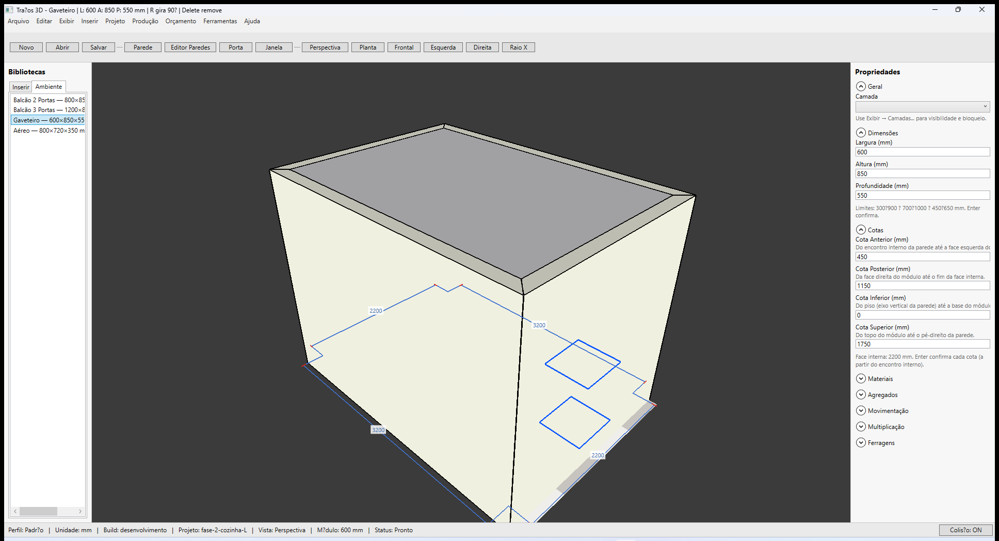
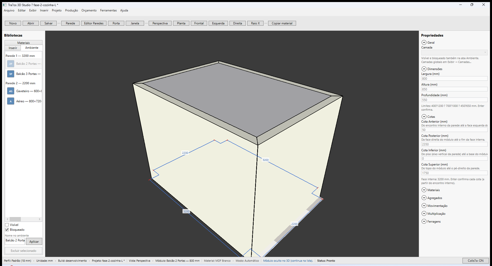

# Traços 3D — Biblioteca: abas Inserir e Ambiente

**Última revisão:** 26/06/2026  
**Referência Promob:** painel lateral — catálogo vs itens no ambiente

---

## Onde fica

Coluna esquerda **Bibliotecas**, com duas abas:

| Aba | Função |
|-----|--------|
| **Inserir** | Catálogo para colocar novos módulos (Cozinhas, Dormitórios, Personalizados) |
| **Ambiente** | Lista dos módulos **já inseridos** no projeto atual |

---

## Aba Inserir

Campo **Buscar** no topo filtra módulos por nome ou id (ex.: `gav`, `balcão`, `aereo`). Expanders sem correspondência ficam ocultos; vazio mostra *Nenhum módulo encontrado.*

Igual ao fluxo anterior:

1. Escolha o módulo (ex.: **Balcão 2 Portas**) — **clique** ou **arraste** para a face interna da parede.
2. **Clique** na face interna da parede no viewport (modo inserção), **ou solte** o módulo arrastado sobre a parede.
3. O módulo é posicionado e aparece na aba **Ambiente**.

Ver [Inserir na face interna](./01-inserir-na-face-interna.md).

---

## Aba Ambiente

Mostra cada instância com **miniatura** (cor por categoria + hint de portas/gavetas) e o rótulo:

`{nome do catálogo ou customizado} — L×A×P mm`

Os módulos ficam **agrupados por cômodo e parede**:

- **Cômodo 1 — Cozinha** (nome editável em **Projeto → Dados da obra → Ambiente** quando há um único cômodo)
  - **Parede 1 — 4850 mm** → módulos…
- Vários cômodos: **Projeto → Adicionar cômodo...** e atribua cada parede em **Propriedades → Outras → Cômodo**

Exemplo com um cômodo (só por parede): agrupamento anterior em `fase-A3-lista-agrupada-parede.png`.

Exemplo: `Balcão 2 Portas — 800×850×550 mm`

| Ação | Resultado |
|------|-----------|
| **Clique** em um item | Seleciona o módulo no viewport e abre **Propriedades** à direita |
| **Duplo-clique** em um item | Seleciona o módulo e **enquadra a câmera** no volume dele |
| **Excluir selecionado** (aba Ambiente) | Remove um ou **vários** módulos selecionados |
| **Ctrl+clique** / **Shift+clique** | Multi-seleção na lista (destaque de todos no viewport) |
| **Nome no ambiente** + **Aplicar** | Renomeia a instância — só com **1** selecionado (persiste no `.tracos`) |
| **Visível** / **Bloqueado** | Oculta no 3D ou impede edição/exclusão — vale para todos os selecionados |
| **Enter** no campo | Aplica o nome (igual ao botão **Aplicar**) |
| **Delete** (com seleção) | Remove todos os módulos selecionados |
| Inserir novo módulo | Item novo aparece na lista automaticamente |
| Abrir projeto `.tracos` | Lista carrega os módulos salvos (inclui nomes customizados) |

Exemplo após renomear: `Balcão pia L — 800×850×550 mm` (nome customizado + dimensões).

Itens ocultos continuam na lista (texto `(oculto)` e opacidade reduzida). Bloqueados mostram `(bloqueado)` e não podem ser editados no painel Propriedades nem excluídos até desmarcar **Bloqueado**.

A seleção na lista e no viewport ficam sincronizadas: clicar no 3D destaca o item na lista (quando a aba Ambiente estiver visível).

---

## Fixture sugerido

`fase-2-cozinha-L.tracos` — quatro módulos em L; abra a aba **Ambiente** para ver a lista completa.

---

## O que ainda não está nesta versão

- Fotografia realista / render 3D na miniatura (apenas swatch + hint)
- Detecção automática de cômodo por geometria fechada (hoje: atribuição manual por parede)

Ver [Promob × Traços — biblioteca](./07-promob-paridade-biblioteca.md).
