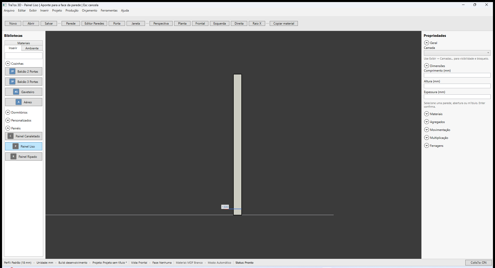

# Traços 3D — Biblioteca Painéis (L7)

**Última revisão:** 26/06/2026  
**Referência Promob:** [Inserir módulo](https://suporte.promob.com/hc/pt-br/articles/31121700311697-Promob-Inserir-M%C3%B3dulo) · [Painel canaletado](https://suporte.promob.com/hc/pt-br/articles/31118981013393-KB-Dica-Promob-Como-inserir-painel-canaletado) · [Painel na parede](https://suporte.promob.com/hc/pt-br/articles/31118956464657-KB-Dica-Promob-Como-inserir-painel-na-parede)

---

## Neste artigo

- Expander **Painéis** na aba **Inserir**
- Painel Liso, Canaletado e Ripado
- Inserção na **face interna** da parede (espessura 18 mm)

---

## Módulos disponíveis

| Botão | Dimensões padrão (L × A × P) | Uso |
|-------|------------------------------|-----|
| **Painel Liso** | 800 × 2100 × 18 mm | Revestimento liso na parede |
| **Painel Canaletado** | 800 × 2100 × 18 mm | Elemento decorativo com frisos |
| **Painel Ripado** | 600 × 1800 × 18 mm | Ripas verticais (sala/decorativo) |

Largura, altura e posição editáveis no painel **Propriedades** (Cotas e dimensões). Profundidade fixa em **18 mm**.

---

## Inserir painel na parede

1. Aba **Inserir** → expanda **Painéis**.
2. Clique no tipo desejado (ex.: **Painel Liso**).
3. Aponte a **face interna** da parede e **clique** para confirmar.
4. Ajuste **Cotas** (Inferior, Superior, Anterior, Posterior) se necessário.
5. Aplique **Material** no painel Propriedades ou arraste da aba Materiais.

O painel encosta na face interna a partir do **piso** da parede (diferente do **Aéreo**, que flutua acima do balcão).

---

## Lista Ambiente

Painéis inseridos aparecem na aba **Ambiente** com rótulo `Nome — L×A×P mm`, como os demais módulos.

---

## Persistência e produção

- `DefinitionId`: `painel-liso`, `painel-canaletado`, `painel-ripado`
- Lista de peças: **1 chapa** por painel (`Painel`, espessura 18 mm)
- Orçamento: preço base por tipo na tabela comercial

---

## Voltar ao índice

[Módulos — visão geral](./README.md)
