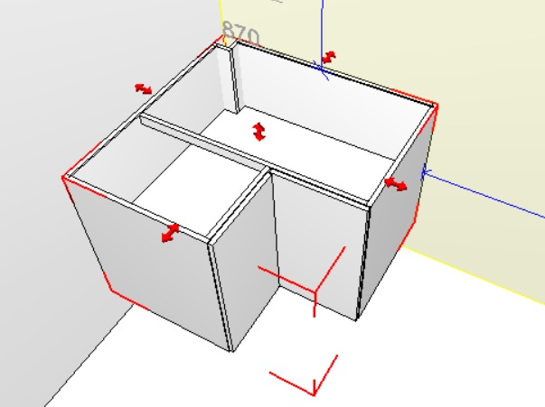
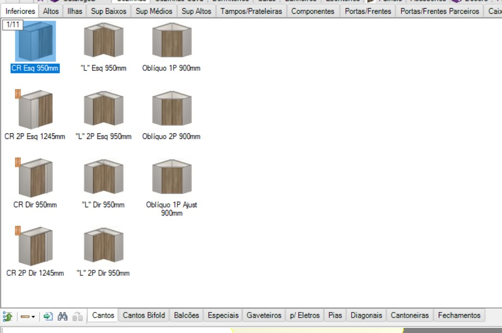
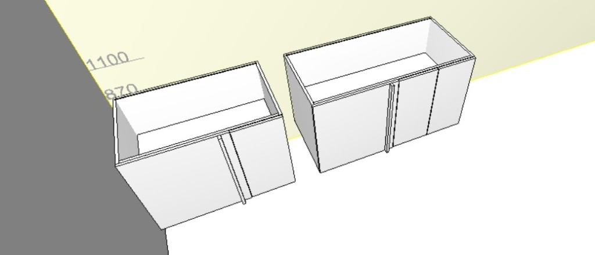
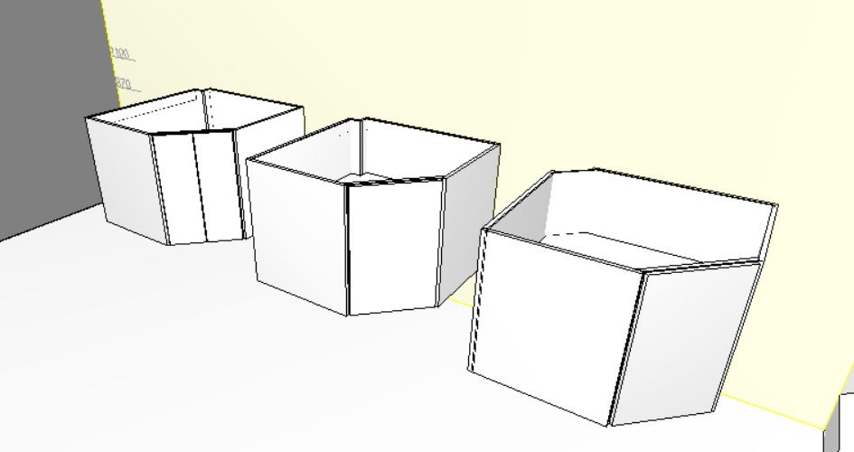
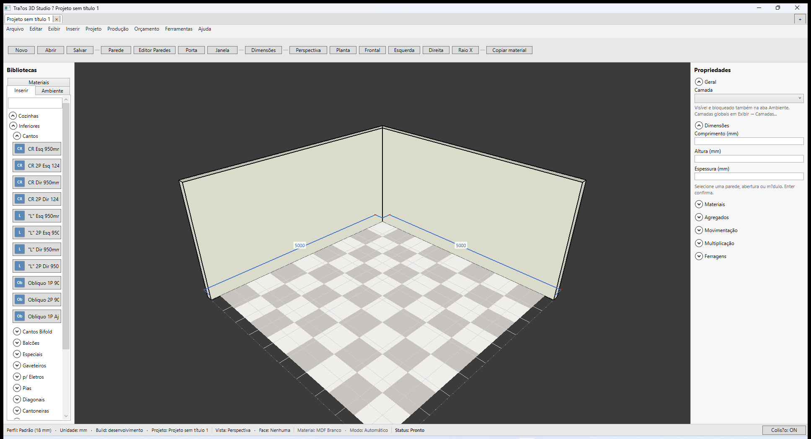

# Promob × Traços — Biblioteca e módulos (Bloco B)

**Última revisão:** 14/07/2026 (hierarquia Cozinhas alinhada ao Promob)  
**Plano:** [PLANO-EXECUCAO.md](../../PLANO-EXECUCAO.md) · **V3:** [ESCOPO-V3-PROMOB-COMPLETO.md](../../ESCOPO-V3-PROMOB-COMPLETO.md)

Manual Traços: [README.md](./README.md)

**Status B.1:** ✅ concluído · **B.2:** ✅ abas Inserir / Ambiente (19/06/2026) · **L2b:** ✅ subpastas Cozinhas (14/07/2026)

---

## Hierarquia Cozinhas → Inferiores (Promob Plus × Traços)

Fonte: screenshots Promob Plus 5.60 (usuário 14/07/2026) + [Montagem caixa Inferior](https://suporte.promob.com/hc/pt-br/articles/31121595552145).

**Nível 3 sob Inferiores** (ordem obrigatória):

1. Cantos · 2. Cantos Bifold · 3. Balcões · 4. Especiais · 5. Gaveteiros · 6. p/ Eletros · 7. Pias · 8. Diagonais · 9. Cantoneiras · 10. Fechamentos

Cada SKU usa `ModuleShapeKind` (CR, L, Oblíquo, extrator, adega, eletro, diagonal, cantoneira, fechamento…) para silhueta 3D distinta.

**Canto Reto (14/08/2026):** caixaria idêntica ao balcão reto. Frentes: porta(s) · **Fechamento** (tipo **Lateral** = aleta na dobradiça; cega ≈ profundidade para alinhar com o módulo sequencial da parede perpendicular; inicia na frente falsa) · frente falsa · distanciador opcional. Ref: [Montagem Caixa Inferior](https://suporte.promob.com/hc/pt-br/articles/31121595552145).

**Canto L 2P (24/07/2026):** paramétrico — laterais por profundidade de lado; base/prateleira L (Inteira/Recortada); **nó Canto** (`cl-tipo` Travessas / Sem / Invertidas) com travessas `cl-larg-trav`×`cl-prof-trav`, fundos com `cl-aftv` + avanços Inferior; 4 sarrafos; **2 portas individuais** (`Porta dir.` / `Porta esq.`) à frente da caixaria com `cl-folga-pa`/`cl-folga-pb` e bordas Frentes\|Portas. Aplica em L 2P Esq e Dir. Sem Scale. Ref: [Canto L bases](https://suporte.promob.com/hc/pt-br/articles/31119362693777).

**Propriedades Avançado — Largura A/B e Medida A/B (24/07/2026):** no painel direito, Canto L expõe **Largura A** / **Largura B** (comprimentos das asas) e **Medida A** / **Medida B** (profundidades, paridade Promob). Cada campo aplica de forma independente. Persistidos em `.tracos` (`cornerLarguraA/B`, `cornerMedidaA/B`).

---

## Artigos Promob de referência

| Tema | URL |
|------|-----|
| Plus — índice geral | [31123224474257](https://suporte.promob.com/hc/pt-br/articles/31123224474257-Plus) |
| Inserir módulos (face interna) | Coberto em [01-inserir-na-face-interna.md](./01-inserir-na-face-interna.md) |
| Biblioteca / catálogo de módulos | Plus — ambientação (painel lateral de bibliotecas) |

---

## Revisão cruzada — `MainWindow.xaml` (01/07/2026)

Coluna esquerda (`LeftLibraryBorder`):

| Elemento XAML | Comportamento hoje |
|---------------|-------------------|
| `TabControl` | Abas **Inserir** \| **Ambiente** (`LibraryTabInsert`, `LibraryTabScene`) |
| Aba **Inserir** | Expanders Cozinhas, Dormitórios, Personalizados, **Painéis** (L7) + campo **Buscar** (L4) |
| Aba **Ambiente** | `SceneModuleList` — árvore **Cômodo → Parede → módulos** (A3c); Visível/Bloqueado (A4); renomear (A5); multi-seleção (A8) |
| Guia **Materiais** | `MaterialsPanel` na mesma coluna (Bloco C) |
| Inserção | Botão ou **arraste** (L6) da aba Inserir → face da parede |

`AutomationId` dos botões de inserção (MCP): `ModuleBalcony2Button`, …, `ModuleChestButton`, `ModulePanelPlainButton`, `ModulePanelGroovedButton`, `ModulePanelSlattedButton`.

Editor de catálogo: menu **Ferramentas → Gerenciar biblioteca...** → `LibraryEditorWindow` (`AutomationId="LibraryEditorWindow"`) — módulos personalizados, logo e nome da marcenaria para orçamento. **Recarregar** sem recompilar: **Ferramentas → Recarregar biblioteca** (`ReloadLibraryMenuItem`) ou **Recarregar do disco** no editor (`LibraryReloadFromDiskButton`). Entradas com **mesmo id** de módulo built-in **sobrescrevem** nome/dimensões no catálogo lateral. Arquivo padrão: `%AppData%\Tracos3DStudio\biblioteca.tracos-lib`. Amostra: `samples/biblioteca-override.tracos-lib`.

Fluxo de inserção: botão na biblioteca → modo “aponte para a face” → clique na parede → `SelectModule` após colocar. Ver [01-inserir-na-face-interna.md](./01-inserir-na-face-interna.md).

---

## Biblioteca lateral (inserir)

| # | Promob | Traços 3D | Status | Entrega |
|---|--------|-----------|--------|---------|
| L1 | Painel **Bibliotecas** com categorias | Coluna `LeftLibraryBorder` | ✅ | Fase 2 / 6 |
| L2 | Categorias por ambiente (Cozinhas, Dormitórios…) | Expanders Cozinhas / Dormitórios / Personalizados | ✅ | Fase 2 / 6 |
| L2b | Subpastas Promob (Inferiores → Balcões/Gaveteiros/Cantos…) | `LibraryGroup`/`LibrarySubGroup` + expanders aninhados em `CozinhasLibraryHost` | ✅ | **14/07/2026** |
| L3 | Ícones / miniatura do módulo | Swatch + hint (2P, 4G, A) na biblioteca e lista Ambiente | ✅ | L3 |
| L4 | Busca / filtro no catálogo | Campo **Buscar** na aba Inserir (nome ou id) | ✅ | L4 |
| L5 | Módulos **personalizados** | Expander Personalizados + `LibraryEditorWindow` | ✅ | Fase 6 |
| L6 | Arrastar da biblioteca para o 3D | Arraste botão da aba Inserir → face da parede | ✅ | L6 |
| L7 | Biblioteca **Painéis** | Expander + 3 tipos (Liso, Canaletado, Ripado) | ✅ | **V2.1** 26/06/2026 |
| L8 | Abas **Inserir** / **Ambiente** na lateral | `TabControl` Inserir + Ambiente | ✅ | **B.2** |
| L9 | Catálogo online / Connect Promob | Catálogo local embarcado | ⬜ | **V3.5b** |
| L10 | Atualizar catálogo sem recompilar | `.tracos-lib` + **Recarregar biblioteca** / editor (override built-in + custom) | ✅ | **V2.6** 26/06/2026 |

---

## Engenharia de modulação / Construtor (V3.7)

| # | Promob | Traços 3D | Status | Gate |
|---|--------|-----------|--------|------|
| EM1 | **Construtor de Armários** — estrutura e vãos | Módulos prontos; L×A×P + portas/gavetas | ⬜ | **V3.7b** |
| EM2–EM8 | Divisórias, interior, paramétrico, regras peças/usinagem | `ModuleDecompositionService` fixo em C# | ⬜ | **V3.7b–e** (schema ✅ **V3.7a**) |

**Spike Promob Plus 5.60 ✅** 02/07/2026 — ver tabela assinada em [08-engenharia-modulacao-construtor.md](./08-engenharia-modulacao-construtor.md).

---

## Lista do ambiente (itens no projeto)

| # | Promob | Traços 3D | Status | Entrega |
|---|--------|-----------|--------|---------|
| A1 | Lista / árvore de **itens inseridos** | Aba **Ambiente** — `SceneModuleList` | ✅ | **B.2** |
| A2 | Selecionar item na lista → destaque no 3D | Clique → `SelectModule` | ✅ | **B.2** |
| A3 | Agrupar por cômodo / parede | Lista **Cômodo N — nome** → **Parede N** (+ **Sem parede**) | ✅ | **V2.3** + **V2.7** 26/06/2026 |
| A4 | Ocultar / bloquear item na lista | Checkboxes **Visível** / **Bloqueado** na aba Ambiente (+ camadas globais) | ✅ | **V2.5** 26/06/2026 |
| A5 | Renomear instância na lista | Campo **Nome no ambiente** + **Aplicar** | ✅ | **V2.2** 26/06/2026 |
| A6 | Contagem / resumo no ambiente | Rótulo L×A×P por item na lista | ✅ | **B.2** |
| A7 | Duplo-clique na lista → enquadra câmera | Duplo-clique na aba **Ambiente** → `FrameOnBounds` | ✅ | B.2 cauda |
| A8 | Multi-seleção na lista | `SelectionMode=Extended` — Ctrl/Shift + **Delete** exclui todos | ✅ | **V2.4** 26/06/2026 |
| A9 | Excluir pela lista | Botão **Excluir selecionado** na aba Ambiente + Delete | ✅ | B.2 cauda |
| A10 | Sincronizar seleção lista ↔ viewport | Clique lista ou 3D | ✅ | **B.2** |

---

## Inserção e edição (já entregue — referência)

| # | Promob | Traços 3D | Status |
|---|--------|-----------|--------|
| I1 | Encostar na face interna | Preview + snap parede | ✅ |
| I2 | Cotas anterior/posterior/inferior/superior | Painel Cotas | ✅ |
| I3 | Colisão entre módulos | Toggle Colisão | ✅ |
| I4 | Girar 90° (**R**) | ✅ | ✅ |
| I5 | Delete remove instância | ✅ | ✅ |
| I6 | Dimensões min/max por tipo | ✅ | ✅ |
| I7 | Camada do módulo | Combo Geral + janela Camadas | ✅ A.5 |
| I8 | Material do módulo | Combo + janela Materiais + drag C.2 | ✅ |
| I9 | Persistência no `.tracos` | ✅ | ✅ |
| I10 | Orçamento / lista de peças por módulo | ✅ | ✅ |

---

## Resumo executivo

| Área | Linhas 🟡/⬜ principais | Status V1 |
|------|-------------------------|-----------|
| Catálogo inserir | — | ✅ L3/L4/L6/L7/L8/L10 · V2.1 Painéis |
| Lista ambiente | — | ✅ B.2 · ✅ A3 · ✅ A5 · ✅ A8 · ✅ A4 · ✅ L10 |
| Já alinhado Promob | I1–I10, L1–L6 | ✅ |

---

## Decisão — escopo B.2 **congelado** (B.1)

Implementar na **próxima** entrega de código (**B.2**), sem expansão de escopo:

### Inclui (checklist fechado) — ✅ B.2 entregue

- [x] `TabControl` na coluna `LeftLibraryBorder`: abas **Inserir** | **Ambiente**
- [x] Aba **Inserir**: conteúdo atual intacto (expanders Cozinhas, Dormitórios, Personalizados, Painéis)
- [x] Aba **Ambiente**: `ListBox` ligada a `_project.Modules`
- [x] Rótulo de item: `{DisplayName do catálogo} — L×A×P mm`
- [x] Clique simples na lista → `SelectModule` + painel Propriedades à direita
- [x] Lista atualiza ao inserir ou excluir módulo
- [x] `AutomationId`: `LibraryTabInsert`, `LibraryTabScene`, `SceneModuleList`
- [x] Testes: `SceneModuleListServiceTests`
- [x] Manual: `04-biblioteca-abas-ambiente.md`

### Caudas B.2 — ✅ entregues (V1 + V2)

- [x] Duplo-clique na lista → enquadra câmera (A7)
- [x] Ícones / miniaturas (L3)
- [x] Busca e filtro no catálogo (L4)
- [x] Arrastar da biblioteca para o viewport (L6)
- [x] Agrupamento por parede (A3) e **cômodo** (A3c)
- [x] Renomear instância (A5)
- [x] Multi-seleção (A8)
- [x] Excluir pela lista (A9)
- [x] Catálogo Painéis (L7)
- [x] Recarregar biblioteca (L10)

### Backlog V3 (catálogo / plataforma)

- Connect / catálogo online (L9) — **V3.5b**
- Mais ambientes (banheiro, lavanderia…) — **V3.3**
- Ver [ESCOPO-V3-PROMOB-COMPLETO.md](../../ESCOPO-V3-PROMOB-COMPLETO.md)

---

## Fixture e regressão

| Artefato | Uso |
|----------|-----|
| `fase-2-cozinha-L.tracos` | 4 módulos — lista Ambiente B.2 |
| `samples/dormitorio-quadrado.tracos` | 3 módulos dormitório |
| `samples/colisao-modulos.tracos` | Dois balcões — seleção na lista |
| `docs/screenshots/modulos/fase-B.2-A7-duplo-clique-ambiente.png` | Aceite A7 — duplo-clique enquadra módulo |
| `docs/screenshots/modulos/fase-B.2-A9-excluir-lista.png` | Aceite A9 — excluir módulo pela lista |
| `docs/screenshots/modulos/fase-B.2-L3-icones-biblioteca.png` | Aceite L3 — miniaturas Inserir + Ambiente |
| `docs/screenshots/modulos/fase-B.2-L4-busca-catalogo.png` | Aceite L4 — filtro no catálogo Inserir |
| `docs/screenshots/modulos/fase-A8-multi-selecao-ambiente.png` | Aceite A8 — multi-seleção na lista |
| `docs/screenshots/modulos/fase-A3-lista-agrupada-parede.png` | Aceite A3 — lista agrupada por parede (V2.3) |
| `docs/screenshots/modulos/fase-A3c-lista-comodo-parede.png` | Aceite A3c — lista agrupada por cômodo e parede (V2.7) |
| `docs/screenshots/modulos/fase-A5-campo-renomear.png` | Aceite A5 — campo Nome no ambiente |
| `docs/screenshots/modulos/fase-L7-painel-inserido-propriedades.png` | Aceite L7 — biblioteca Painéis + modo inserir |
| `docs/screenshots/modulos/fase-L7-biblioteca-paineis.png` | Aceite L7 — aba Inserir |
| `docs/screenshots/modulos/fase-L10-recarregar-biblioteca.png` | Aceite L10 — override built-in + custom após recarregar |

---

## V1 / V2 / V3

**B.2 + caudas + V2 ✅** (L3–L10, A3–A5, A8, A3c). **V1+V2 fechados** 26/06/2026.

**Trilha ativa:** [ESCOPO-V3-PROMOB-COMPLETO.md](../../ESCOPO-V3-PROMOB-COMPLETO.md) — L9, expansão catálogo, **V3.7 engenharia modulação**.
