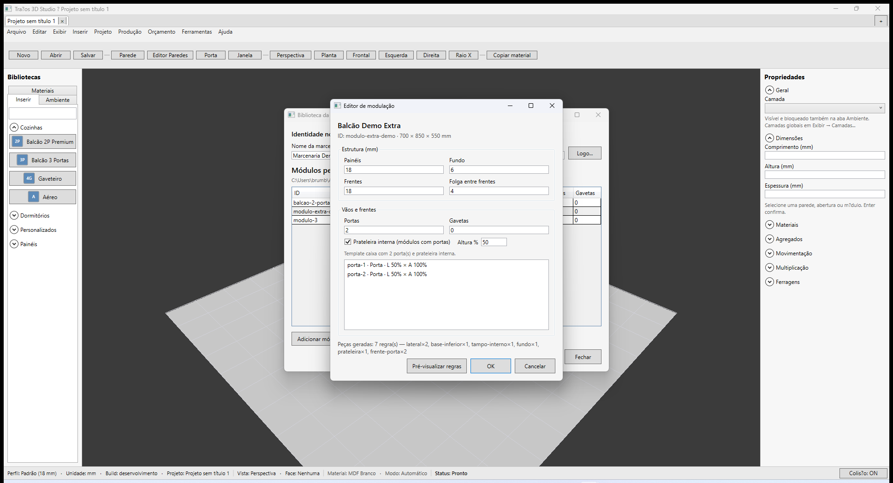
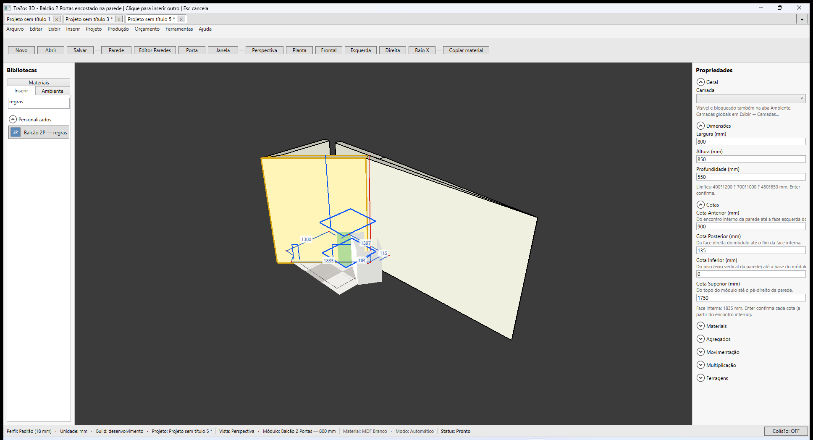

# Promob × Traços — Engenharia de modulação e Construtor de Armários (V3.7)

**Última revisão:** 02/07/2026 — **V3.7-spike ✅** (Promob Plus 5.60.12.4 ao vivo + MCP)  
**Plano:** [PLANO-EXECUCAO.md](../../PLANO-EXECUCAO.md) · **V3:** [ESCOPO-V3-PROMOB-COMPLETO.md](../../ESCOPO-V3-PROMOB-COMPLETO.md)

Manual Traços (futuro): este artigo descreve o **alvo V3.7** — hoje o Traços entrega parametria **caixa** (L×A×P + portas/gavetas) com regras de peças **fixas em C#**.

---

## Artigos Promob de referência

| Tema | URL |
|------|-----|
| Plus — índice (Construtor de armários) | [31123224474257](https://suporte.promob.com/hc/pt-br/articles/31123224474257-Plus) |
| Construtor de Armários | [31121711014545](https://suporte.promob.com/hc/pt-br/articles/31121711014545-Construtor-de-Arm%C3%A1rios) |
| Configurar estrutura do armário | [31119877118609](https://suporte.promob.com/hc/pt-br/articles/31119877118609-Promob-Configurar-a-estrutura-do-arm%C3%A1rio) |
| Configurador de dimensões | Plus — seção homônima |
| Plugin Builder — documentação | [31121872122001](https://suporte.promob.com/hc/pt-br/articles/31121872122001-Plugin-Builder-Gera%C3%A7%C3%A3o-de-Documentos) |

---

## O que o Promob chama de engenharia de modulação

No Plus/Start/Maker, **Construtor de Armários** permite:

1. **Estrutura** — vãos, laterais, divisórias, espessuras; redimensionar mantendo lógica interna.
2. **Divisões / interior** — prateleiras, vãos verticais/horizontais.
3. **Gavetas e portas** — recuos, frentes, configuração por vão.
4. **Relações paramétricas** — alterar largura/altura recalcula vãos, frentes e peças (não só escala visual).
5. **Documentação/produção** — lista de peças, furos e usinagens derivadas da **regra do módulo**, não só de um tipo fixo no código.

Bibliotecas de **fabricante** embutem essas regras; o projetista edita instâncias no ambiente.

---

## Traços hoje (baseline V1/V2)

| Camada | Implementação | Limite |
|--------|---------------|--------|
| Template | `ModuleDefinition` — L×A×P, min/max, portas, gavetas, categoria | Sem árvore estrutural |
| Catálogo custom | `LibraryEditorWindow` + `.tracos-lib` | Metadados; **sem** regras de construção |
| Malha 3D | Gerada por tipo no código | Não configurável pelo usuário |
| Peças / corte | `ModuleDecompositionService` | Regras **hardcoded** (caixa + frentes) |
| Perfil projeto | `ConstructionProfiles` (15/18/25 mm) | Global ao projeto, não por módulo |
| Override | L10 — recarregar `.tracos-lib` | Sobrescreve nome/dims; não engenharia |

**Conclusão:** parametria **comercial** ✅; engenharia de modulação **configurável** ⬜ → trilha **V3.7**.

---

## V3.7-spike — observação Promob Plus (02/07/2026)

**Ambiente:** Promob Plus **5.60.12.4** · WinApp MCP · screenshots em `docs/screenshots/modulos/V3.7-spike/`.

### Dois fluxos distintos no Promob

| Fluxo | Onde | O que faz |
|-------|------|-----------|
| **Usar módulo pronto** | Navegador **Módulos** (topo) → Cozinhas → Inferiores → Cantos… | Catálogo com regras **embutidas** na biblioteca de fabricante (ex.: `CR Esq 950mm`, `Ct 2Gav 950mm`, `Oblíquo 1P Ajust 900mm`) |
| **Construir armário** | **Editar → Construir Armário** | Modo de desenho no ambiente 3D para criar armário **do zero** com estrutura/vãos (Construtor) |

> No Plus do usuário, os itens do catálogo são **templates fechados** — a engenharia está no arquivo da biblioteca, não num editor flat visível ao projetista. O **Construtor** é o caminho para geometria estrutural customizada.

### UI observada (MCP)

| Área | Elementos relevantes |
|------|---------------------|
| **Navegador Módulos** | Abas: Catalog3D, Cozinhas, Dormitórios, Banheiros… · sub-abas Inferiores, Gaveteiros, Cantos… · grade horizontal de ícones com contador `13/15` |
| **Propriedades** | Painel **Ferramentas — Propriedades** · abas **Propriedades** / **Avançado** · seções **Camada**, **Dimensões**, **Cotas**, **Materiais** conforme seleção |
| **Ferramentas** | **Exibir → Ferramentas → Lista de Módulos** · **Ferramentas → Configurar Dimensões…** |
| **Editar** | **Construir Armário** · **Converter para → Painel Horizontal** (instância) · **Réguas** com presets Kitchens/Bedrooms |
| **Orçamento / produção** | **Orçamento → Listagem → Montado / Explodido / Chapas** — lista derivada das regras do módulo |
| **Inserção** | Toolbar orientação: Horizontal, Vertical, Horizontal no Plano, Vertical no Plano |

### Screenshots do spike

| Arquivo | Conteúdo |
|---------|----------|
| `promob-construir-armario-modo.png` | Navegador de módulos + ambiente 3D (baseline) |
| `promob-modulo-selecionado-geral.png` | Painel propriedades **Avançado** (ex.: parede — Comprimento, Espessura, Pé-direito) |

### Implicação para o Traços (V3.7)

O Traços precisa de **três camadas** (hoje só tem a primeira parcialmente):

1. **Catálogo** — módulos prontos (✅ V1/V2; expandir V3.3).
2. **Instância** — L×A×P + materiais no painel (✅ Traços hoje).
3. **Regras de modulação** — árvore estrutural + decomposição data-driven no `.tracos-lib` (✅ **V3.7a** schema · ✅ **V3.7b** editor · ✅ **V3.7c** motor · ✅ **V3.7d** usinagem/fita) + runtime (⬜ V3.7e).

**Próximo gate de código:** **V3.7f Fase 3c.2** (continuar árvore de Montagem da Caixa — fixações/divisória/cantos) · Cozinhas e Dormitórios ainda **longe de completos** (ver mapa Promob em `09-configurador-dimensoes.md`).

### Configurador de Dimensões (V3.7f)

**Artigo dedicado:** [09-configurador-dimensoes.md](./09-configurador-dimensoes.md)

| Fase | Seções no Traços | Promob |
|------|------------------|--------|
| 1 ✅ | Medidas Máximas · Dimensões Externas (subset) | subset |
| 2 ✅ | Chapas · Montagem caixa · Frentes\|Portas · Gavetas | subset |
| 3a ✅ | Dimensões Externas **completas** Cozinhas + Dormitórios | A–O / A–J |
| 3b ✅ | Chapas — árvore por tipo de peça | B/C/D por peça |
| 3c.1 🟡 | Montagem — fatia inicial (fundo + fixações) | Fundo · Sarrafo · Prateleira |
| 3c.2+ ⬜ | Resto Montagem/Cantos · Superior/Alto · Eletros · Frentes · Gavetas · Cava | árvore Promob completa |

**Motor Fase 2:** `CreateEffectiveRules` + sync `PanelThicknessMm`/`BackThicknessMm` no projeto.

### Editor de modulação (V3.7b ✅)

**Caminho:** **Ferramentas → Gerenciar biblioteca…** → selecionar módulo → **Editar modulação…**

| Seção | Campos |
|-------|--------|
| **Estrutura** | Espessura painéis, fundo, frentes, folga entre frentes |
| **Vãos** | Quantidade de portas ou gavetas (mutuamente exclusivo) |
| **Interior** | Prateleira interna (módulos com portas) + altura % |
| **Pré-visualizar** | Lista de vãos (`frontBays`) e resumo de peças |

**AutomationIds:** `ModulationEditorWindow`, `LibraryEditModulationButton`, `ModulationEditorOkButton`.

---

### Schema `modulationRules` (V3.7a ✅)

Campo opcional em cada módulo do `.tracos-lib` (`schemaVersion` **2**):

| Campo | Tipo | Descrição |
|-------|------|-----------|
| `rulesVersion` | int | Versão das regras (hoje **1**) |
| `templateKind` | string | `"box"` (extensível: canto, obliquo…) |
| `structure` | objeto | Espessuras, `frontBays`, `shelves` |
| `pieces` | array | Regras de peças (`role`, dimensões por `source`) |

**Fixture:** `samples/modulacao-balcao-regras.tracos-lib` · **Preset C#:** `ModulationRulesPresets.CreateStandardBox(doors, gavetas)`.

Migração **v1→v2:** arquivos antigos carregam sem `modulationRules`; ao salvar passam para `schemaVersion: 2`.

---

### Motor paramétrico (V3.7c ✅)

Quando o módulo possui `modulationRules.pieces` no catálogo, o runtime usa o motor data-driven:

| Componente | Função |
|------------|--------|
| `ModulationDimensionResolver` | Avalia dimensões (`ModuleWidth`, `InnerWidth`, espessuras…) com escala/offset |
| `ModulationDecompositionService` | Lista de peças para orçamento/corte |
| `ModulationFrontLayout` + `ModuleMeshBuilder` | Vãos (`frontBays`) → frentes no viewport 3D |

**Fluxo:** alterar **Largura** no painel de propriedades → `ModuleInstance.SetDimensions` → mesh e lista de peças recalculam pelas regras.

Módulos **sem** regras continuam no caminho legado (`DoorCount`/`DrawerCount` fixos).

**Testes:** `ModulationParametricTests` — resize 600→800 mm (base interna 564→764 mm; frente porta 296→396 mm).

---

### Usinagem e fita por template (V3.7d ✅)

Cada peça em `modulationRules.pieces` pode definir fita de borda e padrão de furação:

| Campo | Tipo | Descrição |
|-------|------|-----------|
| `edgeBanding` | objeto | `{ front, back, top, bottom }` — fita por face. Omitido = heurística legada por nome |
| `drillingPattern` | string | `auto` · `none` · `lateral` · `horizontal` · `hingeDoor` |

**Fluxo:** decomposição (`ModulationDecompositionService`) → `PartPiece` com spec → `EdgeBandService` / `CabinetDrillingService` → lista de peças e plano de corte.

**Preset:** `ModulationRulesPresets.CreateStandardBox` popula fita/furos equivalentes ao legado (lateral = minifix, frente porta = dobradiça, fundo = sem furo).

**Testes:** `ModulationMachiningTests` — propagação, round-trip `.tracos-lib`, fixture `samples/modulacao-balcao-regras.tracos-lib`.

---

## Paridade Promob × Traços (alvo V3.7) — assinado no spike

| # | Promob (observado Plus 5.60) | Traços 3D hoje | Gap | Gate |
|---|------------------------------|----------------|-----|------|
| EM1 | **Construir Armário** no ambiente; catálogo com cantos/L/obliquo | Inserir caixa + **editor modulação** na biblioteca | Construtor no viewport 3D | V3.7b+ |
| EM2 | Módulos de fábrica com divisórias/prateleiras embutidas (ex. `Ct 4G`) | Prateleira configurável no editor | Interior avançado | 🟡 **V3.7b** |
| EM3 | `Ct 2Gav`, `Ct 2G+1Gav` — combinações de gavetas na biblioteca | Gavetas empilhadas no editor | Recuo por vão fino | 🟡 **V3.7b** |
| EM4 | Dimensões no nome + **Configurar Dimensões** na instância | L×A×P + min/max no painel | Resize recalcula vãos/frentes/peças | 🟡 **V3.7c** Traços ✅ · Promob pareado parcial |
| EM5 | Regras de peças no **arquivo de biblioteca** (não expostas ao user) | `ModuleDecompositionService` fixo | Template data-driven | V3.7a + V3.7e |
| EM6 | Listagem **Explodido/Chapas** com usinagem da regra | Furos globais por tipo de módulo | Fita/furo por template | ✅ **V3.7d** |
| EM7 | Bibliotecas Catalog3D / fabricante (milhares de itens) | `.tracos-lib` flat (nome, L×A×P, portas/gavetas) | `modulationRules` serializável | ✅ **V3.7a** |
| EM8 | Tramontina, Blum, Hettich… no menu Orçamento/Pedido | Built-in cozinha/dorm + custom flat | Libs fabricante com regras | V3.7 + V3.5 |

**Legenda:** ✅ entregue · ⬜ V3.7 · 🟡 parcial

---

## Gates V3.7 (ordem de implementação)

| Gate | Entrega | Aceite |
|------|---------|--------|
| **V3.7-spike** | Mapear Construtor Promob (doc + Plus ao vivo) → tabela EM1–EM8 | Artigo Promob × Traços assinado | ✅ 02/07/2026 |
| **V3.7a** | Schema **`modulationRules`** em `.tracos-lib` (versão + migração) | 1 módulo teste serializa/deserializa regras | ✅ 02/07/2026 |
| **V3.7b** | UI **Editor de modulação** — estrutura, vãos, divisórias, portas/gavetas | Criar template custom; inserir no ambiente | ✅ 02/07/2026 |
| **V3.7c** | **Motor paramétrico** — resize → vãos, frentes, peças | Fixture: largura 600→800 mm → peças corretas | ✅ 26/06/2026 · 🟡 [EM4 Promob×Traços](./09-em4-comparacao-promob-tracos.md) |
| **V3.7d** | Regras **usinagem/fita** por template | Lista peças + furos refletem regra do `.tracos-lib` | ✅ 03/07/2026 |
| **V3.7e** | `ModuleDecompositionService` **data-driven** | Built-in cozinha L usa regras em JSON; regressão 398+ testes |

**Estimativa:** 8–16 semanas (1 dev), após **V3.1** ou em paralelo a **V3.3** (catálogo pronto vs engenharia configurável).

**Dependências:** Fase 2/4/5 ✅ · `.tracos-lib` ✅ · não depende de V3.2 (máquina).

---

## Fora do escopo inicial V3.7 (backlog posterior)

- Plugin Builder Promob 1:1 (geração documentos por plugin separado)
- Construtor no **piso/parede** com fluxo idêntico ao Promob (pode ser V3.7b+)
- SKP / import geométrico como substituto de regras (ver **V3.4**)

---

## Artefatos previstos

| Artefato | Uso |
|----------|-----|
| `docs/manual/modulos/08-engenharia-modulacao-construtor.md` | Este documento |
| `samples/modulacao-balcao-regras.tracos-lib` | Fixture V3.7a ✅ |
| `docs/screenshots/modulos/fase-V3.7-*.png` | Aceite visual |
| Testes `ModulationRulesTests`, `ParametricDecompositionTests` | Regressão |

---

## Histórico

| Data | Alteração |
|------|-----------|
| 03/07/2026 | **V3.7d ✅** — usinagem/fita por peça em `modulationRules.pieces`; `ModulationMachiningTests` |
| 03/07/2026 | **V3.7f Fase 3a ✅** — Dimensões Externas completas Cozinhas (A–O) + Dormitórios (A–J) |
| 03/07/2026 | **V3.7f Fase 2 ✅** — Configurador Chapas/Montagem/Frentes/Gavetas; overlay estrutural |
| 03/07/2026 | **V3.7f Fase 1 ✅** — Configurador de Dimensões |
| 02/07/2026 | **V3.7-spike ✅** — Promob Plus 5.60.12.4 ao vivo; tabela EM1–EM8 assinada; screenshots `V3.7-spike/` |
| 01/07/2026 | Criação — trilha V3.7 registrada no ESCOPO-V3 e PLANO |
