# Configurador de Dimensões (V3.7f)

**Última revisão:** 09/07/2026  
**Referência Promob:** [Configurador de Dimensões](https://suporte.promob.com/hc/pt-br/articles/31118437369617) · Ferramentas → Configurações de Dimensões no Plus

**Caminho no Traços:** **Ferramentas → Configurar Dimensões…**

---

## Escopo e paridade

O Configurador define **medidas padrão** para inserção de módulos e **overlays estruturais** (chapas, folgas, recuos) no motor de modulação. Valores são **persistidos no `.tracos`** (`metadata.dimensionSettings`).

| Escopo V3.7f | Inclui | Fora do escopo (fases futuras) |
|--------------|--------|--------------------------------|
| **Fase 1** ✅ | Medidas Máximas · Dimensões Externas (subset) | — |
| **Fase 2** ✅ | Chapas · Montagem caixa · Frentes\|Portas · Gavetas (subset) | Árvore Chapas por peça |
| **Fase 3a** ✅ | Dimensões Externas **completas** Cozinhas + Dormitórios | — |
| **Fase 3b** ✅ | Chapas — árvore por tipo de peça (subset ~13–15 tipos) | — |
| **Fase 3b.2** ✅ | Chapas — subárvores **Componentes** (13) + **Gavetas** (5) Cozinhas/Dormitórios | — (Chapas completo) |
| **Fase 3c** ✅ | Montagem da Caixa - **Inferior** — árvore completa (21 folhas, ~60 campos persistidos) | Efeito 3D por nó · Dormitórios montagem |
| **Fase 3d** ✅ | Montagem da Caixa - **Superior** — árvore completa (13 folhas persistidos) | Efeito 3D por nó · Despenseiros/Torres |
| **Fase 3e** ✅ | Montagem da Caixa - **Despenseiros \| Torres** — árvore completa (9 folhas persistidos) | Efeito 3D por nó · Eletros |
| **Fase 3f** ✅ | **Eletros** — folha única (13 campos A–M persistidos) | Efeito 3D |
| **Fase 3g** ✅ | **Frentes \| Portas** — árvore completa (9 folhas persistidos) | Efeito 3D por folha |
| **Fase 3h** ✅ | **Gavetas** — árvore 4 folhas (22 combos persistidos) | Efeito 3D por folha · Montantes Promob |
| **Fase 3i** ✅ | **Gavetas Internas \| Auxiliares** — árvore 4 folhas (24 combos persistidos) | Efeito 3D por folha |
| **Fase 3j** ✅ | **Cozinhas Cava** — árvore 6 folhas + subgrupo Frentes \| Portas (4 folhas) | Efeito 3D por folha |
| **Painéis (Traços L7)** | Categoria Traços (decorativos) | **Sem** nó homônimo no Promob Plus (só “Painel” dentro de Chapas) |

> **Atualização (03/07/2026):** Montagem da Caixa **Inferior, Superior e Despenseiros \| Torres** (Cozinhas) — árvores completas mapeadas no Promob e implementadas com persistência. Efeito no viewport/Raio X continua apenas nos campos legados (ponte Fundo/Prateleira). Dormitórios montagem permanece legado.

---

## Mapa Promob completo — Cozinhas (fonte: Configurador Promob ao vivo + screenshots)

Árvore real observada no Promob (nó **Cozinhas**). Cada folha tem seu próprio painel de campos (A, B, C…). Legenda: ✅ feito · 🟡 parcial · ⬜ a fazer.

- **Dimensões Externas** ✅ (A–O)
- **Chapas** ✅ (completo — todas as folhas + subárvores)
  - Lateral · Divisória · Base · Fundo - Inferiores · Fundo - Superiores · Traseira · Travessas · Prateleira · Portas \| Frentes · Painel p/ Portas · Frente Gav Int · Tampo · Tamponamento · Painel · Especial ✅
  - **Componentes** ✅ (13): Sarrafo · Rodapé · Moldura · Vista · Fechamento · Fechamento Lateral · Apoio Eletros · Moldura Engrossuramento · Frente Falsa · Frente Falsa Parcial · Distanciador - Canto Reto · Distanciador · Frente Adega Circular
  - **Gavetas (chapas)** ✅ (5): Lateral · Lateral Metálica · Contra Frente · Posterior · Fundo
- **Montagem da Caixa - Inferior** ✅ (árvore 21 folhas + campos persistidos; efeito 3D pendente nó a nó)
  - Fixação Lateral - Base ✅ · **Fundo** ✅ (8 campos Promob) · Fixação Base - Fundo ✅ · Fixação Fundo - Lateral ✅ · Fixação Fundo - Divisória ✅ · Lateral ✅ · Sarrafo ✅ (8 campos) · Fixação Sarrafo - Lateral ✅ · Fixação Sarrafo - Fundo Inteiro ✅ · Fixação Sarrafo - Fundo Rebaixado \| Travessas \| Sem fundo ✅ · Fixação Painel Frontal - Lateral ✅ · Divisória ✅ · Prateleira ✅
  - **Canto L \| Oblíquo \| Curvo** ✅: Canto (12 campos) · Afastamento Parede
  - **Canto Reto** ✅: Canto (14 campos) · Fechamentos · Sarrafo · Afastamento Parede
  - **Canto Gaveteiro** ✅: Canto · Afastamento Parede
- **Montagem da Caixa - Superior** ✅ (árvore 13 folhas + campos persistidos; efeito 3D pendente)
- **Montagem da Caixa - Despenseiros \| Torres** ✅ (árvore 9 folhas + campos persistidos; efeito 3D pendente)
- **Eletros** ✅ (folha única, 13 campos persistidos; efeito 3D pendente)
- **Frentes \| Portas** ✅ (7 folhas + subgrupo Folgas Painel com 2 folhas; persistidos; efeito 3D pendente)
  - Inferiores · Superiores · Despenseiros · Embutidas · Torres · Puxador Gola ✅
  - **Folgas Painel** ✅: Portas Alumínio · Portas Vidro
- **Gavetas** ✅ (4 folhas, 22 combos persistidos; efeito 3D pendente)
  - Folgas (14 campos A–N) · Fixação Lateral Contra Frente · Fixação Lateral Posterior · Fundos ✅
- **Gavetas Internas \| Auxiliares** ✅ (4 folhas, 24 combos persistidos; efeito 3D pendente)
  - Folgas (14 campos A–N, distintos das gavetas externas) · Fixação Lateral Contra Frente · Fixação Lateral Posterior · Fundos ✅
- **Cozinhas Cava** ✅ (6 folhas + subgrupo Frentes \| Portas com 4 folhas; 51 campos persistidos; efeito 3D pendente)
  - Tipo Puxador · Tipo Lateral · Inferiores · Superiores · Despenseiros · Canto L ✅
  - **Frentes \| Portas** ✅: Inferiores · Superiores · Despenseiros · Torres

> Cada folha ⬜ precisa: (1) confirmar campos no Promob ao vivo, (2) persistência em `dimensionSettings`, (3) overlay no motor/`ModuleMeshBuilder`, (4) teste + screenshot Raio X.

---

## Mapa Promob completo — Dormitórios (a confirmar ao vivo)

Estrutura análoga à de Cozinhas, ajustada para armários/roupeiros:

- Dimensões Externas ✅ (A–J)
- Chapas ✅ (13 folhas) · **Componentes** ✅ (13 folhas específicas Dormitórios) · **Gavetas | Sapateiras** ✅ (4 folhas) — nós **irmãos** em Dormitórios (paridade Promob; distinto de Cozinhas, onde Componentes/Gavetas ficam dentro de Chapas)
- Montagem da Caixa - Armários ✅ (8 folhas — `ArmarioSchema`; paridade Promob)
- Frentes \| Portas ⬜ · Portas de Correr \| Deslizantes ⬜ · Gavetas ⬜ · Gavetas Internas ⬜ · Cabideiros \| Acessórios ⬜ · Cantos ⬜

> **Pendência:** enumerar campo a campo cada folha diretamente no Promob (`Promob5`) conforme cada fatia for implementada — evita erro de inferência.

---

## Mapa campo-a-campo — Montagem da Caixa - Inferior (Cozinhas) — Promob ao vivo (03/07/2026)

Levantado diretamente no `Promob5` (Configurador de Dimensões → Cozinhas → Montagem da Caixa - Inferior). Cada folha lista os rótulos **A/B/C…** e o `id` do campo Promob.

**Configurações globais (combo de topo):** COZ - MDF 18/15 — Fundo encaixado (sarrafo trás horizontal/vertical) · Fundo pregado (sarrafo trás horizontal) · Fundo rebaixado (sarrafo trás vertical) · Fundo travessas · COZ CAVA (encaixado vertical) · DOR — Lateral alinhada com base / sobre base (fixo) / sobre base (auto).

### Folhas diretas (13)

| Folha | Campos (rótulo → id) |
|-------|----------------------|
| **Fixação Lateral - Base** | A Avanço Base sobre Lateral `COZ_RBL` · B Avanço Lateral sobre Base `COZ_RLB` |
| **Fundo** | A Tipo Fundo `COZ_TIP_FUN` · B Recuo Fundo `COZ_AVA_FUN` · C Rebaixo Fundo `COZ_REB_FUN`/`COZ_REB_FUN_TRA` · D Dimensão Travessas `COZ_DIM_TRA` · E Afastamento Superior `COZ_AFA_TRA_SUP` · F Afastamento Inferior `COZ_AFA_TRA_INF` · G Travessas de Sustentação `COZ_TRA_SUS_BAL` · H Dimensão Travessas `COZ_TRA_SUS_DIM_BAL` |
| **Fixação Base - Fundo** | A Avanço Fundo sobre Base `COZ_RFB`/`COZ_AFB_ILH` · B Avanço Base sobre Fundo `COZ_ABF_ILH` · C Recuo Base `COZ_REC_BAS` |
| **Fixação Fundo - Lateral** | E Avanço Fundo sobre Lateral `COZ_RFL`/`COZ_AFL_ILH` · F Avanço Lateral sobre Fundo `COZ_ALF_ILH` |
| **Fixação Fundo - Divisória** | A Avanço Fundo sobre Divisória `COZ_RFD` |
| **Lateral** | A Rebaixo de Lateral `COZ_REB_LAT` |
| **Sarrafo** | A Tipo Sarrafo `COZ_TIP_SAR` · B Sarrafo Segmentado `COZ_SAR_SEG` · C Profundidade Sarrafo Frontal `COZ_SAR_DIM` · D Profundidade Sarrafo Traseiro `COZ_SAR_DIM_TRA` · E Sentido Sarrafo Frontal `COZ_SAR_SENT`/`COZ_SAR_SENT_GAV` · F Sentido Sarrafo Traseiro `COZ_SAR_TRA`/`COZ_SAR_TRA_GAV` · G Recuo Sarrafo Frontal `COZ_REC_SAR_FRO` · H Formato Sarrafo `COZ_SAR_FORM_OBL` |
| **Fixação Sarrafo - Lateral** | A Avanço Sarrafo sobre Lateral `COZ_ASL` |
| **Fixação Sarrafo - Fundo Inteiro** | A Avanço Sarrafo sobre Fundo `COZ_AVA_SAR_FUN` · B Avanço Fundo sobre Sarrafo `COZ_AVA_FUN_SAR` |
| **Fixação Sarrafo - Fundo Rebaixado \| Travessas \| Sem fundo** | A Recuo Sarrafo `COZ_REC_SAR` · B Rebaixo Sarrafo `COZ_REB_SAR` |
| **Fixação Painel Frontal - Lateral** | A Avanço Lateral sobre Frontal `COZ_AVA_LAT_FRO` · B Avanço Frontal sobre Lateral `COZ_AVA_FRO_LAT` |
| **Divisória** | A Recuo Frontal Divisória `COZ_DIV_REC_INF` · B Rebaixo Divisória `COZ_REB_DIV`/`COZ_REB_DIV_SEG_SAR` · C Dimensão Distanciador `COZ_DIM_DIV_DIST` |
| **Prateleira** | A Recuo Prateleira `COZ_PRAT_REC_INF` · B Folga Lateral `COZ_PRAT_FOL_LAT` |

### Subgrupo **Canto L \| Oblíquo \| Curvo** (pasta, sem campos próprios)

| Folha | Campos |
|-------|--------|
| **Canto** | A Tipo Canto `COZ_TIPO_CANTO_L` · B Largura Travessas `COZ_TRA_L_LARG` · C Profundidade Travessas `COZ_TRA_L_PROF` · D Avanço Fundo sobre Travessa `COZ_L_AFTV` · E Tipo Tampo `COZ_CANTO_L_TAM` · F Tipo Base `COZ_CANTO_L_BAS` · G Folga Interna Porta A `COZ_CTO_PT_A` · H Folga Interna Porta B `COZ_CTO_PT_B` · I Avanço Base sobre Traseira `COZ_L_ABT` · J Avanço Traseira sobre Base `COZ_L_ATB` · K Avanço Fundo sobre Traseira `COZ_L_AFT` · L Profundidade Distanciador `COZ_SAR_DIM_OBL` |
| **Afastamento Parede** | A Afastamento Lateral `COZ_CR_AFA_PL_L` · B Afastamento Traseiro `COZ_CR_AFA_PT_L` |

### Subgrupo **Canto Reto** (pasta)

| Folha | Campos |
|-------|--------|
| **Canto** | A Tipo Frente Falsa `COZ_TIPO_FF_CR` · B Avanço FF sobre Base `COZ_CR_AFFB` · C Avanço FF sobre Sarrafo `COZ_CR_AFFS` · D Avanço FF sobre Lateral `COZ_CR_AFFL` · E Avanço FF sobre FF Parcial `COZ_CR_AFFFFP` · F Recuo Frente Falsa `COZ_CR_RFF` · G Recuo FF Parcial `COZ_CR_RFFP` · H Dimensão FF Parcial `COZ_CR_DIM_FFP` · I Utilização do Distanciador `COZ_CR_USO_DIST` · J Avanço FF Inteira sobre Distanciador `COZ_CR_AFFD` · K Avanço Distanciador sobre FF `COZ_CR_ADFF` · L Avanço Distanciador sobre Prateleira `COZ_CR_ADP` · M Recuo Prateleira `COZ_CR_REC_PRAT_INF` · N Avanço Porta sobre FF/FF Parcial `COZ_CR_AVA_POR` |
| **Fechamentos** | A Tipo Fechamento `COZ_CR_TIP_FEC` · B Recuo Fechamento Frontal `COZ_CR_AFA` · C Dimensão Fechamento Frontal `COZ_CR_PRO_FEC` · D Fechamento Superior `COZ_FEC_SUP` · E Fechamento Inferior `COZ_FEC_INF` · F Fechamento Traseiro `COZ_FEC_TRA` |
| **Sarrafo** | A Tipo Sarrafo Frontal `COZ_CR_TIPO_SAR_FRO` |
| **Afastamento Parede** | A Afastamento Lateral `COZ_CR_AFA_PL` · B Afastamento Traseiro `COZ_CR_AFA_PT` |

### Subgrupo **Canto Gaveteiro** (pasta)

| Folha | Campos |
|-------|--------|
| **Canto** | A Dimensão Travessas Frontais `COZ_GAV_CT_TRAV` · B Largura Sarrafos de Sustentação `COZ_GAV_CT_LARG_SAR` · C Largura Travessas Fundo `COZ_TRAV_CT_GAV_LARG` · D Profundidade Travessas Fundo `COZ_TRAV_CT_GAV_PROF` |
| **Afastamento Parede** | A Afastamento Lateral/Traseiro `COZ_AFA_P_GAV_CT` |

> **Total:** 13 folhas diretas + 3 subgrupos (8 folhas) = **21 folhas**, ~60 campos. No Promob **todo campo é um combo editável** (valor numérico + presets); os campos abaixo são os de **tipo enumerado** (lista fechada), levantados ao vivo:

### Opções dos combos de tipo (Promob ao vivo)

| Combo (nó) | Opções |
|------------|--------|
| **Tipo Fundo** (Fundo) | Inteiro · Rebaixado · Trav Vertical · Trav Horizontal · Sem fundo |
| **Tipo Sarrafo** (Sarrafo) | Frontal · Traseiro · Ambos · Inteiro · Sem sarrafo |
| **Sarrafo Segmentado** (Sarrafo) | Não Segmentado · Frontal · Traseiro · Ambos · Inteiro |
| **Sentido Sarrafo Frontal/Traseiro** (Sarrafo) | Horizontal · Vertical |
| **Formato Sarrafo** (Sarrafo) | Chanfrado · Reto |
| **Tipo Canto** (Canto L) | Sem travessas · Travessas · Travessas invertidas |
| **Tipo Tampo** (Canto L) | Inteiro · Recortado |
| **Tipo Base** (Canto L) | Inteira · Recortada |
| **Tipo Frente Falsa** (Canto Reto) | Inteira · Parcial Dupla |
| **Tipo Fechamento** (Canto Reto) | Lateral · Frontal |
| **Utilização do Distanciador** (Canto Reto) | Sim · Não — no módulo: `BlindCorner.UseSpacer` |
| **Fechamento Superior/Inferior/Traseiro** (Canto Reto) | Sim · Não |
| **Tipo Sarrafo Frontal** (Canto Reto) | Parcial (até o distanciador) · Sem sarrafo · Inteiro |

---

## Mapa campo-a-campo — Montagem da Caixa - Superior (Cozinhas) — Promob ao vivo (03/07/2026)

Levantado diretamente no `Promob5`. Aéreos têm árvore **menor** que inferiores (sem Sarrafo, Lateral, fixações de sarrafo, Canto Gaveteiro).

### Folhas diretas (8)

| Folha | Campos (rótulo → id) |
|-------|----------------------|
| **Fixação Lateral - Base Inferior** | A Avanço Base sobre Lateral `COZ_RBL_SUP_INF` · B Avanço Lateral sobre Base `COZ_RLB_SUP_INF` |
| **Fixação Lateral - Base Superior** | A Avanço Base sobre Lateral `COZ_RBL_SUP_SUP` · B Avanço Lateral sobre Base `COZ_RLB_SUP_SUP` |
| **Fundo** | A Tipo Fundo `COZ_TIP_FUN_SUP` · B Recuo Fundo `COZ_AVA_FUN_SUP` · C Travessas de Sustentação `COZ_TRA_SUS` · D Dimensão Travessas `COZ_TRA_SUS_DIM` |
| **Fixação Base - Fundo** | A Avanço Fundo sobre Base Inferior `COZ_RFB_SUP` · B Avanço Fundo sobre Base Superior `COZ_RFB_SUP_SUP` · C Avanço Base sobre Fundo `COZ_ABF_ILH_SUP` · D Recuo Base Inferior `COZ_REC_BAS_SUP_INF` · E Recuo Base Superior `COZ_REC_BAS_SUP_SUP` |
| **Fixação Fundo - Lateral** | E Avanço Fundo sobre Lateral `COZ_RFL_SUP` · F Avanço Lateral sobre Fundo `COZ_ALF_ILH_SUP` |
| **Fixação Fundo - Divisória** | A Avanço Fundo sobre Divisória `COZ_RFD_SUP` |
| **Prateleira** | A Recuo Prateleira `COZ_PRAT_REC_SUP` · B Folga Lateral `COZ_PRAT_FOL_LAT_SUP` |
| **Divisória** | A Recuo Frontal Divisória `COZ_DIV_REC_SUP` · B Dimensão Distanciador `COZ_SUP_DIM_DIV_DIST` |

### Subgrupo **Canto L \| Oblíquo \| Curvo**

| Folha | Campos |
|-------|--------|
| **Cantos** | A Tipo Canto `COZ_TIPO_CANTO_L_SUP` · B Largura Travessas `COZ_TRA_L_LARG_SUP` · C Profundidade Travessas `COZ_TRA_L_PROF_SUP` · D Avanço Fundo sobre Travessa `COZ_L_AFTV_SUP` · E Tipo Base `COZ_CANTO_L_BAS_SUP` · F Folga Interna Porta A `COZ_CTO_SUP_PT_A` · G Folga Interna Porta B `COZ_CTO_SUP_PT_B` · H Avanço Base sobre Traseira `COZ_L_ABT_SUP` · I Avanço Traseira sobre Base `COZ_L_ATB_SUP` · J Avanço Fundo sobre Traseira `COZ_L_AFT_SUP` · K Profundidade Distanciador `COZ_SAR_DIM_OBL_SUP` |
| **Afastamento Parede** | A Afastamento Lateral `COZ_CR_AFA_PL_L_SUP` · B Afastamento Traseiro `COZ_CR_AFA_PT_L_SUP` |

### Subgrupo **Canto Reto**

| Folha | Campos |
|-------|--------|
| **Canto** | A Tipo Frente Falsa `COZ_TIPO_FF_CR_SUP` · B Avanço FF sobre Base Superior `COZ_CR_AFFB_SUP_SUP` · C Avanço FF sobre Base Inferior `COZ_CR_AFFB_SUP` · D Avanço FF sobre Lateral `COZ_CR_AFFL_SUP` · E Recuo Frente Falsa `COZ_CR_RFF_SUP` · F Utilização do Distanciador `COZ_CR_SUP_USO_DIST` · G Avanço FF Inteira sobre Distanciador `COZ_CR_AFFD_SUP` · H Avanço Distanciador sobre FF `COZ_CR_ADFF_SUP` · I Avanço Distanciador sobre Prateleira `COZ_CR_ADP_SUP` · J Recuo Prateleira `COZ_CR_REC_PRAT_SUP` · K Avanço Porta sobre FF/Parcial `COZ_CR_AVA_POR_SUP` |
| **Fechamentos** | A Tipo Fechamento `COZ_CR_TIP_FEC_SUP` · B Recuo Fechamento Frontal \| Dimensão FF Parcial Dupla `COZ_CR_AFA_SUP` · C Dimensão Fechamento Frontal `COZ_CR_PRO_FEC_SUP` · D Fechamento Superior `COZ_FEC_SUP_SUP` · E Fechamento Inferior `COZ_FEC_INF_SUP` · F Fechamento Traseiro `COZ_FEC_TRA_SUP` |
| **Afastamento Parede** | A Afastamento Lateral `COZ_CR_AFA_PL` · B Afastamento Traseiro `COZ_CR_AFA_PT` |

> **Total:** 8 folhas diretas + 2 subgrupos (5 folhas) = **13 folhas**. **Tipo Fundo** (Superior): Inteiro · Sem fundo.

---

## Mapa campo-a-campo — Montagem da Caixa - Despenseiros \| Torres (Cozinhas) — Promob (03/07/2026)

Fonte: [documentação Promob](https://suporte.promob.com/hc/pt-br/articles/31120114705937) + árvore ao vivo no `Promob5` 5.60. **9 folhas diretas** (sem subgrupos de canto). O nó **Lateral** (Folga/Alinhamento) consta na documentação Promob mas **não** aparece na árvore do Plus 5.60 observada ao vivo — não implementado.

| Folha | Campos (rótulo Promob) |
|-------|------------------------|
| **Fixação Lateral - Base Inferior** | A Avanço Base sobre Lateral `COZ_RBL_DES_INF` · B Avanço Lateral sobre Base `COZ_RLB_DES_INF` |
| **Fixação Lateral - Base Superior** | A Avanço Base sobre Lateral `COZ_RBL_DES_SUP` · B Avanço Lateral sobre Base `COZ_RLB_DES_SUP` |
| **Fundo** | A Tipo Fundo `COZ_TIP_FUN_DES` · B Recuo Fundo `COZ_AVA_FUN_DES` · C Travessas de Sustentação `COZ_TRA_SUS_DES` · D Dimensão Travessas `COZ_DIM_TRA_DES` |
| **Fixação Base - Fundo** | A Avanço Fundo sobre Base Inferior `COZ_RFB_DES_INF` · B Avanço Fundo sobre Base Superior `COZ_RFB_DES_SUP` · C Recuo Base Inferior `COZ_REC_BAS_DES_INF` · D Recuo Base Superior `COZ_REC_BAS_DES_SUP` |
| **Fixação Fundo - Lateral** | A Avanço Fundo sobre Lateral `COZ_AFL_DES` |
| **Fixação Fundo - Divisória** | A Avanço Fundo sobre Divisória `COZ_AFD_DES` |
| **Divisória** | A Recuo Frontal Divisória `COZ_REC_DIV_DES` · B Recuo Traseiro Divisórias Móveis `COZ_REC_DIV_MOV_DES` · C Recuo Traseiro Divisórias Fixas `COZ_REC_DIV_FIX_DES` · D Dimensão Distanciador `COZ_DIM_DIST_DES` |
| **Prateleira** | A Recuo Frontal Prateleiras `COZ_REC_PRAT_DES` · B Recuo Traseiro Prateleiras Móveis `COZ_REC_PRAT_MOV_DES` · C Recuo Traseiro Prateleiras Fixas `COZ_REC_PRAT_FIX_DES` · D Folga Lateral `COZ_FOL_PRAT_DES` |
| **Superior Recuado** | A Recuo Traseiro `COZ_REC_SUP_REC` · B Avanço Fundo sobre Base `COZ_AFB_SUP_REC` · C Avanço Fundo sobre Prateleira `COZ_AFP_SUP_REC` · D Recuo Fundo `COZ_REC_FUN_SUP_REC` |

> **Total:** **9 folhas**, **~28 campos**. **Tipo Fundo:** Inteiro · Sem fundo. **Travessas de Sustentação:** Sim · Não (3 travessas horizontais para despenseiros/torres quando ativo).

---

## Mapa campo-a-campo — Eletros (Cozinhas) — Promob (03/07/2026)

Fonte: [documentação Promob](https://suporte.promob.com/hc/pt-br/articles/31117730608785) + `Promob5` 5.60 ao vivo. **Pasta Eletros → folha Eletros** (painel com seções **Vão** e **Apoio**).

| Letra | Campo Promob | Código ref. | Default Promob |
|-------|--------------|-------------|----------------|
| A | Fogão — Largura Vão | `COZ_VAO_FOG_LAR` | 540 |
| B | Forno — Largura Vão | `COZ_VAO_FOR_LAR` | 500 |
| C | Forno — Altura Vão | `COZ_VAO_FOR_ALT` | 350 |
| D | Microondas — Largura Vão | `COZ_VAO_MICRO_LAR` | 500 |
| E | Microondas — Altura Vão | `COZ_VAO_MICRO_ALT` | 350 |
| F | Lava louças — Largura Vão | `COZ_VAO_LAV_LAR` | 450 |
| G | Lava louças — Altura Vão | `COZ_VAO_LAV_ALT` | 520 |
| H | Afastamento entre Vãos | `COZ_AFAST_ENTRE_VAO` | 170 |
| I | Afastamento Inferior | `COZ_AFAST_VAO_INF` | 100 |
| J | Fogão — Dimensão Apoio | `COZ_APO_FOG` | 120 (combo) |
| K | Forno — Dimensão Apoio | `COZ_APO_FOR` | 160 (combo) |
| L | Microondas — Dimensão Apoio | `COZ_APO_MIC` | 160 (combo) |
| M | Lava louças — Dimensão Apoio | `COZ_APO_LAV` | 160 (combo) |

> **Total:** **1 folha**, **13 campos** (9 numéricos + 4 combos de apoio). Opções de apoio no Traços: 80 · 100 · 120 · 140 · 160 · 180 · 200 mm.

---

## Fase 3a — Dimensões Externas (paridade Promob)

### Cozinhas — 15 campos (Promob A–O)

| Letra | Campo Promob | Propriedade Traços | Inserção (motor) |
|-------|--------------|-------------------|------------------|
| A | Inferiores — Altura | `cozinhaInferiorHeightMm` | Balcão · gaveteiro |
| B | Inferiores — Profundidade | `cozinhaInferiorDepthMm` | Balcão · gaveteiro |
| C | Superiores Baixos — Altura | `cozinhaSuperiorBaixoHeightMm` | Aéreo baixo (≤450 mm ref.) |
| D | Superiores Médios — Altura | `cozinhaSuperiorHeightMm` | Aéreo médio (padrão) |
| E | Superiores Altos — Altura | `cozinhaSuperiorAltoHeightMm` | Aéreo alto (>850 mm ref.) |
| F | Superiores — Profundidade | `cozinhaSuperiorDepthMm` | Todos os aéreos |
| G | Ilhas — Profundidade | `cozinhaIlhaDepthMm` | ⬜ catálogo ilha |
| H | Despenseiros — Altura | `cozinhaDespenseiroHeightMm` | ⬜ catálogo despenseiro |
| I | Despenseiros — Profundidade | `cozinhaDespenseiroDepthMm` | ⬜ catálogo despenseiro |
| J | Vista p/ Tampo — Altura | `cozinhaVistaTampoHeightMm` | persistência (motor futuro) |
| K | Tampo — Avanço | `cozinhaTampoAvancoMm` | persistência |
| L | Rodapés — Recuo | `cozinhaRodapeRecuoMm` | persistência |
| M | Moldura Engrossuramento — Profundidade | `cozinhaMolduraEngrossProfMm` | persistência |
| N | Vista Inferior — Altura | `cozinhaVistaInferiorHeightMm` | persistência |
| O | Vista Inferior — Recuo | `cozinhaVistaInferiorRecuoMm` | persistência |

**Faixa superior do aéreo:** o slot (baixo/médio/alto) é inferido pela **altura padrão do módulo** no catálogo (`DefaultHeight`).

### Dormitórios — 10 campos (Promob A–J)

| Letra | Campo Promob | Propriedade Traços | Inserção (motor) |
|-------|--------------|-------------------|------------------|
| A | Armários — Altura | `dormitorioArmarioHeightMm` | Guarda-roupa |
| B | Armários — Profundidade | `dormitorioArmarioDepthMm` | Guarda-roupa |
| C | Bancadas — Altura | `dormitorioBancadaHeightMm` | Cômoda (paridade Bancadas) |
| D | Bancada — Profundidade | `dormitorioBancadaDepthMm` | Cômoda |
| E | Criados — Altura | `dormitorioCriadoHeightMm` | Criado-mudo |
| F | Criados — Profundidade | `dormitorioCriadoDepthMm` | Criado-mudo |
| G | Superiores — Altura | `dormitorioSuperiorHeightMm` | ⬜ aéreo dormitório |
| H | Superiores — Profundidade | `dormitorioSuperiorDepthMm` | ⬜ aéreo dormitório |
| I | Tampo — Avanço | `dormitorioTampoAvancoMm` | persistência |
| J | Moldura Engrossuramento — Profundidade | `dormitorioMolduraEngrossProfMm` | persistência |

> **Nota:** o Traços mantém o módulo **Cômoda** no catálogo; no configurador usa os campos **Bancadas** do Promob (C/D).

---

## Fase 3b — Chapas por tipo de peça

Árvore **Chapas** expandida (paridade Promob). Cada nó tem **B** largura máx., **C** comprimento máx. e **D** espessura.

### Cozinhas (15 tipos)

Lateral · Divisória · Base · Fundo — Inferiores · Fundo — Superiores · Traseira · Travessas · Prateleira · Portas \| Frentes · Painel p/ Portas · Frente Gav. Interna · Tampo · Tamponamento · Painel · Especial

### Dormitórios (13 tipos)

Lateral · Divisória · Base · Fundo · Traseira · Travessas · Prateleira · Portas \| Frentes · Painel p/ Portas · Frente Gav. Interna · Tampo · Painel · Especial

### Dormitórios — Chapas, Componentes e Gavetas | Sapateiras (10/07/2026)

No Promob, **Chapas**, **Componentes** e **Gavetas | Sapateiras** são **três nós irmãos** em Dormitórios (não aninhados dentro de Chapas).

| Nó | Folhas (Promob) |
|---|---|
| **Chapas** | Lateral · Divisória · Base · Fundo · Traseira · Travessas · Prateleira · **Porta \| Frentes** · Painel p/ Portas · **Frente Gav Interna** · Tampo · Painel · Especial |
| **Componentes** | Sarrafo · Rodapé · Moldura · Vista · Fechamento · Fechamento Lateral · **Afastador Montante** · **Lateral Montante** · Moldura Engrossuramento · Frente Falsa · Frente Falsa Parcial · Distanciador - Canto Reto · Distanciador |
| **Gavetas \| Sapateiras** | Lateral · Contra Frente · Posterior · Fundo (**sem** Lateral Metálica) |

### Componentes (13) e Gavetas (5) — Cozinhas — Fase 3b.2

Sob **Chapas** (Cozinhas), duas subárvores aninhadas (paridade Promob):

- **Componentes:** Sarrafo · Rodapé · Moldura · Vista · Fechamento · Fechamento Lateral · Apoio Eletros · Moldura Engrossuramento · Frente Falsa · Frente Falsa Parcial · Distanciador - Canto Reto · Distanciador · Frente Adega Circular
- **Gavetas:** Lateral · Lateral Metálica · Contra Frente · Posterior · Fundo

Cada folha tem os mesmos campos **B** (largura máx.), **C** (comprimento máx.) e **D** (espessura). Persistem em `cozinhaChapas.pieces` / `dormitorioChapas.pieces` com as chaves `comp-*` / `gav-*`.

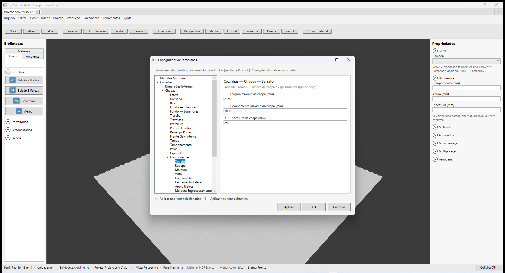

### Motor

`ChapaConfiguratorService` mapeia `role` da peça (`lateral`, `fundo`, `frente-porta`…) → espessura do tipo correspondente. Aéreos usam **Fundo — Superiores**; inferiores usam **Fundo — Inferiores**.

Persistência: `metadata.dimensionSettings.cozinhaChapas.pieces` / `dormitorioChapas.pieces`.

> **Fase futura:** material (A) e fita de borda 1–4 por peça (integração plano de corte).

---

## Fase 3c — Montagem da Caixa - Inferior (árvore completa)

Árvore **Montagem da Caixa - Inferior** (Cozinhas) com paridade Promob: **13 folhas diretas + 3 subgrupos de canto** (21 folhas, ~60 campos). Levantamento campo a campo no `Promob5` — ver **Mapa campo-a-campo** acima.

### Implementação Traços

- Schema declarativo: `BoxAssemblyInferiorSchema.cs` (nós, rótulos A/B/C…, opções de combo).
- Persistência: `cozinhaInferiorBox.inferiorNumeric` / `inferiorChoice` (dicionários por chave).
- UI: `DimensionConfiguratorWindow` gera campos dinamicamente por nó; combos de tipo enumerados ao vivo (Tipo Fundo, Tipo Sarrafo, Tipo Canto, etc.).
- **Ponte legado (3D):** campos `BackPanelType`, `BackRecessMm`, `SarrafoHeightMm`, `LateralBaseOverlapMm`, `ShelfDepthInsetMm` / `ShelfWidthInsetMm` sincronizados via `SyncInferiorToLegacy` — o motor 3D existente continua funcionando.
- **Efeito 3D — Fixação Fundo:** `ffl-afl` / `ffl-alf` (Fundo ↔ Lateral) e `fbf-afb` / `fbf-abf` / `fbf-rec-base` (Fundo ↔ Base) aplicados no balcão reto e no Canto L via `ModulationStructure` (`ApplyToStructure`).
- **Efeito 3D — Canto L Tipo Base/Tampo:** `cl-tipo-base` Inteira e `cl-tipo-tampo` Inteiro geram peça L contínua (sem emenda); Recortada/Recortado mantém bipartida.
- **Efeito 3D — Canto L 2P portas:** `Porta dir.` e `Porta esq.` individuais à frente da caixaria (`z≥Pd` / `x≥Pe`); folgas `cl-folga-pa` / `cl-folga-pb` + bordas de Frentes\|Portas Inferiores. Aplica em L 2P Esq e Dir.
- **Efeito 3D — Canto Reto:** caixaria = `BuildCarcass` (mesma engenharia do balcão reto: fundo/avanços/sarrafos/base/prateleira). Frentes CR + `UseSpacer` (`cr-uso-dist`) por cima. `ApplyToModules` / inserção aplicam A/P e a árvore Inferior a cada módulo e a todos. Canto L inalterado.

### Screenshot

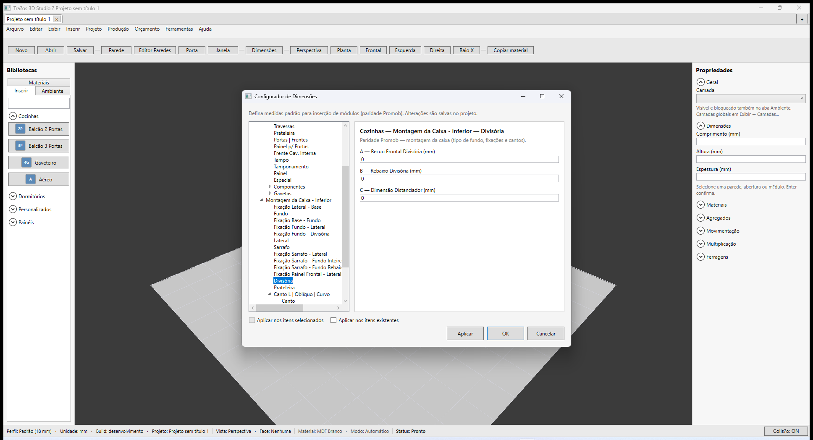

### Tipos de fundo (combo Promob no nó Fundo)

| Opção Promob | Ponte legado `BoxBackPanelType` |
|--------------|----------------------------------|
| Inteiro | `EncaixadoSarrafoHorizontal` |
| Rebaixado | `RebaixadoSarrafoVertical` |
| Trav Vertical / Trav Horizontal | `Travessas` |
| Sem fundo | `Pregado` |

> O combo global de presets (topo do Promob) permanece fora do escopo desta fase.

### Seções ainda simplificadas (outras categorias)

Nenhuma seção principal de Dormitórios permanece na fatia legado de 3 nós — ver **Montagem Armários** abaixo.

### Dormitórios — Montagem da Caixa - Armários (10/07/2026)

Árvore conforme **Promob ao vivo** (não é a mesma de Bancadas|Criados/Inferior):

| Nível | Folhas |
|-------|--------|
| **Diretas** | Lateral · Rodapé · Fundo |
| **Canto L \| Oblíquo \| Curvo** | Canto · Afastamento Parede |
| **Canto Reto** | Canto · Fechamentos · Afastamento Parede |

**Total: 8 folhas.** Schema: `BoxAssemblyArmarioSchema.cs`. Persistência: `dormitorioArmarioBox.armarioNumeric` / `armarioChoice`.

> **Correção:** versão anterior reutilizou `InferiorSchema` (21 folhas) por atalho — incorreto para Armários.

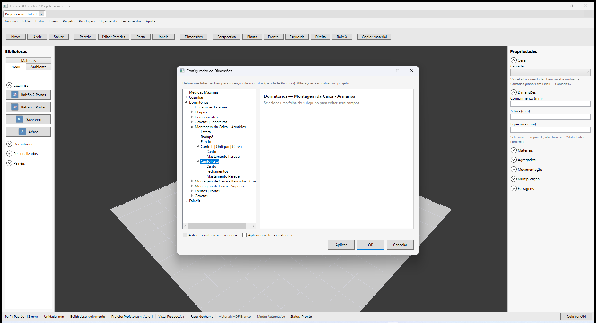

#### Folha Lateral (Promob ao vivo + [doc oficial](https://suporte.promob.com/hc/pt-br/articles/31121552118801))

| Grupo Promob | Campo | Rótulo | Tipo | Default |
|--------------|-------|--------|------|---------|
| Tipo Lateral | A | Lateral | Auto · Fixo | Fixo |
| Fixação Lateral - Base Inferior | B | Avanço Base sobre Lateral | mm | 0 |
| | C | Avanço Lateral Fixo sobre Base | mm | 58 |
| Fixação Lateral - Base Superior | D | Avanço Base sobre Lateral | mm | 0 |
| | E | Avanço Lateral sobre Base | mm | 10 |
| Folga - Alinhamento | F | Folga Lateral | mm | 0 |
| | G | Alinhamento | Traseiro · Central · Frontal | Central |

Chaves persistidas: `dormitorioArmarioBox.armarioNumeric` / `armarioChoice` (`tip-lat`, `arm-rbl`, `arm-rlb`, `arm-rbl-sup`, `arm-rlb-sup`, `lat-fol`, `lat-ali`). IDs Promob: `DOR_TIP_LAT`, `DOR_ARM_RBL`, `DOR_ARM_RLB`, `DOR_ARM_RBL_SUP`, `DOR_ARM_RLB_SUP`, `DOR_LAT_FOL`, `DOR_LAT_ALI`.

#### Folha Rodapé (Promob ao vivo + [doc oficial](https://suporte.promob.com/hc/pt-br/articles/31117488779537))

| Grupo Promob | Campo | Rótulo | Tipo | Default |
|--------------|-------|--------|------|---------|
| Tipo Rodapé | A | Rodapé | Auto · Fixo | Fixo |
| Rodapé | B | Recuo Rodapé Frontal | mm | 50 |
| | C | Recuo Rodapé Traseiro | mm | 0 |
| Rodapé Fixo | D | Altura Rodapé Fixo | mm | 80 |

Chaves: `tip-rod`, `rod-rec-fro`, `rod-rec-tra`, `rod-alt-fix`. IDs Promob: `DOR_RDP_FRO`, `PROF_RDP`, `PROF_RDP_TRA`, altura fixo (campo numérico).

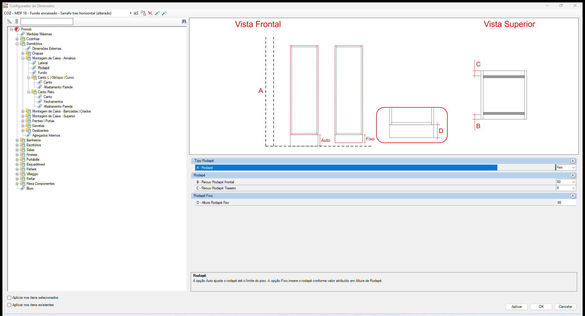

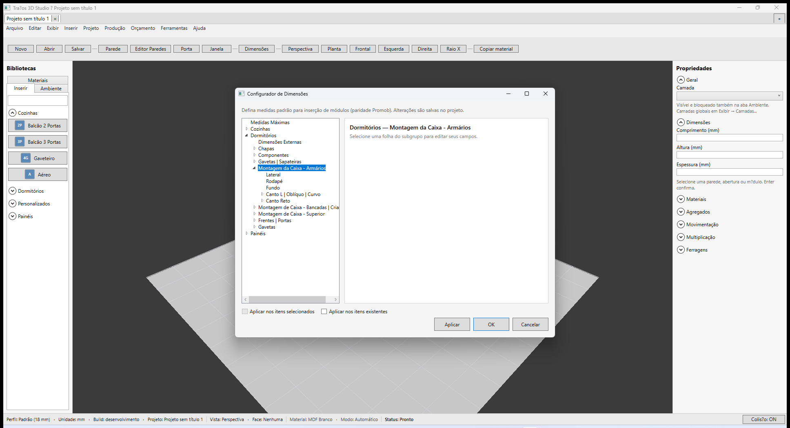

### Motor (3D — escopo atual)

`BoxAssemblyConfiguratorService` aplica os campos legados em `ModulationStructure`; demais campos das árvores Inferior/Superior/Despenseiros estão **persistidos** aguardando overlay no motor (fase futura, nó a nó).

> **Fase futura:** aplicar cada folha no `ModuleMeshBuilder` / Raio X; Dormitórios montagem.

---

## Fase 3d — Montagem da Caixa - Superior (árvore completa)

Árvore **Montagem da Caixa - Superior** (Cozinhas) com paridade Promob: **8 folhas diretas + 2 subgrupos de canto** (13 folhas). Levantamento campo a campo no `Promob5` — ver **Mapa campo-a-campo — Superior** acima.

### Implementação Traços

- Schema declarativo: `BoxAssemblySuperiorSchema.cs`.
- Persistência: `cozinhaSuperiorBox.superiorNumeric` / `superiorChoice`.
- UI: árvore dinâmica no configurador (inclui **Fixação Lateral - Base Inferior/Superior**, ausentes na Inferior).
- **Ponte legado (3D):** `BackPanelType` (Inteiro/Sem fundo), `BackRecessMm`, `ShelfDepthInsetMm` / `ShelfWidthInsetMm` via `SyncSuperiorToLegacy`.

### Screenshot

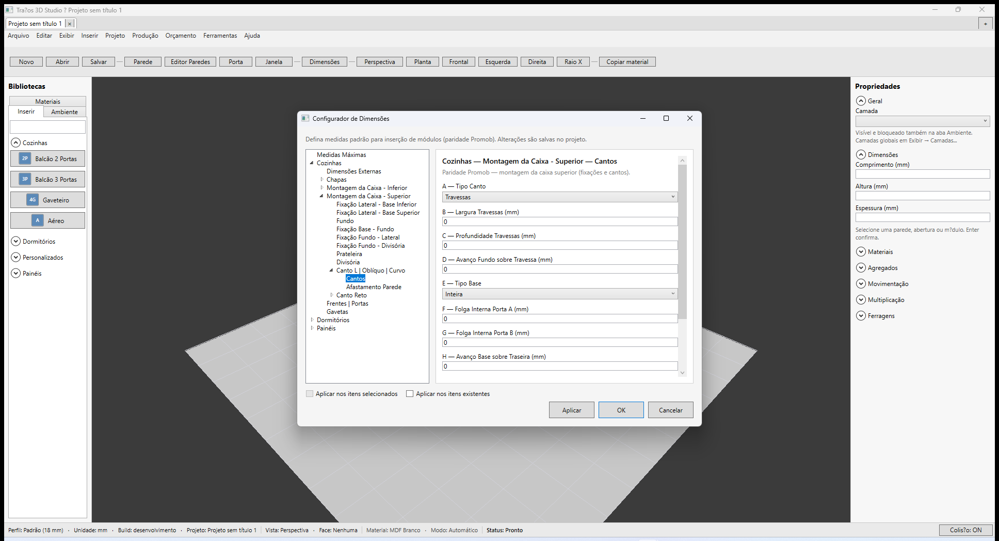

### Diferenças vs Inferior

| Aspecto | Inferior | Superior |
|---------|----------|----------|
| Folhas diretas | 13 | 8 |
| Fixação lateral | 1 nó (Base) | 2 nós (Base Inferior + Base Superior) |
| Fundo | 8 campos (tipos variados) | 4 campos (Inteiro / Sem fundo) |
| Sarrafo / fixações sarrafo | Sim | **Não** |
| Canto L folha | **Canto** | **Cantos** (sem Tipo Tampo) |
| Canto Reto | Canto + Fechamentos + Sarrafo + Afastamento | Canto + Fechamentos + Afastamento (sem Sarrafo) |
| Canto Gaveteiro | Sim | **Não** |

---

## Fase 3e — Montagem da Caixa - Despenseiros \| Torres (árvore completa)

Árvore **Montagem da Caixa - Despenseiros \| Torres** (Cozinhas) com paridade Promob: **9 folhas diretas** (sem cantos). Levantamento no `Promob5` + [KB Promob](https://suporte.promob.com/hc/pt-br/articles/31120114705937) — ver **Mapa campo-a-campo — Despenseiros \| Torres** acima.

### Implementação Traços

- Schema declarativo: `BoxAssemblyDespenseirosSchema.cs`.
- Persistência: `cozinhaDespenseiroBox.despenseirosNumeric` / `despenseirosChoice`.
- UI: árvore dinâmica no configurador (`CozinhaBoxDespenseirosTreeItem`).
- Slot `CozinhaDespenseiro` no motor usa `cozinhaDespenseiroBox` (antes compartilhava `cozinhaInferiorBox`).
- **Ponte legado (3D):** `BackPanelType`, `BackRecessMm`, `ShelfDepthInsetMm` / `ShelfWidthInsetMm` via `SyncDespenseirosToLegacy` (semeia da Inferior na primeira abertura).

### Screenshots

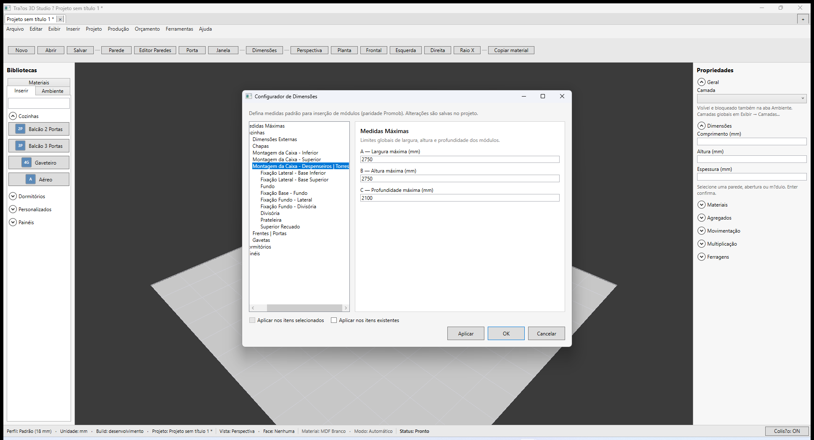

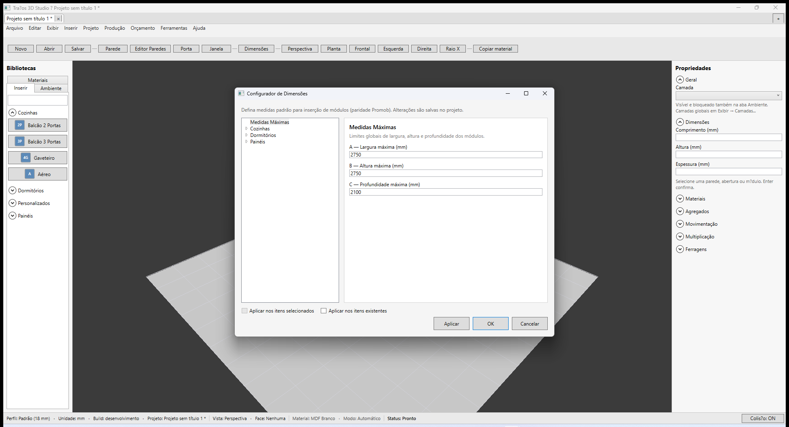

### Diferenças vs Superior

| Aspecto | Superior | Despenseiros \| Torres |
|---------|----------|------------------------|
| Folhas | 13 (8 + cantos) | **9** (sem cantos) |
| Divisória / Prateleira | 2 campos cada | **4 campos** cada (recuos frontal/traseiro móvel/fixo) |
| Fixação Base-Fundo | 5 campos (inclui Avanço Base sobre Fundo) | **4 campos** (só recuos de base) |
| Fixação Fundo-Lateral | 2 campos | **1 campo** |
| Exclusivo | Cantos L/Reto | **Superior Recuado** (4 campos) |

---

## Fase 3f — Eletros (folha única)

Árvore **Eletros** (Cozinhas): pasta **Eletros** com **1 folha** (13 campos A–M). Levantamento no `Promob5` + [KB Promob](https://suporte.promob.com/hc/pt-br/articles/31117730608785).

### Implementação Traços

- Schema: `CozinhaEletrosSchema.cs`.
- Persistência: `cozinhaEletros.numeric` / `cozinhaEletros.choice`.
- Serviço: `EletrosConfiguratorService.EnsureInitialized`.
- UI: `CozinhaEletrosTreeItem` → folha `CozinhaEletrosLeafTreeItem`.

### Screenshot

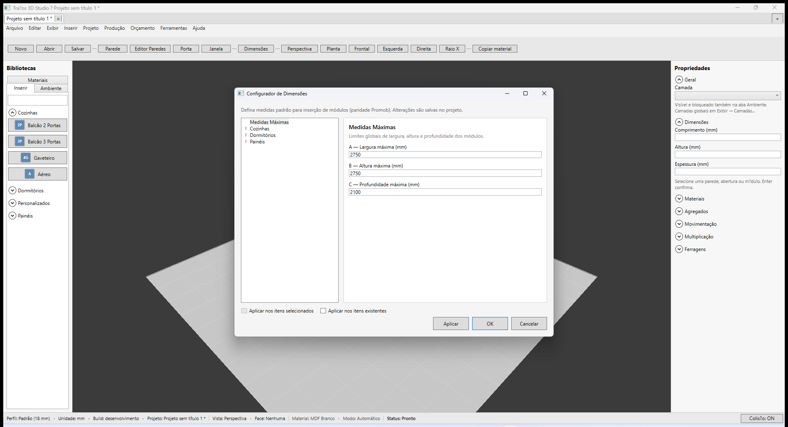

---

## Fase 3g — Frentes | Portas (árvore completa)

Árvore **Frentes | Portas** (Cozinhas): **7 folhas diretas** + subgrupo **Folgas Painel** (2 folhas). Levantamento no `Promob5` 5.60 ao vivo (04/07/2026).

### Folhas e campos (Promob)

| Folha | Campos | Tipo Traços |
|-------|--------|-------------|
| **Inferiores** | A Entre Portas/Frentes `COZ_ENT_PT_INF` · B–E Bordas `COZ_BD_*_INF` | 5 combos (0–30 mm) |
| **Superiores** | `COZ_ENT_PT_SUP` · `COZ_BD_*_SUP` | 5 combos (defaults Promob: 5, 5, 10, 10, 11) |
| **Despenseiros** | `COZ_ENT_PT_DESP` · `COZ_BD_*_DESP` | 5 combos |
| **Embutidas** | `COZ_ENT_PT_EMB` · `COZ_BD_*_EMB` | 5 combos |
| **Torres** | `COZ_ENT_PT_TOR` · `COZ_BD_*_TOR` | 5 combos |
| **Puxador Gola** | Altura · Ponteiras · Espessura · Quantidade · Dimensão Barra | 5 combos |
| **Portas Alumínio** | Folga Perfil 10/20/40/45/45B/45L/45LB/50/Borda + Folga Gola Alumínio | 10 numéricos |
| **Portas Vidro** | 4 Perfis · 2 Perfis | 2 numéricos |

### Implementação Traços

- Schema: `CozinhaFrentesPortasSchema.cs`.
- Persistência: `cozinhaFrentesPortas.numeric` / `cozinhaFrentesPortas.choice` (chaves `{folha}:{campo}`).
- Serviço: `FrentesPortasConfiguratorService.EnsureInitialized` + `SyncToLegacy` → `cozinhaDoorFrontGapMm` (inferiores entre-portas).
- UI: `CozinhaFrentesPortasTreeItem` → folhas com `AutomationId` `CozinhaPortas{Folha}TreeItem`.
- Prefixo flush: `portas-num-*` / `portas-cho-*`.

### Screenshot

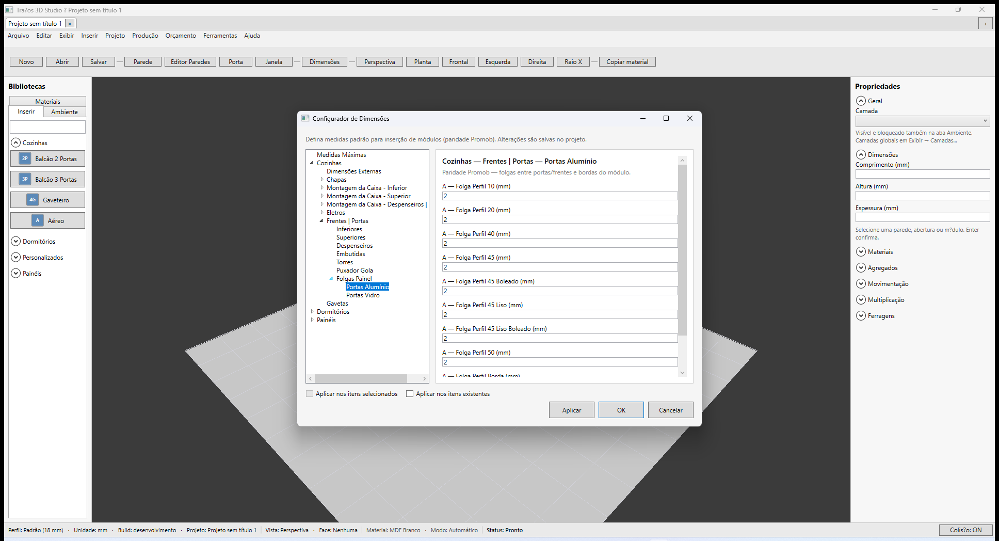

---

## Fase 3h — Gavetas (árvore 4 folhas)

Árvore **Gavetas** (Cozinhas): **4 folhas** mapeadas no `Promob5` 5.60 ao vivo (08/07/2026), alinhadas à estrutura de [Gavetas Externas — Dormitórios](https://suporte.promob.com/hc/pt-br/articles/31117415905553) e KB [gaveteiro](https://suporte.promob.com/hc/pt-br/articles/31119033485457).

### Folhas e campos (Promob)

| Folha | Campos | ids Promob (amostra) |
|-------|--------|----------------------|
| **Folgas** | A–N (14 combos): corrediça, fundo caixa, folgas sup/inf caixa (C–H), folgas sup/inf frente/montante (I–N) | `GAV_COR` · `GAV_FUN` · `GAV_FOLG_*` · `GAV_FGAV_*` |
| **Fixação Lateral - Contra Frente** | A Avanço Lateral sobre CF · B Avanço CF sobre Lateral | `GAV_RLFT` · `GAV_RFTL` |
| **Fixação Lateral - Posterior** | A Avanço Lateral sobre Posterior · B Avanço Posterior sobre Lateral | `GAV_ALP` · `GAV_APL` |
| **Fundos** | A–D avanços/recuo fundo gaveta | `GAV_RFUL` · `GAV_AFCF` · `GAV_AFP` · `GAV_REC_FUN` |

> **Nota:** Borda Superior/Inferior e Folga Entre Gavetas (KB gaveteiro) **não** aparecem na folha Folgas do Plus 5.60 ao vivo — provável subseção Montantes / Gavetas Inferiores-Superiores (fase futura). O motor 3D (Fase 2) continua usando `cozinhaDrawerFrontGapMm` persistido no projeto.

### Implementação Traços

- Schema: `CozinhaGavetasSchema.cs`.
- Persistência: `cozinhaGavetas.choice` (chaves `{folha}:{campo}`).
- Serviço: `GavetasConfiguratorService.EnsureInitialized`.
- UI: `CozinhaGavetasTreeItem` → folhas `CozinhaGavetas{Folha}TreeItem`.
- Prefixo flush: `gav-cho-*`.

### Screenshot

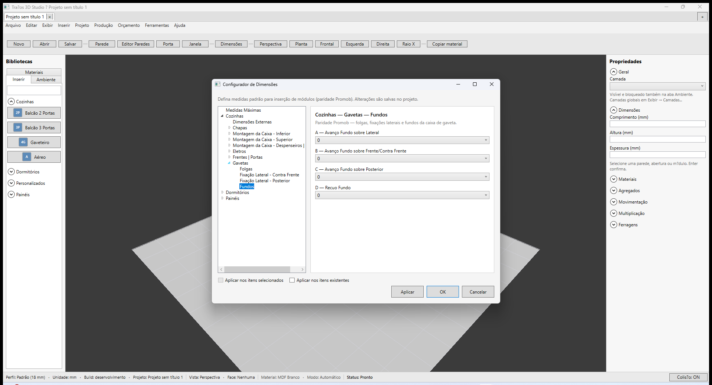

---

## Fase 3i — Gavetas Internas | Auxiliares (árvore 4 folhas)

Árvore **Gavetas Internas | Auxiliares** (Cozinhas): **4 folhas** alinhadas à [documentação Promob](https://suporte.promob.com/hc/pt-br/articles/31117695847313) e à estrutura das gavetas externas (Folgas · Fixação Lateral · Fundos).

### Folhas e campos (Promob)

| Folha | Campos | Observação |
|-------|--------|------------|
| **Folgas** | A–N (14 combos): corrediça · fundo caixa · **avanço lateral da frente (C)** · folgas sup/inf caixa (D–I) · folgas internas J–L · folgas auxiliares M–N | **Diferente** das gavetas externas: C é avanço lateral da frente; J–N são internas/auxiliares (não frente/montante I–N) |
| **Fixação Lateral - Contra Frente** | A Avanço Lateral sobre CF · B Avanço CF sobre Lateral | Mesma estrutura das gavetas externas |
| **Fixação Lateral - Posterior** | A Avanço Lateral sobre Posterior · B Avanço Posterior sobre Lateral | Idem |
| **Fundos** | A–D avanços/recuo fundo gaveta | Idem |

> **Nota:** Sem `SyncToLegacy` — efeito 3D por folha fica para fase futura (mesmo critério das fases 3g/3h).

### Implementação Traços

- Schema: `CozinhaGavetasInternasSchema.cs`.
- Persistência: `cozinhaGavetasInternas.choice` (chaves `{folha}:{campo}`).
- Serviço: `GavetasInternasConfiguratorService.EnsureInitialized`.
- UI: `CozinhaGavetasInternasTreeItem` → folhas `CozinhaGavetasInternas{Folha}TreeItem`.
- Prefixo flush: `gavint-cho-*`.

### Screenshot

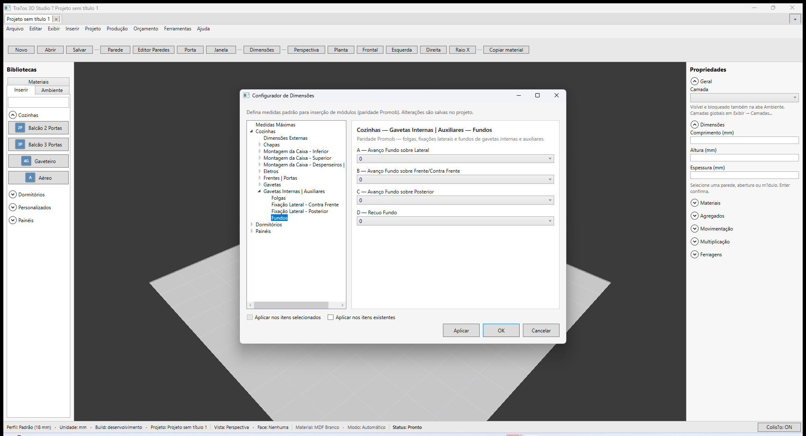

---

## Fase 3j — Cozinhas Cava (árvore 6 folhas + Frentes | Portas)

Árvore **Cozinhas Cava** mapeada no Promob Plus 5.60 (7 nós diretos na árvore; Frentes \| Portas com 4 subfolhas), alinhada à [documentação Promob](https://suporte.promob.com/hc/pt-br/articles/31117669775889).

### Folhas e campos (Promob)

| Folha | Campos | ids Promob (amostra) |
|-------|--------|----------------------|
| **Tipo Puxador** | A Tipo · B Dimensão Barra · C Quantidade | `COZ_CAV_PUX` · `COZ_CAV_ALU_BARRA` · `COZ_CAV_QTD_PUX_PER` |
| **Tipo Lateral** | A Tipo Lateral | — |
| **Inferiores** | A–H puxador alumínio/madeira + gaveteiros + 1G+2Gav | — |
| **Superiores** | A–F puxador base + intermediários | — |
| **Despenseiros** | A–G larguras/profundidades + recuo lateral | — |
| **Canto L** | A Travessas Frontais · B–C dimensões travessas | — |
| **Frentes \| Portas → Inferiores** | A–C avanços + D–G folgas | — |
| **Frentes \| Portas → Superiores** | A–B avanços + C–F folgas | — |
| **Frentes \| Portas → Despenseiros** | A–B avanços + C–E folgas | — |
| **Frentes \| Portas → Torres** | A–C avanços + D–G folgas | — |

> **Nota:** Sem `SyncToLegacy` — efeito 3D por folha fica para fase futura (catálogo Cava no Traços ainda pendente).

### Implementação Traços

- Schema: `CozinhaCavaSchema.cs`.
- Persistência: `cozinhaCava.numeric` / `cozinhaCava.choice` (chaves `{folha}:{campo}`).
- Serviço: `CavaConfiguratorService.EnsureInitialized`.
- UI: `CozinhaCavaTreeItem` → folhas `CozinhaCava{Folha}TreeItem`.
- Prefixo flush: `cava-num-*` / `cava-cho-*`.

### Screenshot

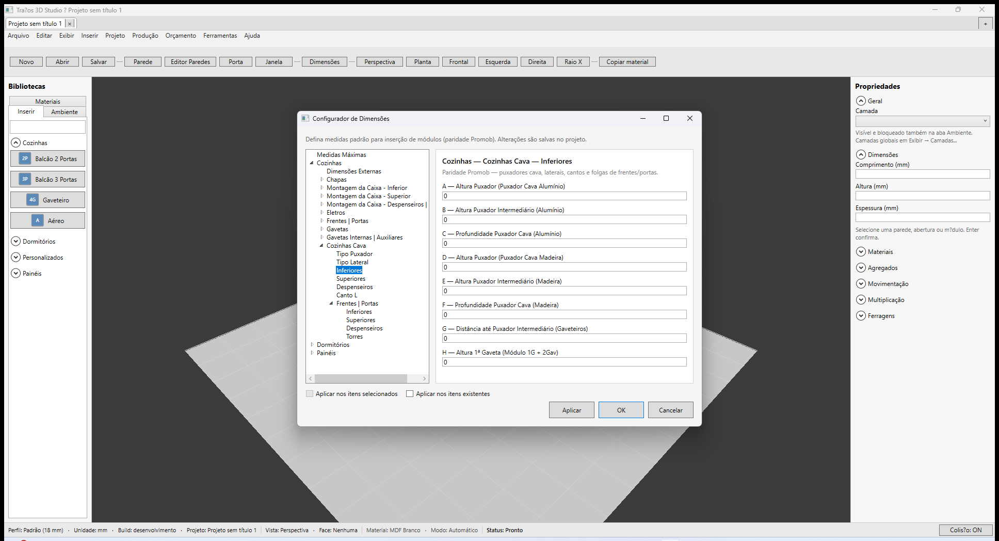

---

## Fase 3c.1 — Montagem da Caixa (legado — incorporado em 3c)

> **Nota:** primeira fatia da árvore de montagem do Promob. Falta a maior parte (fixações, divisória, cantos, Superior/Alto) — ver **Mapa Promob completo** acima.

Árvore **Montagem da Caixa** expandida por seção (paridade Promob — primeira entrega: fundo + fixações principais).

### Tipos de fundo (5 variantes Promob)

| Valor | Rótulo no configurador |
|-------|------------------------|
| `EncaixadoSarrafoHorizontal` | Fundo encaixado — Sarrafo trás horizontal |
| `EncaixadoSarrafoVertical` | Fundo encaixado — Sarrafo trás vertical |
| `Pregado` | Fundo pregado |
| `RebaixadoSarrafoVertical` | Fundo rebaixado — Sarrafo trás vertical |
| `Travessas` | Fundo travessas |

### Nós por seção

| Seção | Nós |
|-------|-----|
| Cozinhas — Inferior | Fundo · Fixação Lateral-Base · Sarrafo · Prateleira |
| Cozinhas — Superior | Fundo · Prateleira |
| Dormitórios — Armários | Lateral · Rodapé · Fundo · Canto L · Canto Reto (8 folhas) |

### Campos (por nó)

- **Fundo:** tipo (combo) · recuo/ranhura (B) · altura/espessura sarrafo (C/D quando aplicável)
- **Fixação Lateral-Base:** superposição lateral sobre base (mm)
- **Sarrafo:** altura e espessura (mm)
- **Prateleira:** recuo frontal (A) · folga lateral (D)

### Motor

`BoxAssemblyConfiguratorService` aplica `BackPanelType`, recuos e sarrafo em `ModulationStructure`; adiciona peça **Sarrafo** na decomposição quando o tipo usa sarrafo. `ModuleMeshBuilder.BuildBackAssembly` renderiza fundo/sarrafo/travessas no viewport.

Persistência: `metadata.dimensionSettings.cozinhaInferiorBox` · `cozinhaSuperiorBox` · `cozinhaDespenseiroBox` · `dormitorioArmarioBox`.

Campos legados de prateleira (Fase 2) são sincronizados via `SyncLegacyShelfFields` / `EnsureBoxInitialized`.

> **Fase futura (3c+):** divisória, cantos, fechamentos e demais fixações da árvore Promob completa.

---

## Fases 1 e 2 (referência)

| Seção | Traços hoje | Promob |
|-------|-------------|--------|
| Medidas Máximas | 3 campos | ✅ |
| Chapas | árvore por peça (3b ✅) | + material + fita |
| Montagem caixa | **Inferior + Superior + Despenseiros/Torres completos** (3c/3d/3e ✅) · **Armários** `ArmarioSchema` 8 folhas ✅ | overlay 3D por nó |
| Eletros | **Folha única 13 campos** (3f ✅) | Efeito 3D nichos |
| Frentes\|Portas | **Árvore 9 folhas** (3g ✅) · legado `cozinhaDoorFrontGapMm` sincronizado | Efeito 3D por folha |
| Gavetas | **Árvore 4 folhas / 22 combos** (3h ✅) · legado `cozinhaDrawerFrontGapMm` (motor 3D Fase 2) | Montantes · folga entre frentes |

**Motor Fase 2:** `DimensionConfiguratorService.CreateEffectiveRules` aplica chapas/folgas/recuos; sync `PanelThicknessMm` / `BackThicknessMm` no projeto.

---

## AutomationIds

| Elemento | AutomationId |
|----------|----------------|
| Janela | `DimensionConfiguratorWindow` |
| Árvore | `DimensionConfiguratorCategoryTree` |
| Aplicar / OK / Cancelar | `DimensionConfiguratorApplyButton` · `…OkButton` · `…CancelButton` |
| Checkboxes aplicar | `DimensionConfiguratorApplySelectedCheck` · `…ApplyAllCheck` |
| Menu / toolbar | `OpenDimensionConfiguratorMenuItem` · `DimensionConfiguratorButton` |

---

## Aceite visual (Fase 3c.1)

- `docs/screenshots/modulos/configurador/3c-10-fundo-panel.png` — painel **Fundo** (combo 5 tipos + recuo + sarrafo).
- `docs/screenshots/modulos/configurador/3c-03-sem-raiox.png` × `3c-06-ambiente.png` — módulo sólido × **Raio X** revelando o interior (fundo/prateleira).
- `docs/screenshots/modulos/configurador/3c-11-travessas-aplicado.png` — “Fundo travessas” aplicado a módulo existente.

Screenshots comparando Traços × Promob Plus (pendente):

- `docs/screenshots/modulos/configurador/fase-V3.7f-3a-cozinhas-dim-ext.png`
- `docs/screenshots/modulos/configurador/fase-V3.7f-3a-dormitorios-dim-ext.png`

---

## Histórico

| Data | Gate |
|------|------|
| 03/07/2026 | V3.7f Fase 1 — janela + Dimensões Externas subset |
| 03/07/2026 | V3.7f Fase 2 — Chapas/Montagem/Frentes/Gavetas |
| 03/07/2026 | Raio X passa a revelar interior dos módulos (frente transparente) |
| 03/07/2026 | V3.7f Fase 3d — Montagem Caixa Superior: árvore 13 folhas + persistência; mapa Promob ao vivo |
| 03/07/2026 | V3.7f Fase 3e — Montagem Caixa Despenseiros \| Torres: árvore 9 folhas + `cozinhaDespenseiroBox`; validado MCP |
| 03/07/2026 | V3.7f Fase 3f — Eletros: folha única 13 campos + `cozinhaEletros`; validado MCP |
| 04/07/2026 | V3.7f Fase 3g — Frentes \| Portas: árvore 9 folhas + `cozinhaFrentesPortas`; validado MCP |
| 08/07/2026 | V3.7f Fase 3h — Gavetas: árvore 4 folhas / 22 combos + `cozinhaGavetas`; validado MCP |
| 09/07/2026 | V3.7f Fase 3i — Gavetas Internas \| Auxiliares: árvore 4 folhas / 24 combos + `cozinhaGavetasInternas`; validado MCP |
| 09/07/2026 | V3.7f Fase 3j — Cozinhas Cava: árvore 10 folhas / 51 campos + `cozinhaCava`; validado MCP |
| 03/07/2026 | V3.7f Fase 3c — Montagem Caixa Inferior: árvore 21 folhas + persistência; mapa Promob ao vivo |
| 03/07/2026 | V3.7f Fase 3c.1 — Montagem caixa (fatia inicial: fundo + fixações) |
| 03/07/2026 | V3.7f Fase 3b.2 — Chapas: subárvores Componentes (13) + Gavetas (5); Chapas completo |
| 03/07/2026 | V3.7f Fase 3b — Chapas árvore por peça Cozinhas/Dormitórios |
| 03/07/2026 | V3.7f Fase 3a — Dimensões Externas completas Cozinhas/Dormitórios |
