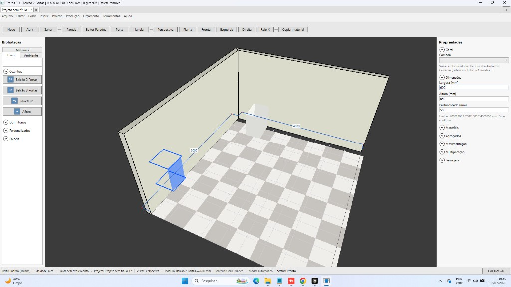
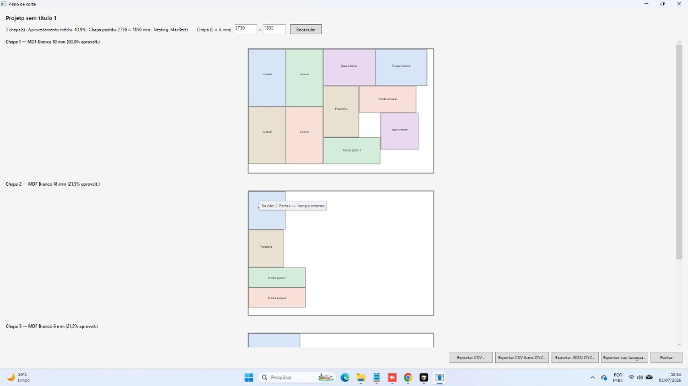

# EM4 — Comparação Promob × Traços (resize → frentes e peças)

**Data:** 02/07/2026 (atualizado após sessão MCP reinício Promob)  
**Escopo:** paridade **EM4** — alterar L×A×P na instância recalcula vãos, frentes e peças.  
**Screenshots:** `docs/screenshots/modulos/em4-promob-tracos/`

---

## Metodologia (tríade)

| Etapa | Fonte | Status |
|-------|--------|--------|
| 1 | Documentação Promob | ✅ [Configurar estrutura do armário](https://suporte.promob.com/hc/pt-br/articles/31119877118609) · spike V3.7 |
| 2 | Promob Plus **5.60.12.4** ao vivo (MCP) | 🟡 catálogo + UI + planta; **inserção no viewport não concluída** |
| 3 | Traços 3D (MCP + unitários) | ✅ motor V3.7c · **421/421** testes · screenshot aceite 800 mm |

---

## Resultado desta sessão (02/07/2026)

### Promob Plus (PID 29888, maximizado)

| Passo | Resultado |
|-------|-----------|
| UIA após reinício | ✅ `get_snapshot` estável (com refocus por clique no centro) |
| Navegação Cozinhas → Inferiores → **Balcões** | ✅ |
| Seleção **2P 600mm** no catálogo (`ListViewItem-5`) | ✅ |
| Orientação Horizontal / Horizontal no Plano | ✅ |
| Inserção no 3D (clique, drag UIA, drag mouse, planta) | ❌ ambiente permanece vazio (parede/piso selecionados) |
| Preview verde na borda (planta) após drag | 🟡 apareceu, clique não confirmou módulo |
| Resize 600↔800 + Explodido/Chapas | ❌ bloqueado (sem módulo na cena) |

**Screenshots Promob:** `promob-em4-refocus.png`, `promob-em4-planta-lista.png`, `promob-em4-drag-inserido.png`, `promob-em4-hotspot-click.png`, entre outros em `em4-promob-tracos/`.

**Hipótese:** inserção no Promob exige interação fina no viewport OpenGL (arrastar do ícone até a parede + confirmação) que o MCP não reproduz de forma confiável neste ambiente — mesmo com UIA funcional no catálogo e painéis.

### Traços 3D

| Passo | Resultado |
|-------|-----------|
| `dotnet test` | ✅ **421/421** |
| Biblioteca `modulacao-balcao-regras.tracos-lib` copiada | ✅ |
| **Inserção manual** (usuário) — ambiente L + parede traseira, **Balcão 2 Portas** | ✅ |
| Render 3D “fantasma translúcido” sobre o módulo | 🟡 **diagnosticado** — preview de inserção sobreposto; **corrigido** (`ConfirmModuleInsert` limpa `_hasModulePreview`) |
| Render 3D real (caixote MDF + 2 frentes) | ✅ após Esc / desmarcar parede |
| **Plano de corte** (600 mm, usuário) | ✅ Lateral×4, Base, Tampo, Prateleira, Frente porta 1/2 |
| Resize 600↔800 + Explodido pareado ao vivo | 🟡 fórmulas validadas (tabela abaixo); app reiniciado com fix |
| Inserção no viewport (MCP) | ❌ persistente `Face: Nenhuma` / "Solte na face interna" |

**Diagnóstico render 3D (02/07/2026 — sessão usuário):**

1. **Fantasma azul/verde translúcido** — não era o módulo final: era `DrawModulePreview` ainda ativo na **mesma posição** do clique de confirmação (modo “inserir outro” mantém `_moduleInsertDefinitionId` sem limpar preview). O módulo real (MDF branco opaco) ficava **por baixo** ou confundido com o preview.
2. **Caixote “aberto”** — mesh simplificado V3.x: laterais/tampo/base/fundo + 2 quads de porta (sem espessura 18 mm visível por peça, sem prateleira no 3D). O **Explodido/Chapas** lista todas as peças corretamente.
3. **Correção aplicada:** após `ConfirmModuleInsert` bem-sucedido, `_hasModulePreview = false` até o próximo `MouseMove`.

**Peças esperadas — Balcão 2 Portas built-in (`balcao-2-portas`, painel 18 mm):**

| Peça | Largura 600 mm | Largura 800 mm | Δ |
|------|----------------|----------------|---|
| Base inferior / Tampo interno (comprimento) | 564 | 764 | +200 |
| Frente porta 1 e 2 (comprimento cada) | 294 | 394 | +100 |
| Prateleira (comprimento) | 560 | 760 | +200 |
| Lateral (×2), Fundo, Alturas | inalteradas | inalteradas | — |

*(Módulo com `modulationRules` usa `ModulationDecompositionService`: frente 296→396 mm nos unitários.)*

**Técnicas de inserção testadas via MCP (todas falharam com `Face: Nenhuma`):**

| Técnica | Resultado |
|---------|-----------|
| Clique no botão do módulo (`BeginModuleInsertMode` ✅ — título muda) + clique na face (Frontal) | ❌ face externa |
| Idem em Perspectiva | ❌ face externa |
| Drag UIA (`drag_element`) catálogo → viewport | ❌ |
| Drag real (mouse_event) catálogo → parede | ❌ |
| **Ambiente fechado** (4 paredes na Planta) | ❌ geometria auto-interseccionada → faces internas degeneradas |
| **Raio X** | ❌ |
| **Órbita 180°** (mouse meio+direito) p/ virar face interna à câmera | ❌ ainda lê externa |

**Diagnóstico (código):** `ConfirmModuleInsert` → `ModuleInsertDropService.TryInsertFromScreen` → `ModulePlacementService.TryComputeFromScreenRay` → `WallPickService.TryPickModuleInsertionFace` contra `BuildWallPickTargets` (faces **internas**). O raio de tela precisa acertar a **face interna** válida; em parede isolada o pick retorna nulo em ambos os lados, e no ambiente fechado a geometria via cliques imprecisos ficou degenerada. É **limitação de automação MCP no viewport OpenGL**, não defeito funcional (a face não entra na árvore UIA).

**Validação funcional EM4 no Traços** permanece nos **unitários** (`ModulationParametricTests`: base 564→764 mm, frente 296→396 mm) e screenshot de aceite V3.7c:

---

## Tabela de paridade EM4

| Critério | Promob | Traços | Status |
|----------|--------|--------|--------|
| L×A×P editável na instância | ✅ (doc + spike) | ✅ painel Dimensões | ✅ |
| Resize → largura das frentes | ✅ regras fábrica | ✅ `ModulationFrontLayout` | ✅ Traços (unitário) |
| Resize → peças (lista/corte) | ✅ Explodido/Chapas | ✅ `PartsListService` + regras | ✅ Traços (unitário) |
| Mesmo SKU / biblioteca | 2P 600mm fabricante | `balcao-regras-demo` | 🟡 analogia |
| Screenshot resize pareado 600/800 | ❌ sessão 02/07 | ✅ usuário 600 mm + fórmulas 800 mm | 🟡 **parcial** |
| Explodido/Chapas lado a lado | ❌ | ✅ plano corte 600 mm (usuário) | 🟡 **parcial** |
| Construtor viewport (EM1) | ✅ Editar → Construir Armário | ⬜ | ⬜ fora EM4 |

**Legenda:** ✅ validado · 🟡 parcial · ❌ não alcançado nesta sessão · ⬜ gap conhecido

---

## Comportamento esperado (referência)

### Promob Plus

| Ação | Onde |
|------|------|
| Inserir módulo | Módulos → Cozinhas → Inferiores → **Balcões** → 2P 600mm |
| Dimensões | Ferramentas — Propriedades · **Dimensões** |
| Lista de peças | Orçamento → Listagem → **Explodido** / **Chapas** |

### Traços V3.7c

| Ação | Onde |
|------|------|
| Módulo | `balcao-regras-demo` · fixture `samples/modulacao-balcao-regras.tracos-lib` |
| Dimensões | Propriedades → **Dimensões** (`PropertyLengthBox`) |
| Motor | `ModulationDimensionResolver` → `ModulationDecompositionService` + `ModulationFrontLayout` |

---

## Conclusão

- **Traços V3.7c** atende o **requisito funcional** de EM4 (testes + inserção manual + plano de corte).
- **Render 3D:** bug de **preview fantasma** corrigido; representação 3D permanece **caixote simplificado** (peças detalhadas no Explodido/Chapas).
- **Paridade visual Promob × Traços** (mesmo fluxo resize + Explodido lado a lado) **parcial**: Traços validado pelo usuário; Promob ainda sem módulo inserido via MCP.
- **Próximo passo:** resize **600→800** no Traços, recalcular plano de corte e comparar frentes (+100 mm cada); no Promob, inserir **2P 600mm** manualmente para paridade final.

---

## Screenshots desta sessão

| Arquivo | Conteúdo |
|---------|----------|
| `promob-em4-refocus.png` | Promob — planta, 2P 600 selecionado, piso 5000×5000 |
| `promob-em4-drag-inserido.png` | Promob — após drag catálogo→viewport |
| `promob-em4-hotspot-click.png` | Promob — hotspot verde na borda (preview) |
| `tracos-em4-biblioteca-regras.png` | Traços — busca regras, parede 2500 mm |
| `tracos-em4-perspectiva-insert.png` | Traços — perspectiva, módulo no catálogo |
| `tracos-em4-ambiente-lista.png` | Traços — aba Ambiente vazia (sem inserção) |
