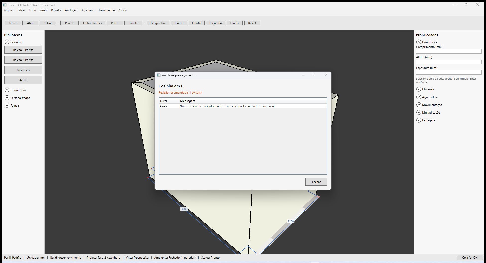
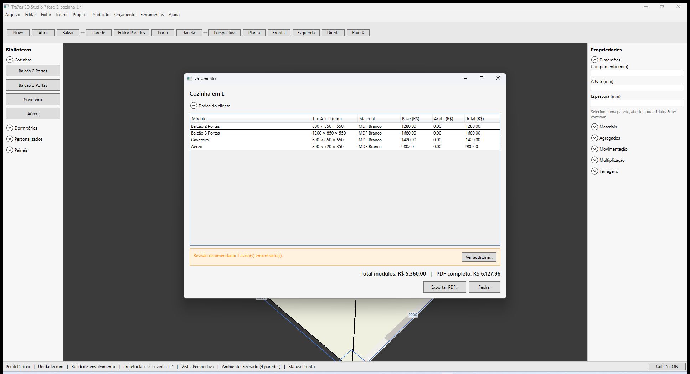

# Traços 3D — Auditoria e orçamento

**Última revisão:** 20/06/2026

---

## Neste artigo

- **Auditar projeto** antes de enviar proposta
- Abrir janela **Orçamento** com lista de módulos e preços
- Dados do cliente no PDF
- Exportar **PDF** comercial

---

## Antes de começar

1. Projeto com módulos inseridos (ex.: `fase-2-cozinha-L.tracos`).
2. Preços base configurados na biblioteca (**Ferramentas → Gerenciar biblioteca...**) ou editados na grade do orçamento.
3. **Projeto → Dados do cliente e da obra...** — preencha cliente, obra e ambiente antes do orçamento (como no Promob).

---

## Auditar projeto

1. Menu **Orçamento → Auditar projeto...**
2. Revise a lista de **erros**, **avisos** e **informações**:

| Tipo | Exemplos |
|------|----------|
| **Erro** | Projeto sem módulos; módulo sem preço base |
| **Aviso** | Cliente não informado; colisão entre módulos; peça sem preço de material |
| **Info** | Ambiente sem paredes |

3. **Fechar** ou, ao abrir o orçamento, **Continuar para orçamento** se aceitar os avisos.

---

## Dados do cliente e da obra

1. Menu **Projeto → Dados do cliente e da obra...**
2. **Dados da obra:** nome do projeto, **Obra**, título do **Ambiente**, **Validade (dias)**, **Desconto (%)**, **Condições de pagamento**, **Vendedor** e **Observações comerciais**.
3. **Dados do cliente:** tipo (PF/PJ), código, nome, CPF/CNPJ, endereço (rua, número, complemento), CEP, bairro, cidade, UF, entrega, telefone, celular, e-mail, anotações.
4. Os dados são salvos no `.tracos` e reutilizados no orçamento e no PDF.

Também é possível editar os dados do cliente na janela **Orçamento** (expander **Dados do cliente**).

---

## Abrir orçamento

1. **Orçamento → Abrir orçamento...**
2. Se houver avisos, a auditoria aparece primeiro — confirme **Continuar para orçamento** se desejar prosseguir.
3. Na janela **Orçamento**:

| Coluna | Descrição |
|--------|-----------|
| **Módulo** | Nome do item da biblioteca |
| **L × A × P** | Dimensões em mm |
| **Material** | Material aplicado ao módulo |
| **Base (R$)** | Preço editável por linha |
| **Acab. (R$)** | Adicional de material (somente leitura) |
| **Total (R$)** | Base + acabamento |

4. Expanda **Dados do cliente** (já aberto por padrão) ou use **Projeto → Dados do cliente e da obra...** — campos Promob: tipo PF/PJ, código, CPF/CNPJ, endereço completo, anotações.

---

## Exportar PDF comercial

1. Na janela Orçamento, clique **Exportar PDF...**
2. Escolha o destino — o PDF inclui:
   - Cabeçalho com logo (se configurado na biblioteca), data/hora, **Obra** e **Validade** (data limite + dias)
   - Dados do cliente (código, CPF/CNPJ, endereço com número/complemento, anotações)
   - Tabela de módulos e totais
   - Lista de peças (quando aplicável)
   - Página com **visualização 3D** do viewport

---

## Persistência

Preços customizados por instância e dados do cliente são salvos no `.tracos` (metadata do projeto).

---

## Voltar ao índice

[Orçamento — visão geral](./README.md)
