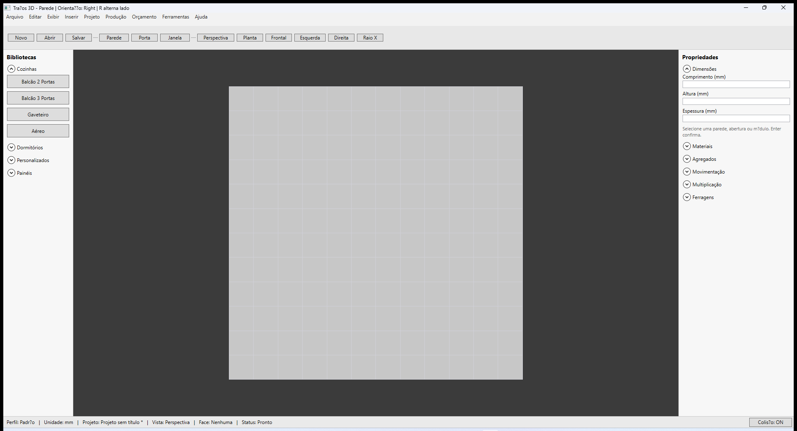
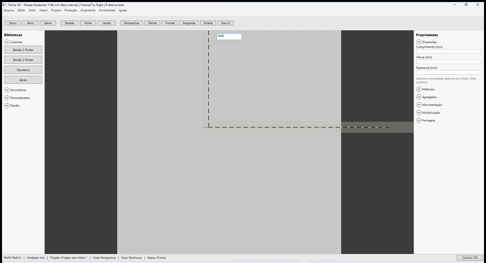
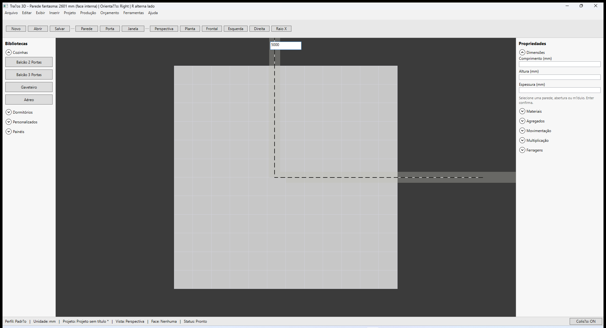
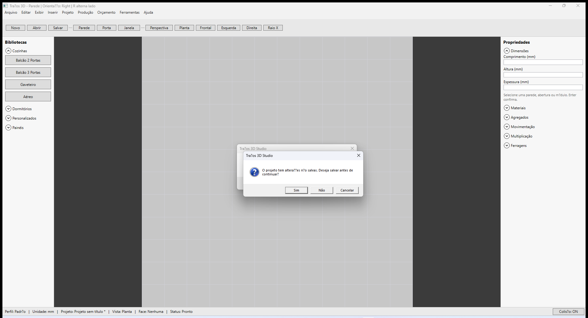
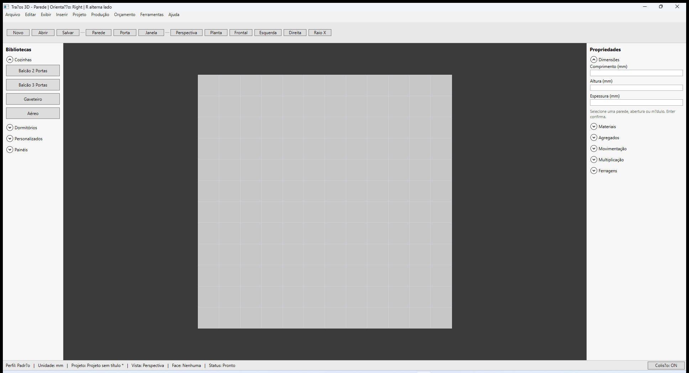
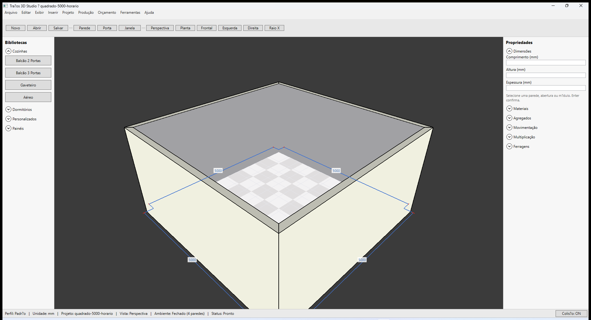
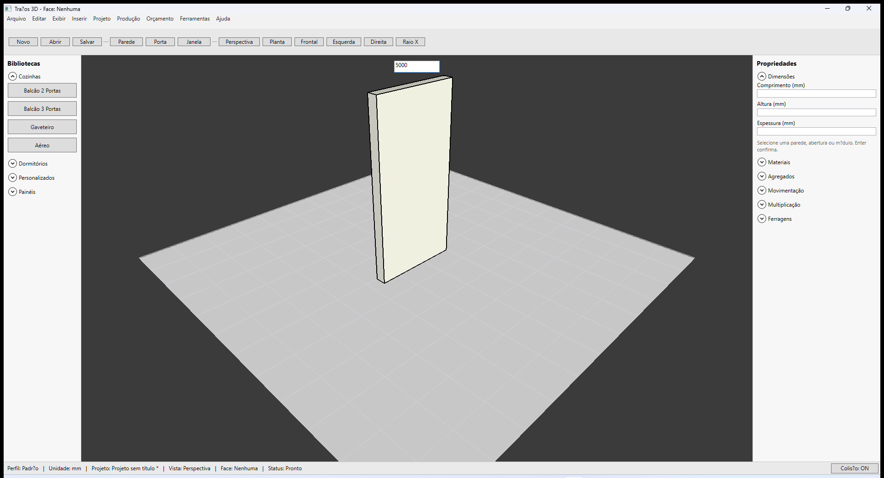

# Traços 3D — Construir paredes

**Última revisão:** 01/07/2026 (V3.1a P8 — diálogo fechar parede)  
**Referência Promob:** [Promob - Paredes](https://suporte.promob.com/hc/pt-br/articles/31122539571345-Promob-Paredes) (seção construção)

---

## Neste artigo

- Ativar o modo **Parede** e desenhar no viewport
- Usar a caixa de medida e o snap
- Fechar o ambiente (contorno fechado)
- Alternar vistas (**Planta**, **Perspectiva**, etc.)

---

## Antes de começar

1. Abra ou crie um projeto (**Arquivo → Novo projeto** ou **Abrir projeto**).
2. Confira na barra de status: **Unidade: mm** e **Build:** com data do instalador.

Fixture recomendada: `samples/quadrado-5000-horario.tracos`

---

## Construir paredes (fluxo básico)

1. Na barra superior, clique em **Parede**.
2. Clique no **viewport** (área central) no ponto inicial da parede.
3. Digite o **comprimento** na caixa de medida (ex.: `5000`) e pressione **Enter**.
4. Repita cliques para cada segmento do contorno.
5. Para **fechar** o ambiente, clique no ponto inicial do primeiro segmento ou complete o último trecho até o vértice de fechamento.

> **IMPORTANTE** — No Promob (e no Traços), o fluxo recomendado é desenhar o contorno no **sentido horário** com **Orientação Interna** para que cotas e piso alinhem com a face interna. Detalhes em [Orientação e comprimento](./02-orientacao-e-comprimento.md).

6. Para **sair** do modo parede sem desenhar mais segmentos, pressione **Esc**.

### Sequência: quadrado 4×5000 mm (sentido horário)

---

## Com precisão (medida digitada)

Como no Promob “com precisão”:

1. Após cada clique, use a caixa **MeasureBox** no viewport.
2. Digite o valor em **milímetros** (sem unidade) e confirme com **Enter**.
3. O próximo ponto é fixado na distância indicada ao longo da direção do segmento.

O painel **Construção de parede** (à direita, ao desenhar) mostra:

| Campo | Uso |
|-------|-----|
| Comprimento | Próximo segmento (confirmação) |
| Orientação | **Interna** ou **Externa** — ver artigo de orientação |
| Espessura | Padrão 150 mm (Normal) |
| Altura | Pé-direito (padrão 2600 mm) |

Tecla **R** alterna **Orientação** durante o desenho.

---

## Fechar o ambiente

Quando o último segmento encosta o contorno:

- O Traços pergunta: **“Deseja fechar a parede e finalizar o ambiente?”** (paridade Promob P8).
- Clique **Sim** para fechar (piso e teto automáticos) ou **Não** para continuar desenhando.

---

## Vistas durante a construção

| Botão | Função |
|-------|--------|
| **Perspectiva** | Navegação 3D livre |
| **Planta** | Vista superior (ideal para medidas no plano) |
| **Frontal / Esquerda / Direita** | Elevações ortográficas |
| **Raio X** | Paredes semi-transparentes |

Durante o modo **Parede**, a câmera segue o fluxo de construção; no **Editor de Paredes** a vista fica fixa em planta — ver [Editor de Paredes](./03-editor-de-paredes.md).

---

## Selecionar e editar uma parede

1. Saia do modo parede (**Esc** ou outra ferramenta).
2. Clique na **face lateral** da parede no viewport.
3. O painel **Propriedades** exibe **Comprimento**, espessura, pé-direito, etc.
4. Clique no **topo horizontal** da parede para editar o **grupo** (todas as paredes do ambiente) — pé-direito e espessura globais.

**Delete** remove a parede selecionada (face) ou o grupo. **Ctrl+Z** desfaz o último segmento no modo desenho.

---

## Próximos passos

- [Orientação e comprimento](./02-orientacao-e-comprimento.md)
- [Editor de Paredes](./03-editor-de-paredes.md)
