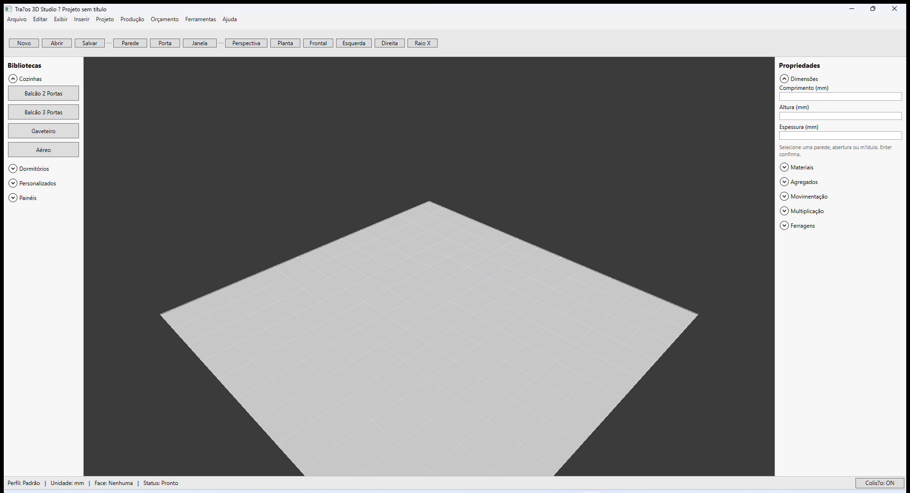
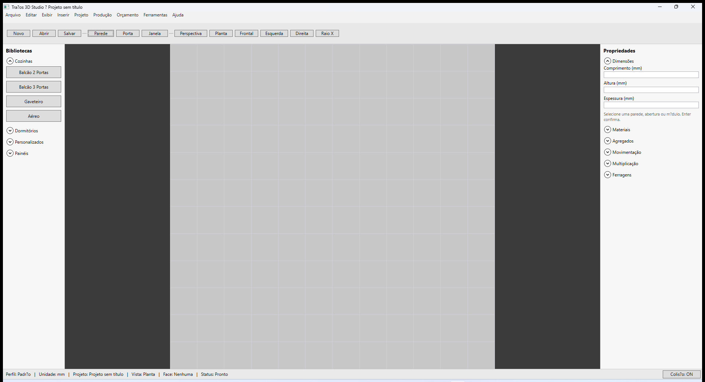
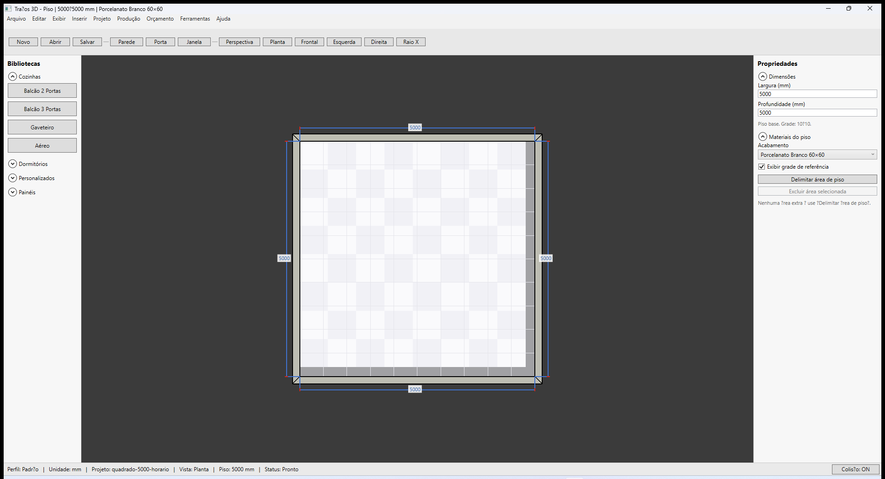
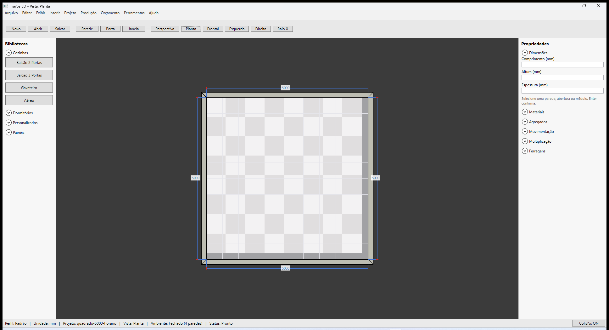

# Traços 3D — Orientação e comprimento

**Última revisão:** 20/06/2026  
**Referência Promob:** [Promob - Paredes](https://suporte.promob.com/hc/pt-br/articles/31122539571345-Promob-Paredes) (Orientação, sentido horário)

---

## Neste artigo

- O que é **Orientação** (Interna / Externa)
- Como **Comprimento** se aplica à face de referência
- Sentido **horário** na construção e face interna tracejada
- Tecla **R** e painel de propriedades

---

## Conceito (igual Promob)

1. **Orientação** define **qual lado** da parede recebe o valor digitado em **Comprimento**.
2. **Interna** — a medida na face voltada para o interior do ambiente (quando o contorno é horário).
3. **Externa** — a medida na face oposta.
4. Desenhar no **sentido horário** alinha vértices internos, cotas automáticas e piso como no Promob.

> **IMPORTANTE** — Desenho **anti-horário** com Orientação **Interna** pode fazer a mesma cota numérica cair na face **externa**. Isso é coerente com o modelo Promob, não um bug.

---

## Durante a construção

1. Com **Parede** ativo, abra o painel **Construção de parede**.
2. Campo **Orientação**: combo **Interna** / **Externa**.
3. Pressione **R** para alternar sem abrir o combo.
4. A **linha tracejada** no preview indica a face de referência do próximo segmento.

---

## Orientação Externa (comparação)

---

## Parede já construída (seleção)

1. Selecione a parede (clique na face lateral).
2. No painel **Propriedades → Dimensões**, altere **Orientação** ou **Comprimento**.
3. **Enter** confirma cada campo.
4. O título da janela e a barra de status mostram o comprimento na **face de referência**.

---

## Face interna no viewport

- Linha **tracejada** = face interna do ambiente (referência para cotas de módulo e piso).
- Cotas **automáticas** nos vértices internos aparecem após fechar o ambiente — ver [Cotas e medidas](./04-cotas-e-medidas.md).

---

## Aceite visual recomendado

| Teste | Resultado esperado |
|-------|-------------------|
| Quadrado 4×5000 **horário** + Interna | Comprimento e cotas **5000** na face interna |
| Mesmo quadrado **anti-horário** + Interna | Comprimento 5000 na referência; interno ~4700 (espessura 150) |
| Piso automático | Encosta na face interna no fluxo horário |

Fixture: `samples/quadrado-5000-horario.tracos`

---

## Próximo

[Editor de Paredes](./03-editor-de-paredes.md) · [Cotas e medidas](./04-cotas-e-medidas.md)
