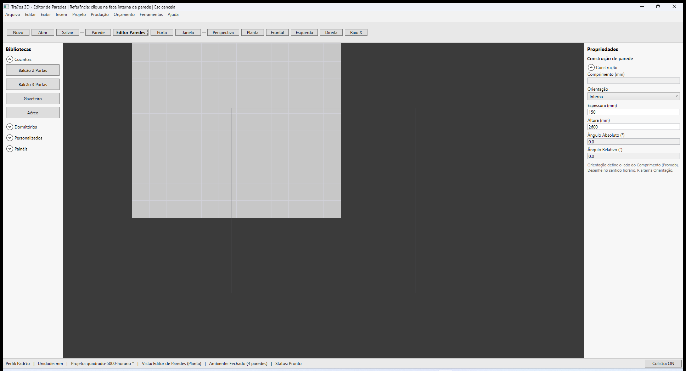
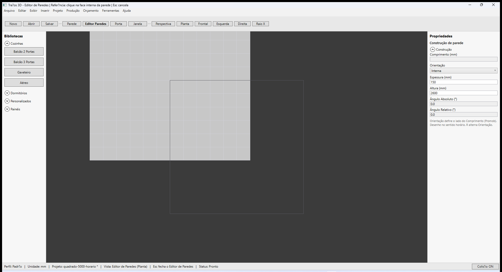
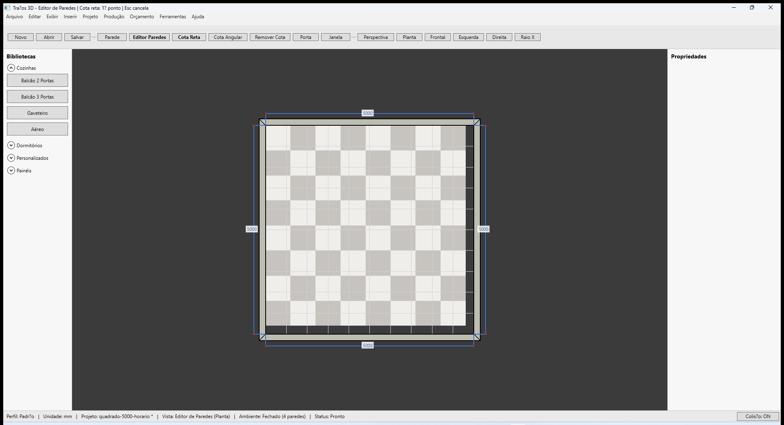

# Traços 3D — Editor de Paredes

**Última revisão:** 20/06/2026  
**Referência Promob:** modo de edição 2D / planta para construção de paredes

---

## Neste artigo

- Entrar e sair do **Editor de Paredes**
- O que muda na interface (vista, módulos, teto)
- Ferramentas da barra do editor
- Construção de parede dentro do editor

---

## Abrir o editor

1. Clique em **Editor Paredes** na barra superior.
2. A vista muda para **Planta** fixa (**Editor de Paredes (Planta)** na barra de status).
3. **Módulos** e **teto** ficam ocultos para foco no contorno.
4. O modo **Parede** inicia automaticamente para continuar desenhando.

Para **fechar** o editor:

- Clique novamente em **Editor Paredes**, ou
- Pressione **Esc**, ou
- Ative **Porta** / **Janela** (retorna ao ambiente 3D completo).

> **IMPORTANTE** — **Perspectiva** fica bloqueada no editor; use **Esc** para sair antes de mudar a vista 3D.

---

## Barra de ferramentas do editor

| Botão | Função |
|-------|----------|
| **Cota Reta** | Cota manual entre dois pontos |
| **Cota Angular** | Cota angular (3 pontos) |
| **Remover Cota** | Remove cota manual selecionada |
| **Mover HotPoint** | Arrasta hotpoint verde (parede curva) |
| **Encontro Canto** | Join manual em canto — ver [Encontros](./05-encontros-geometria.md) |
| **Encontro T** | Join manual em T |

Cotas manuais: detalhes em [Cotas e medidas](./04-cotas-e-medidas.md).

---

## Painel Construção de parede

No editor, o painel à direita mantém os campos de **Construção** (comprimento, orientação, espessura, altura) e **Aparar Cantos** (chanfro manual).

---

## Próximo

[Cotas e medidas](./04-cotas-e-medidas.md) · [Encontros e geometria](./05-encontros-geometria.md)
