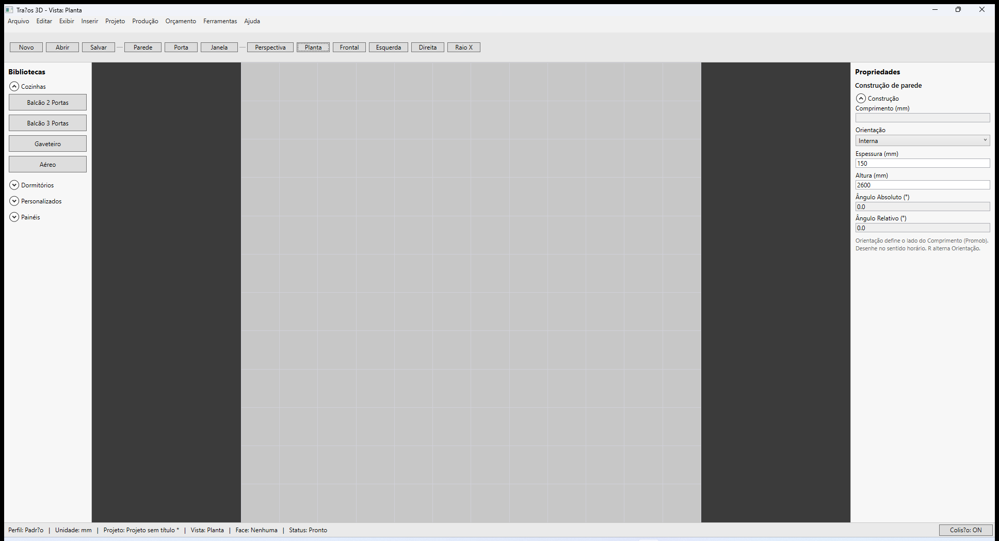
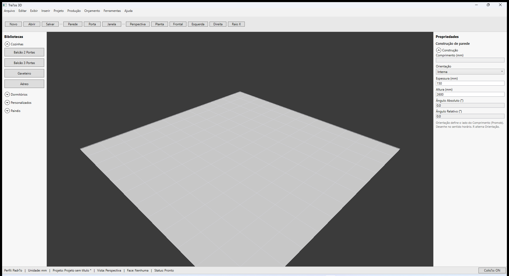
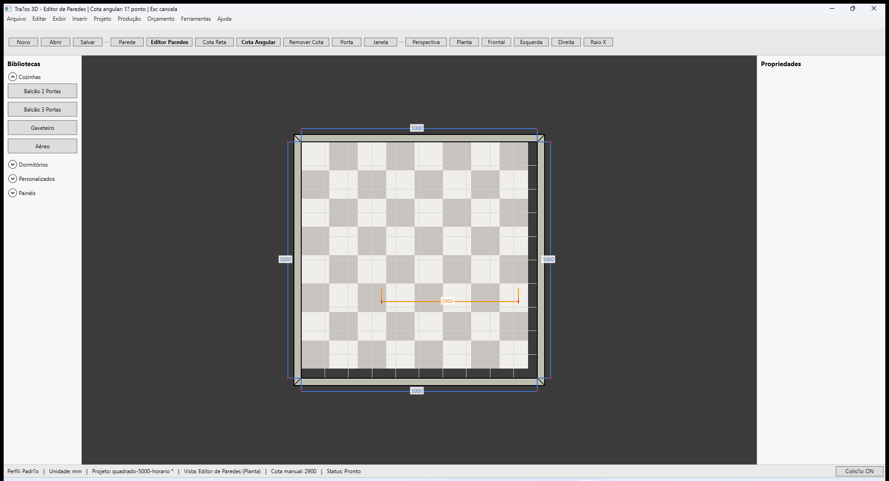
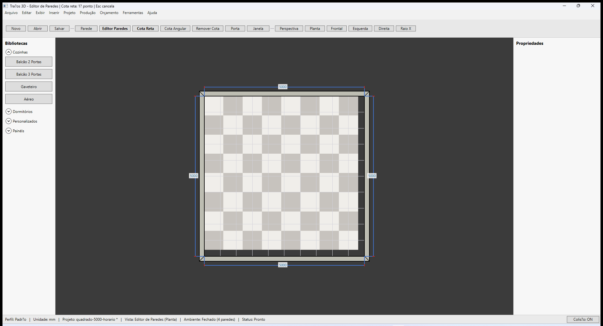
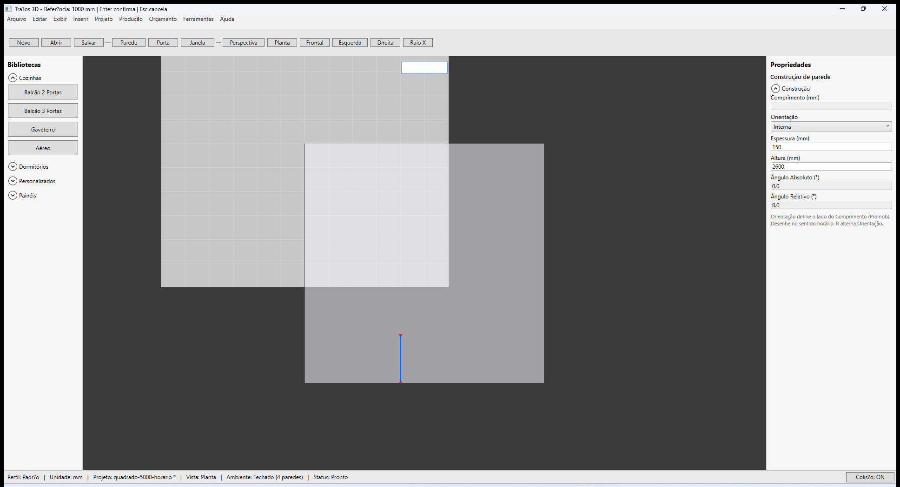
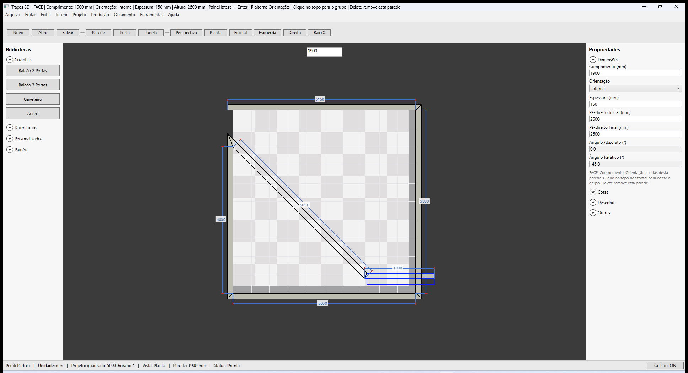
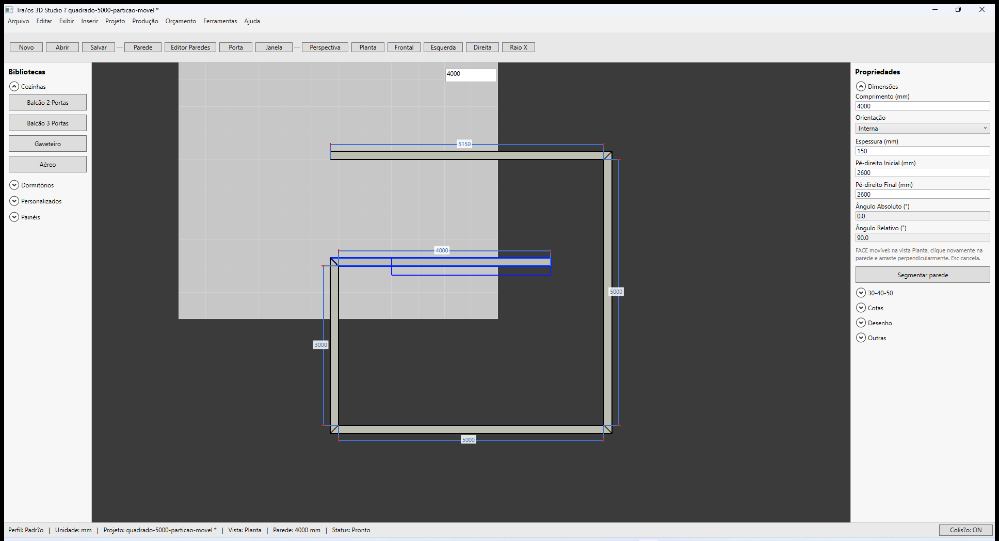

# Traços 3D — Cotas e medidas (paredes)

**Última revisão:** 20/06/2026  
**Referência Promob:** cotas automáticas, cotas no editor, referência, 30-40-50

---

## Neste artigo

- Cotas **automáticas** nos vértices internos (M4)
- Cotas **manuais** retas e angulares no editor (M5)
- Construção com **referência** a outra parede (M6)
- Ferramenta **30-40-50** (M7)

---

## Cotas automáticas (vértices internos)

Após fechar o ambiente no sentido horário com orientação coerente:

1. Alterne para **Planta** se necessário.
2. Cotas azuis aparecem nos **vértices internos** do contorno.
3. Os valores refletem o comprimento na face interna.

---

## Cotas manuais (Editor de Paredes)

Requer [Editor de Paredes](./03-editor-de-paredes.md) ativo.

### Cota reta

1. Clique **Cota Reta**.
2. Clique o **1º ponto** no viewport (snap a vértices de parede).
3. Clique o **2º ponto**.
4. A cota persiste no projeto (`.tracos` → `manualDimensions`).
5. **Esc** cancela o modo; clique na cota para selecionar; **Delete** remove.

### Cota angular

1. Clique **Cota Angular**.
2. Clique **1º ponto**, depois o **vértice** (centro do ângulo), depois o **3º ponto**.

---

## Construção com referência (M6)

Desenhar um novo segmento a uma distância fixa da **face interna** de uma parede existente:

1. Ative **Parede** (ou já esteja no editor).
2. Ao encadear de um ponto existente, use o fluxo de **referência** (clique na face interna da parede de referência).
3. Digite a distância em mm; **Enter** confirma; **Esc** cancela.
4. Linha **azul** indica a referência no preview.

---

## Ferramenta 30-40-50 (M7)

Para cantos com parede que **desloca** (ângulo definido por três medidas A, B, C):

1. Selecione a parede de **referência** (fixa no canto).
2. No painel, expanda **30-40-50**.
3. Preencha **A**, **B**, **C** (mm) — padrões 300 / 400 / 500.
4. Clique **Selecionar parede deslocada** e escolha a parede móvel no viewport.
5. A parede deslocada aparece em **vermelho** no preview.
6. Clique **Aplicar**.

---

## Cotas no painel da parede selecionada

Seção **Cotas** (parede selecionada, modo face):

| Campo | Uso Promob-like |
|-------|-----------------|
| Afastamento Piso | Distância do piso |
| Cota Anterior / Posterior | Ao longo da parede |
| Cota Inferior / Superior | Altura na parede |

Edição em **grupo** (topo): alguns campos ficam somente leitura — apenas valores globais de grupo.

---

## Próximo

[Encontros e geometria](./05-encontros-geometria.md)
