# Traços 3D — Encontros e geometria avançada

**Última revisão:** 20/06/2026  
**Referência Promob:** encontro de paredes, curvas, chanfro, segmentar, movimentar, tipos de parede

---

## Neste artigo

- **Encontro Canto** e **Encontro T** (G1)
- Paredes **curvas** — flecha e hotpoint (G2)
- **Segmentar** parede (G3)
- **Movimentar** parede móvel (G4)
- **Aparar cantos** — chanfro manual (G5)
- Tipo **Dry Wall** (G6)

Fixture principal: `samples/quadrado-5000-particao-movel.tracos`

---

## Encontro Canto e Encontro T (G1)

Ferramentas no [Editor de Paredes](./03-editor-de-paredes.md).

### Encontro Canto

1. Abra o editor e clique **Encontro Canto**.
2. Clique a parede que **desloca** (primeira).
3. Clique a **segunda** parede (aresta de referência no canto).
4. O eixo da primeira parede estende ou encurta até o **cruzamento exato** dos eixos no canto.

### Encontro T

1. Clique **Encontro T**.
2. Clique a parede **móvel** (perpendicular que deve encostar).
3. Clique a parede de **passagem** (segmento onde o T se forma).
4. A extremidade mais próxima da parede móvel vai ao ponto onde seu eixo cruza o eixo da parede de passagem.

> **IMPORTANTE** — A lógica usa **interseção de eixos em milímetros**. A parede móvel pode **estender** até o cruzamento (ex.: partição no sample de partição móvel).

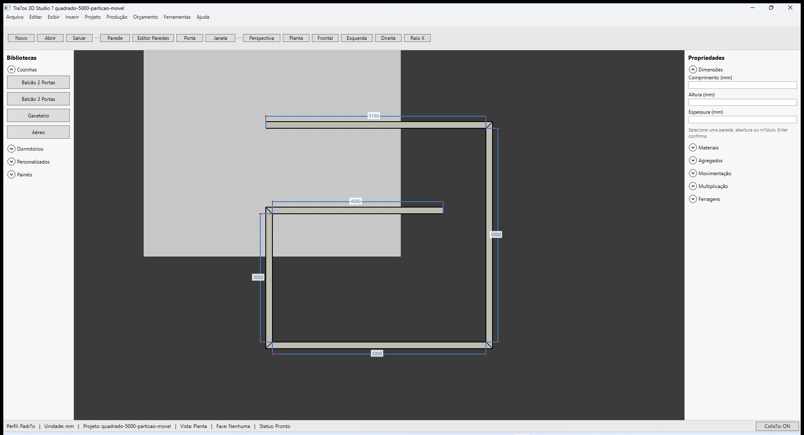

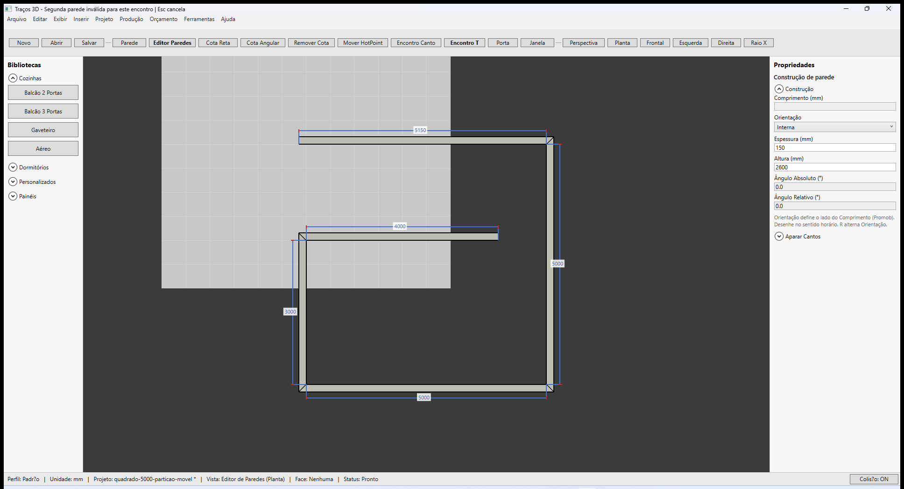

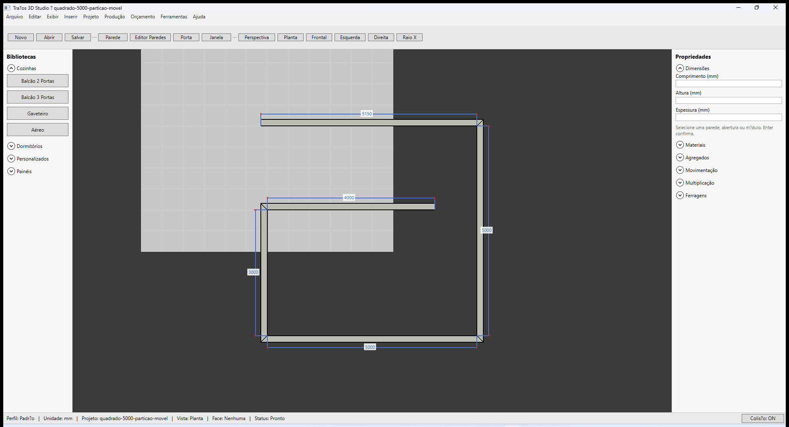

**Esc** cancela o modo.

---

## Paredes curvas (G2)

1. Selecione a parede (face).
2. No painel **Dimensões**, campo **Flecha (mm)** — ou use o editor:
3. **Editor Paredes → Mover HotPoint** — hotpoint **verde** no arco; arraste no viewport.
4. **Ângulo do Arco (°)** é calculado (somente leitura).

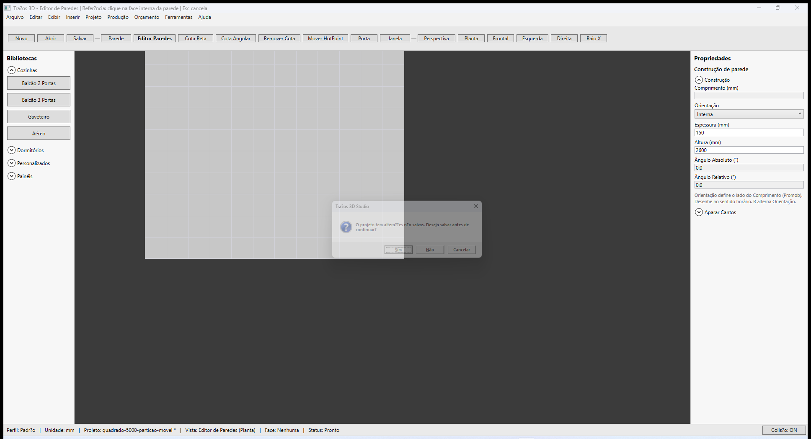

Portas e janelas **recortam o arco** no viewport (contorno e sólido seguem a tesselação da curva). Fixture: `samples/curva-porta.tracos`.

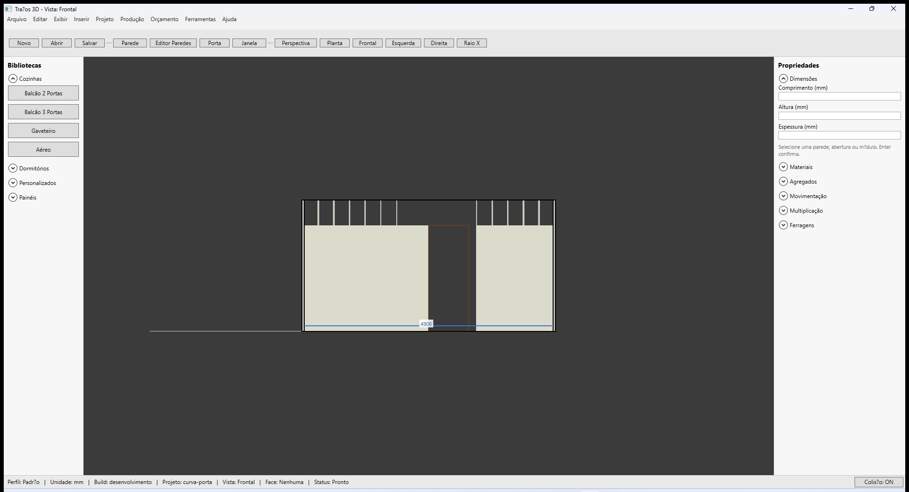

---

## Segmentar parede (G3)

1. Selecione a parede (não em modo grupo).
2. Clique **Segmentar parede** e confirme.
3. Clique no **ponto de divisão** ao longo da parede no viewport.
4. O trecho vira duas paredes; módulos vinculados são reatribuídos.

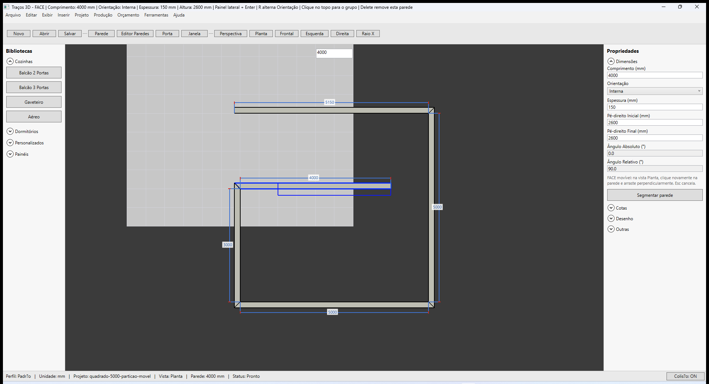

---

## Movimentar parede móvel (G4)

1. Marque **Movível** em **Propriedades → Outras** (parede selecionada).
2. Vista **Planta**.
3. Clique a mesma parede duas vezes (selecionar + iniciar arraste) e mova **perpendicularmente**.
4. Linha/cota **azul** mostra o deslocamento. **Esc** cancela.

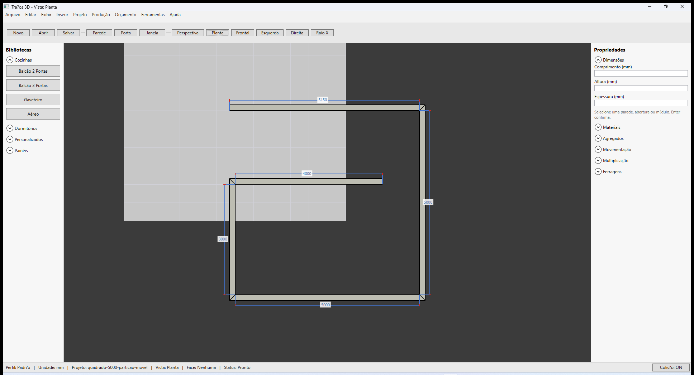

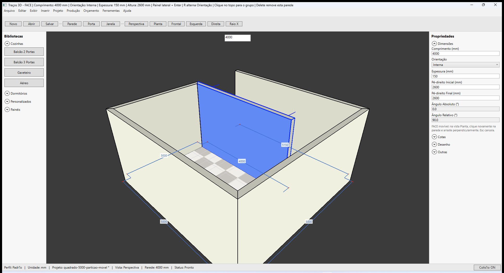

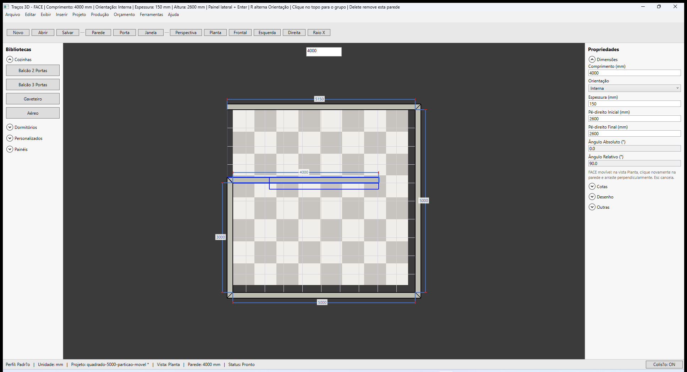

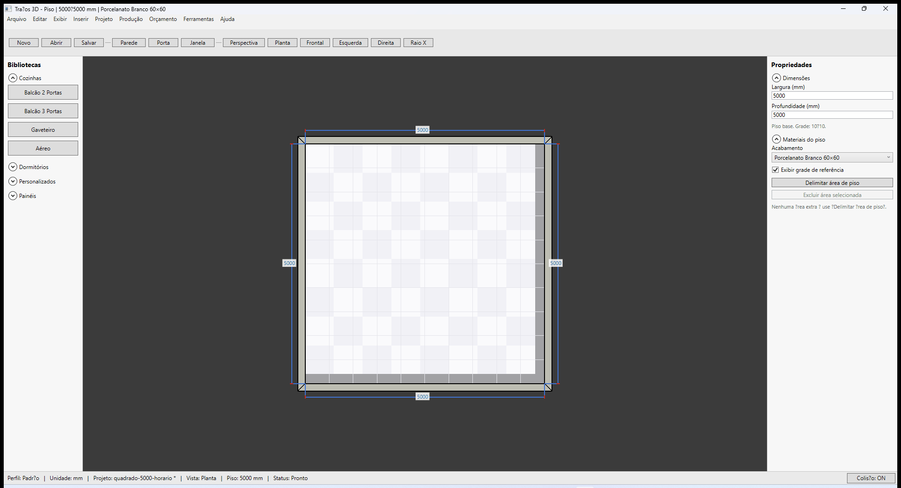

---

## Aparar cantos — chanfro manual (G5)

1. No painel **Construção**, expanda **Aparar Cantos** (ou use no editor).
2. Clique **Aparar Parede**.
3. Defina a distância (mm) no campo do chanfro.
4. Clique no **canto** da parede no viewport (hotpoint **laranja**).

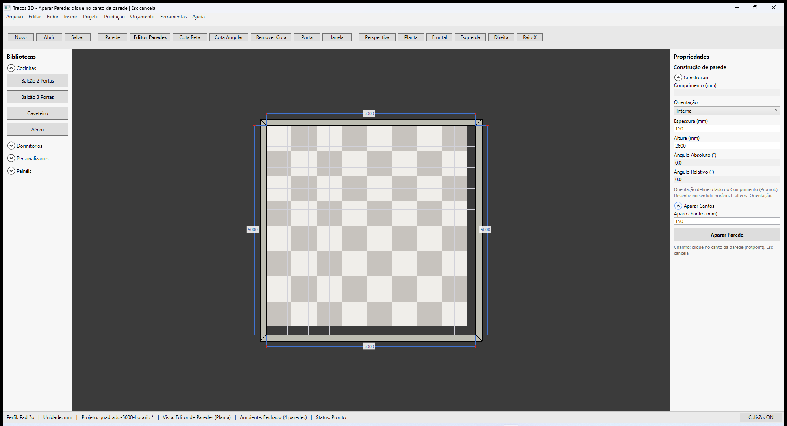

---

## Tipo Dry Wall (G6)

1. Selecione a parede (face).
2. **Propriedades → Outras → Tipo**: **Normal** ou **Dry Wall**.
3. Ao mudar o tipo, a **espessura** atualiza: Normal **150 mm**, Dry Wall **70 mm**.
4. Dry Wall renderiza com tonalidade **mais clara** no viewport.

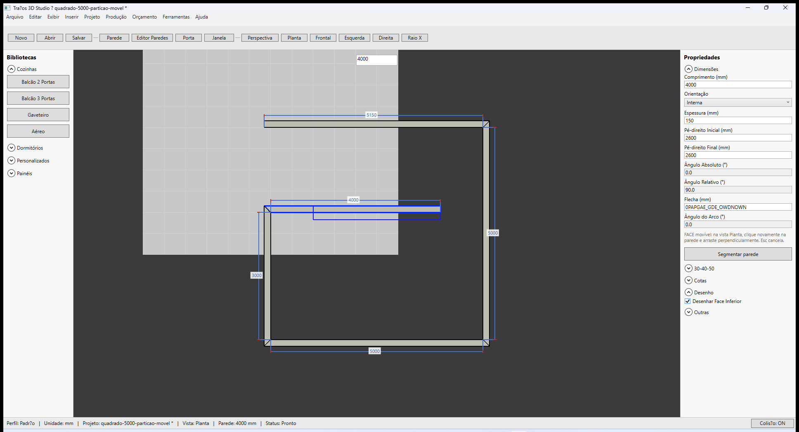

---

## Voltar ao índice

[Paredes — visão geral](./README.md)
