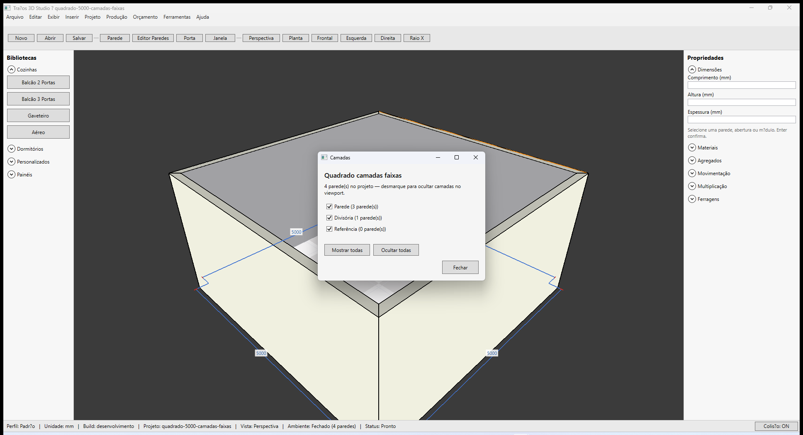
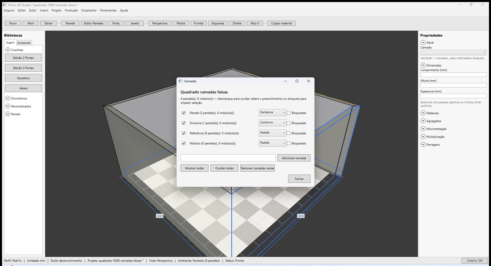
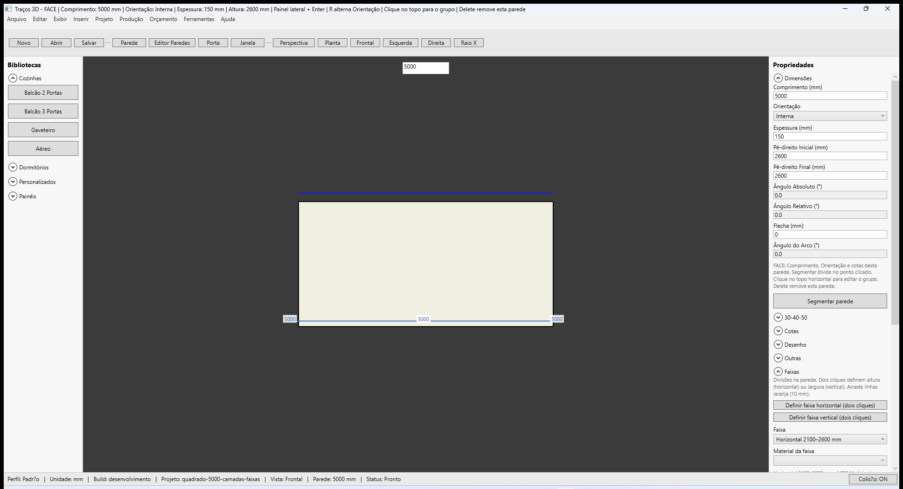
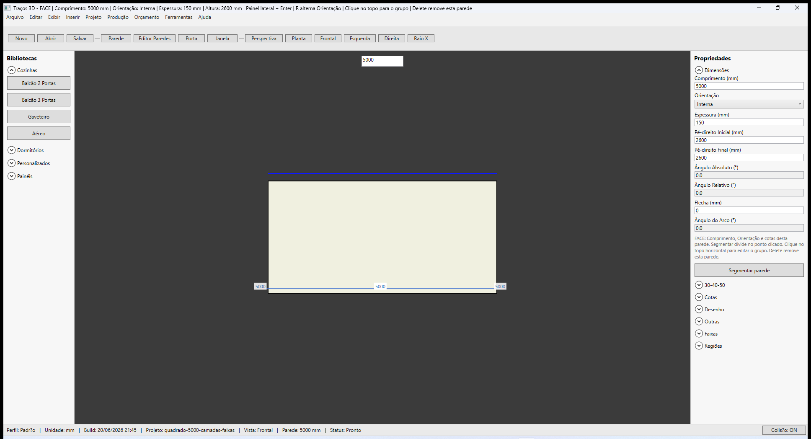
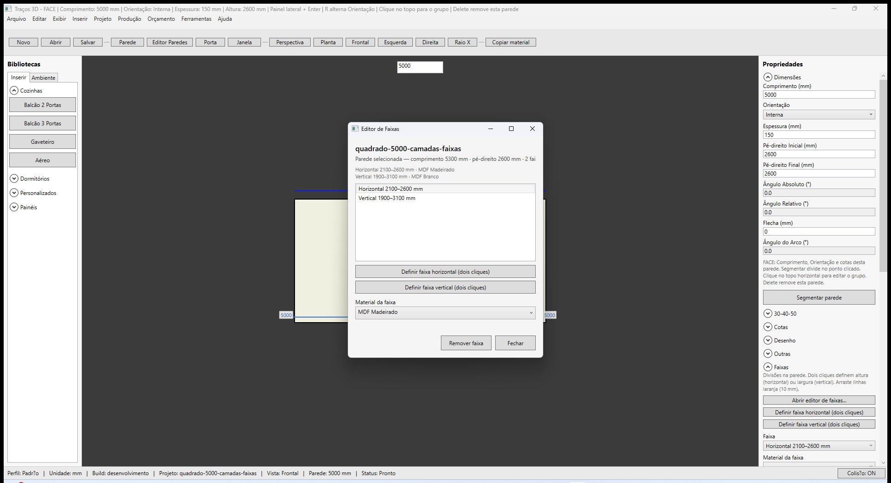
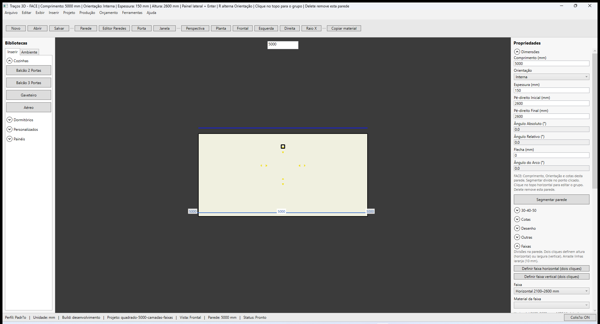
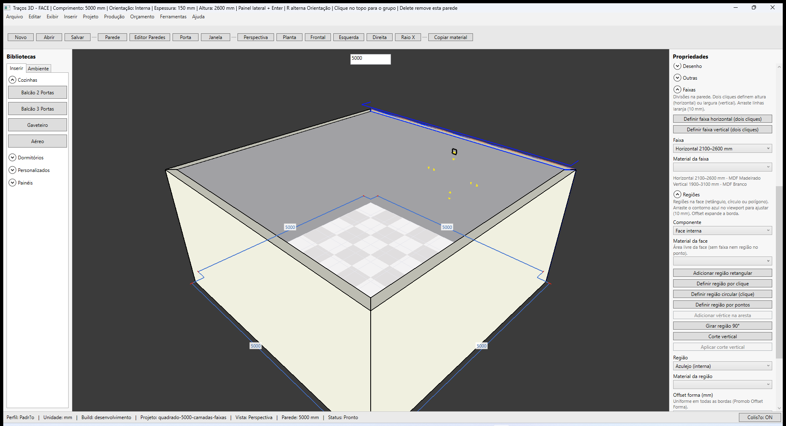
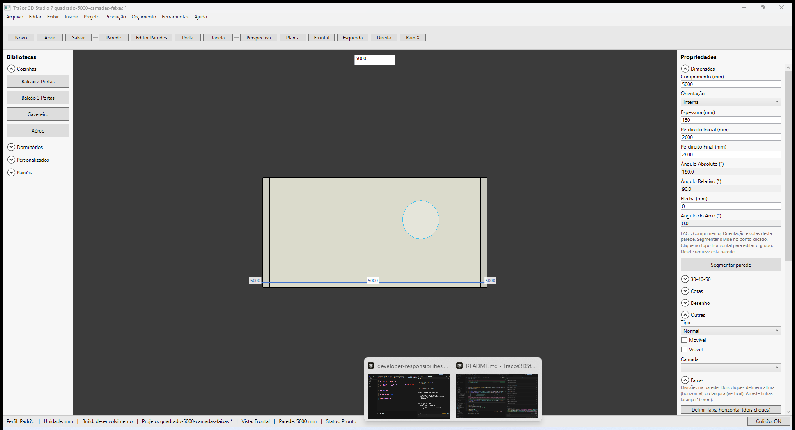

# Traços 3D — Camadas, faixas e regiões

**Última revisão:** 26/06/2026  
**Referência Promob:** [Camadas dos itens](https://suporte.promob.com/hc/pt-br/articles/31122154236177) · [Criar faixa na parede](https://suporte.promob.com/hc/pt-br/articles/31121131353745) · [Criar Regiões](https://suporte.promob.com/hc/pt-br/articles/31121116437649)

---

## Neste artigo

- Definir **Camada** da parede (Outras)
- Adicionar **faixa horizontal** superior
- Adicionar **região retangular** na face interna/externa
- Visual no viewport (linhas laranja = faixas, azul = regiões)

---

## Camada

1. Selecione uma **face** da parede (não o grupo).
2. Expanda **Outras** → campo **Camada**.
3. Opções padrão: **Parede**, **Divisória**, **Referência**.

Paredes em camada oculta não são renderizadas. Use **Exibir → Camadas...** para mostrar ou ocultar cada camada no viewport (com contagem de paredes e módulos).

### Camadas de módulos (A.5)

1. Selecione um **módulo** no viewport.
2. Expanda **Geral** → campo **Camada** (padrão: **Módulo**).
3. Em **Exibir → Camadas...**:
   - Digite o nome e clique **Adicionar camada** para criar camadas customizadas (ex.: Iluminação).
   - Marque **Bloqueada** para impedir seleção de itens na camada (módulos e paredes).
   - Desmarque a visibilidade para ocultar a camada no viewport.
   - Combo **Preenchimento** por camada: **Padrão**, **Fantasma** (sólido semitransparente) ou **Contorno** (somente arestas — útil para camadas de referência).
   - Clique **Remover camadas vazias** para excluir camadas customizadas sem paredes nem módulos (com confirmação).

Camada, bloqueio, preenchimento e camadas customizadas são salvos no `.tracos`.

Fixture: parede sul em `Parede`, parede leste em `Divisória` — `samples/quadrado-5000-camadas-faixas.tracos`

---

## Faixas

1. Com a face selecionada, **botão direito** na parede → **Editar Faixas...** (Promob) ou use **Exibir → Editor de Faixas...**.
2. Ou expanda **Faixas** no painel / abra o **Editor de Faixas** dedicado (F2).
2. Clique **Definir faixa horizontal (dois cliques)** — primeiro clique na altura inferior (ou superior), segundo clique na altura oposta; cria faixa horizontal entre os dois pontos (linhas laranja horizontais).
3. Clique **Definir faixa vertical (dois cliques)** — primeiro clique na posição lateral, segundo clique na outra lateral; cria faixa vertical entre os dois pontos (linhas laranja verticais, altura total da parede).
4. **Arraste** uma linha laranja no viewport (com a parede selecionada) para ajustar topo/base ou laterais da faixa (snap 10 mm).
5. No **Editor de Faixas**, clique **Editar Regiões...** (paridade Promob F7) — abre o expander **Regiões** no painel à direita para a mesma parede.
6. O resumo lista cada faixa (`Horizontal 1100–2100 mm` ou `Vertical 1500–3200 mm`).

No viewport, linhas **laranja** marcam divisões horizontais (topo/base) ou verticais (laterais da faixa).

Fixture: `samples/quadrado-5000-camadas-faixas.tracos` — faixa horizontal MDF, faixa vertical, região azulejo (arraste nas linhas laranja/azul).

---

## Regiões

1. Expanda **Regiões**.
2. Escolha **Face interna** ou **Face externa**.
3. Clique **Adicionar região retangular** — região padrão **1200×1000 mm** centrada, base **1100 mm** (faixa de azulejo acima do peitoril).
4. Ou clique **Definir região por clique** — dois cliques na face definem cantos opostos do retângulo (alongamento × altura).
5. Ou clique **Definir região circular (clique)** — um clique define o centro (raio padrão **600 mm**). Arraste a borda azul para ajustar o raio (snap 10 mm).
6. Ou clique **Definir região por pontos** — cliques na face definem vértices; **comprimento + Enter** no campo Medida estende o último segmento na direção do mouse; clique no **primeiro ponto** para fechar (forma em L, etc.).

7. Selecione a região no combo **Região**:
   - **Adicionar vértice na aresta** — com região **poligonal** selecionada, clique na aresta no viewport para inserir um novo vértice (Esc encerra).
   - **Offset forma (mm)** — expansão/recuo **uniforme** em todas as bordas (Promob Offset Forma). Enter confirma.
   - **Offset por aresta** — quatro campos (início along / fim along / base / topo). Positivo expande só aquela aresta; negativo recua. Enter em cada campo confirma.
   - **Setas amarelas** no viewport (região retangular selecionada, sem rotação): clique na seta externa +10 mm; seta interna −10 mm na aresta.
   - **Girar região 90°** — botão no painel; ou arraste a **alça preta** acima da região no viewport (snap 5°). Regiões circulares não rotacionam.
   - **Corte vertical** — botão no painel; clique na região para posicionar a **linha vermelha**; **Enter** ou **Aplicar corte vertical** confirma (divide em duas regiões). Esc cancela.
8. **Arraste** uma borda do contorno azul (parede selecionada) para ajustar largura, altura ou raio (snap 10 mm) — retângulo **sem rotação** e círculo. **Arraste dentro** da região para mover o bloco inteiro (retângulo, círculo ou polígono).

No viewport, contorno **azul** na face escolhida (retângulo ou círculo).

---

## Regiões no piso (A.4)

1. Selecione o **piso** (clique na planta) ou uma região existente.
2. Expanda **Regiões** no painel do piso.
3. **Adicionar região retangular** — região padrão centrada (~2000×2000 mm).
4. **Definir região retangular (dois cliques)** — em Materiais do piso ou dois cliques na planta.
5. **Definir região circular (clique)** — centro no piso (raio padrão 600 mm).
6. **Definir região por pontos** — cliques + MeasureBox + Enter; fechar no 1º ponto.
7. Combo **Região** — material, **offset forma** e **offset por aresta** (igual às paredes).
8. Arraste bordas azuis (ret/círculo) ou setas amarelas (offset por aresta).

---

## Persistência

Camada, faixas e regiões são salvas no `.tracos` com a parede. Reabra `samples/quadrado-5000-camadas-faixas.tracos` para validar.

---

## Limitações (MVP)

| Promob | Traços 3D MVP |
|--------|----------------|
| Editor de Faixas completo (múltiplas verticais, arraste fino) | Faixa horizontal/vertical por **dois cliques** + **arraste de linhas** no viewport | ✅ |
| Editor de Regiões (pontos, múltiplas formas) | Parede: ret/circ/polígono + offset. **Piso:** ret/circ/polígono + offset | ✅ |
| Janela Camadas global | **Exibir → Camadas...** — visibilidade por camada | ✅ |
| Material por faixa/região | Combo material + preview colorido no viewport | ✅ |
