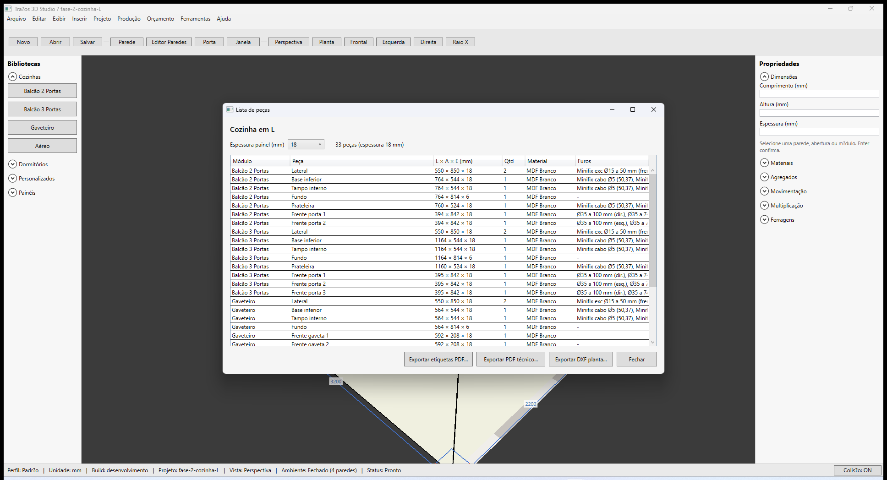

# Traços 3D — Lista de peças e furos

**Última revisão:** 20/06/2026

---

## Neste artigo

- Ver todas as peças do projeto com medidas e materiais
- Coluna **Furos** (dobradiça Ø35 mm, minifix)
- Ajustar espessura do painel para recalcular a lista

---

## Abrir lista de peças

1. Menu **Projeto → Lista de peças...**
2. A janela lista cada peça derivada dos módulos:

| Coluna | Descrição |
|--------|-----------|
| **Módulo** | Balcão, Gaveteiro, Aéreo… |
| **Peça** | Lateral, base, frente, tampo… |
| **L × A × E** | Dimensões em mm |
| **Qtd** | Quantidade |
| **Material** | MDF aplicado |
| **Furos** | Usinagens automáticas (dobradiça, minifix) |

3. **Espessura painel (mm)** — 15, 18 ou 25 — altera a decomposição (perfil de construção do projeto).

---

## Furos automáticos

| Tipo | Quando |
|------|--------|
| **Dobradiça** | Frentes de porta (Ø35 mm, posições por altura) |
| **Minifix** | Laterais e bases dos módulos de caixa |

Os furos aparecem na coluna **Furos** e no PDF técnico (**Projeto → Exportar PDF técnico...**).

---

## Exportações na mesma janela

- **Exportar etiquetas PDF...** — ver [Etiquetas PDF](./03-etiquetas-pdf.md)
- **Exportar PDF técnico...** — folha com planta e peças (Fase 4)
- **Exportar DXF planta...** — planta CAD

---

## Voltar ao índice

[Produção — visão geral](./README.md)
