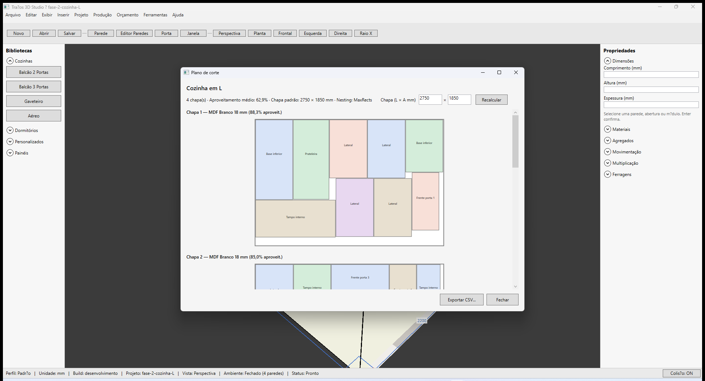

# Traços 3D — Plano de corte (MaxRects)

**Última revisão:** 20/06/2026

---

## Neste artigo

- Visualizar **nesting** das peças nas chapas
- Ajustar tamanho da chapa e recalcular
- Exportar **CSV** para otimizador externo

---

## Abrir plano de corte

1. Menu **Produção → Abrir plano de corte...**
2. O resumo mostra:
   - Quantidade de **chapas**
   - **Aproveitamento médio** (%)
   - Dimensão padrão da chapa (metadata do projeto)
   - Algoritmo **MaxRects**

3. Cada chapa exibe um diagrama com peças coloridas e nome abreviado.

---

## Ajustar chapa

1. Edite **Chapa (L × A mm)** — padrão **2750 × 1850** mm.
2. Clique **Recalcular** — valores salvos no `.tracos`.
3. Margem de corte e kerf usam `CutKerfMm` e `SheetMarginMm` do metadata (configuração de projeto).

---

## Exportar CSV

| Caminho | Uso |
|---------|-----|
| **Produção → Exportar CSV plano de corte...** | Diálogo de arquivo direto |
| Botão **Exportar CSV...** na janela do plano | Mesmo formato |

O CSV lista posição de cada peça em cada chapa para importação em otimizadores.

---

## Perfil de construção

Espessura de painel e fita de borda influenciam as medidas das peças. Altere em **Projeto → Perfil de construção** (Padrão 18 mm, Reforçado 25 mm, Econômico 15 mm).

---

## Voltar ao índice

[Produção — visão geral](./README.md)
