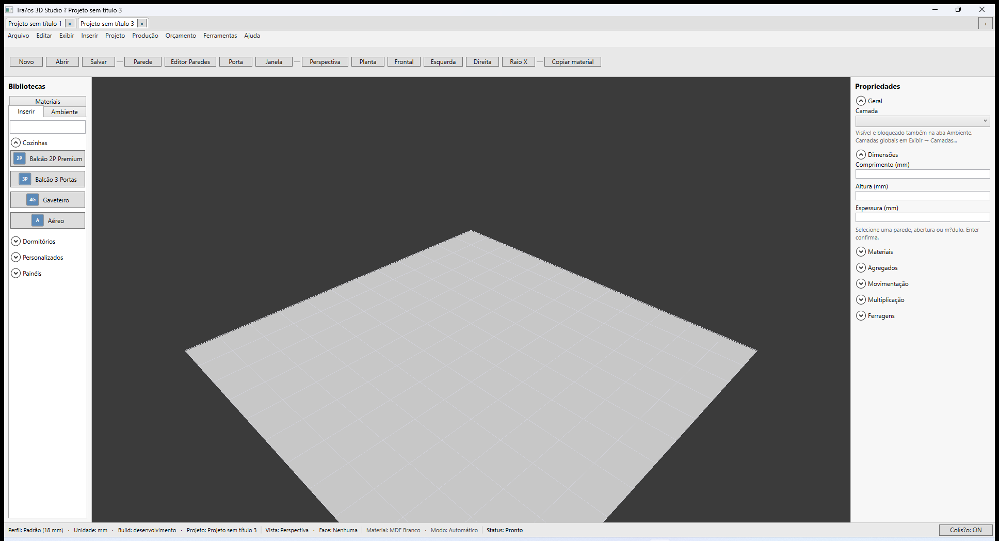

# Traços 3D — Abas multi-projeto (S3)

**Marco:** V3.1c — paridade [Promob — Salvar projetos](https://suporte.promob.com/hc/pt-br/articles/31121685244049-Promob-Salvar-Projetos)  
**Status:** ✅ 01/07/2026  
**AutomationIds:** `ProjectTabBar`, `ProjectTabNewButton`, `ProjectTabCloseButton`, `CloseProjectTabMenuItem`

---

## O que mudou

Na barra superior da janela principal há **abas de projeto**, no estilo Promob Plus: vários arquivos `.tracos` abertos na **mesma** janela, cada um com estado isolado.

---

## Operações

| Ação | Como fazer |
|------|------------|
| **Nova aba** | Botão **+** na barra de abas · menu **Arquivo → Novo** |
| **Abrir em nova aba** | **Arquivo → Abrir...** — não fecha a aba atual |
| **Trocar de projeto** | Clique na aba desejada |
| **Fechar aba** | Botão **×** na aba · **Arquivo → Fechar aba** · **Ctrl+W** |
| **Salvar** | **Ctrl+S** ou **Arquivo → Salvar** — salva só a **aba ativa** |

### Comportamentos importantes

- Abrir um arquivo **já aberto** em outra aba **foca** essa aba (não duplica).
- Cada aba mantém seu próprio **indicador de alterações** (`*` no título da aba e na barra de título da janela).
- Ao **fechar a janela**, o Traços pergunta sobre **cada aba suja**, uma de cada vez.
- Ao fechar a última aba, uma **nova aba vazia** é criada automaticamente (a janela não fecha sozinha).

---

## Paridade Promob

| Promob Plus | Traços 3D |
|-------------|-----------|
| Várias abas de projeto no topo | ✅ Barra `ProjectTabBar` |
| Salvar projeto ativo | ✅ Salvar escopo = aba ativa |
| Fechar projeto individual | ✅ Fechar aba com confirmação |

---

## Ver também

- [Guia de início rápido](../GUIA-INICIO-RAPIDO.md)
- [Paridade materiais — S3](../materiais/07-promob-paridade-materiais.md)
- [ESCOPO V3](../../ESCOPO-V3-PROMOB-COMPLETO.md) — onda V3.1
